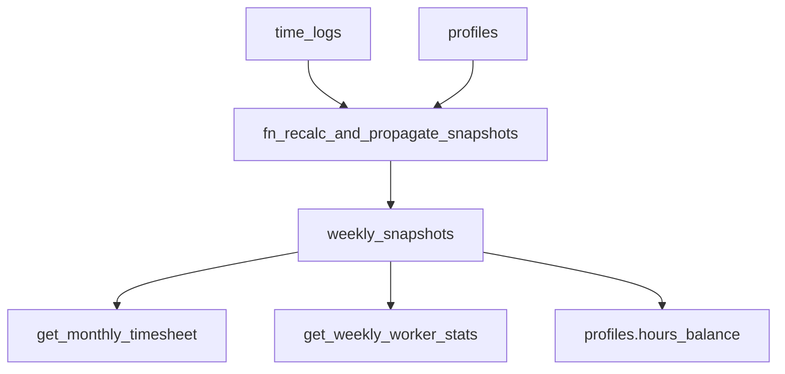

# Horas trabajadas, contrato, extras y arrastre (SSOT vs UI)

Este documento describe el flujo real del código en migraciones Supabase y cómo auditar discrepancias entre **calendario (extras por día)** y **balances semanales (snapshots)**.

## Fuentes de verdad

| Capa | Tabla / RPC | Rol |
|------|-------------|-----|
| Fichajes | `public.time_logs` | Horas por día (`total_hours`, `clock_in`, `event_type`). |
| Perfil | `public.profiles` | `contracted_hours_weekly`, `prefer_stock_hours` (Bolsa vs Pago), `joining_date`, `hours_balance`, `role`, `is_fixed_salary`. |
| Balances semanales (SSOT) | `public.weekly_snapshots` | `balance_hours` (semana sin arrastre), `pending_balance` (arrastre entrante), `final_balance` (resultado con arrastre), `contracted_hours_snapshot`, `prefer_stock_hours_override`, `is_paid`. |
| Calendario mensual | `public.get_monthly_timesheet` | Grid de días + `summary` enriquecido con snapshots; **extras diarios** con regla de `joining_date`. |
| Grid semanal | `public.get_worker_weekly_log_grid` | Misma filosofía de extras que el timesheet, por una semana. |
| Horas extras / coste | `public.get_weekly_worker_stats` | Agregados manager; separa `startBalance` / `weeklyBalance` / `finalBalance`. |

## Motor SSOT: `fn_recalc_and_propagate_snapshots(p_user_id, p_start_date)`

- Recorre semanas desde `greatest(p_start_date, primer fichaje)` hasta semana actual + margen.
- Partición por fecha local **Madrid**: `(clock_in AT TIME ZONE 'Europe/Madrid')::date`.
- **Contrato efectivo** por semana: `weekly_snapshots.contracted_hours_snapshot` si existe; si no, `profiles.contracted_hours_weekly`.
- **Reglas de `balance_hours` (resumen)**:
  - Mes **agosto** (`extract(month from week_start) = 8`): balance semanal = suma de horas de la semana (regla histórica del proyecto).
  - **Manager** o **salario fijo**: `total_hours` en snapshot puede incluir base 40h + fichajes; el balance semanal de extras respecto a contrato sigue la lógica en la migración vigente (ver `pg_get_functiondef`).
  - **Staff normal** con `joining_date` en mitad de semana: horas **antes** de `joining_date` se tratan como extra a efectos de balance (`v_logs_prejoin`); desde `joining_date` aplica contrato sobre `v_logs_postjoin` (sin prorratear el contrato a días previos).
- **Arrastre (`pending_balance`)** desde la semana `week_start - 7`:
  - **Deuda** (`final_balance` anterior &lt; 0): siempre entra en `pending_balance`.
  - **Crédito** (`final_balance` anterior &gt; 0): solo entra si la semana anterior era **Bolsa** (`prefer_stock_hours_override` o perfil) **y** `is_paid` de esa semana es **false**. Si estaba pagada/liquidada, el crédito **no** se arrastra.
- **`final_balance`** = `pending_balance` + `weekly_balance`.
- **`profiles.hours_balance`**: al final se sincroniza con una semana de referencia cercana a “hoy”; si no es bolsa o está pagado y el saldo es positivo, se fuerza a 0 en perfil (no acumular crédito “pagable” en el campo global).

### Verificar versión desplegada

Ejecutar en SQL Editor:

[`sql/diagnostics/verify_fn_recalc_engine.sql`](../sql/diagnostics/verify_fn_recalc_engine.sql)

Comprueba marcadores en el cuerpo de la función y lista RPCs de recálculo instaladas.

## UI vs SSOT: por qué “no cuadra” a veces

| Concepto | Dónde se ve | Definición |
|----------|-------------|------------|
| Extras por **día** (celda “Ex”) | `get_monthly_timesheet` / `get_worker_weekly_log_grid` | Running semanal de horas **desde `joining_date`**; días previos a incorporación = todo extra. |
| “Pendientes” en pie de semana | `weekly_snapshots.pending_balance` (vía `summary.startBalance` en timesheet) | **Arrastre** de semana anterior, no “extras del lunes”. |
| “Extras” en pie de semana (staff) | `weekly_snapshots.balance_hours` o equivalente en RPC | Saldo **de la semana** sin arrastre (según migración que exponga el campo). |
| Importe extras | Depende de `prefer_stock` / `is_paid` y RPC (`get_weekly_worker_stats`) | Bolsa suele implicar coste 0 en nómina inmediata. |

Si un caso falla solo en calendario pero el snapshot es coherente, el bug está en la RPC de grid/timesheet. Si falla el arrastre entre semanas, el bug está en `fn_recalc` o en datos (`is_paid`, override bolsa, migraciones no aplicadas).

## Auditoría rápida en BD (un empleado, varias semanas)

```sql
select week_start, pending_balance, balance_hours, final_balance,
       is_paid, prefer_stock_hours_override, contracted_hours_snapshot
from public.weekly_snapshots
where user_id = '<uuid>'
  and week_start between '2026-04-01'::date and '2026-04-30'::date
order by week_start;
```

Cruzar con fichajes por Madrid y `profiles.joining_date`.

## RPCs de recálculo parcial (nombres canónicos)

| RPC | Uso |
|-----|-----|
| `rpc_recalculate_user_balances_from_week(p_user_id uuid, p_week_start date)` | **Un empleado** desde un lunes; propaga hacia delante solo para ese usuario. |
| `rpc_recalculate_all_users_from_week(p_week_start date)` | Empleados con **fichajes o snapshots** desde esa semana en adelante (más ligero que iterar todos los perfiles). |
| `rpc_recalculate_all_balances_from_week(p_week_start date)` | **Todos** los `profiles.id` (costoso; solo si necesitas reescribir también filas sin actividad reciente). |
| `rpc_recalculate_all_balances()` | Recálculo global desde el primer fichaje (histórico completo). |

Si una RPC “no existe” en el error de Postgres, la migración correspondiente **no está aplicada** en ese proyecto Supabase: aplicar migraciones o ejecutar el SQL de la migración en el editor.

## Diagrama


