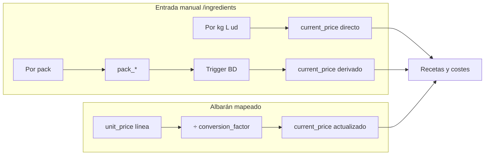

# Precios en `/ingredients` y relación con albaranes (SSOT)

Documento de referencia para desarrollo y operación: qué guarda la base de datos, cómo funciona el asistente de precio en pantalla y cuándo un albarán actualiza el coste del ingrediente.

## 1. Qué número es realmente el precio del ingrediente

El valor que usan **recetas, mermas, consumo personal y costes** es siempre:

- **`ingredients.current_price`**: euros por **`ingredients.purchase_unit`** (típicamente €/kg, €/L o €/ud).

La conversión desde la cantidad en la receta hasta esa unidad de compra está descrita en código en `src/lib/recipe-cost.ts`.

### Dos modos de llegar a ese €/unidad de compra

| Modo en BD (`supplier_pricing_mode`) | Campos relevantes | Cómo se obtiene `current_price` |
|--------------------------------------|-------------------|----------------------------------|
| `per_purchase_unit` | `current_price`, `purchase_unit` | Se introduce directamente (asistente o edición). |
| `per_pack` | `pack_price`, `pack_units`, `pack_unit_size_qty`, `pack_unit_size_unit`, `purchase_unit` | Un **trigger** en Postgres recalcula `current_price` al insertar/actualizar: precio del pack dividido por (unidades en el pack × contenido por unidad expresado en `purchase_unit`). Migración: `supabase/migrations/20260415140000_ingredients_pack_pricing_equivalences.sql`. |

En la app, la misma idea de cálculo desde pack aparece en `computeEffectivePriceFromPack` dentro de `src/app/ingredients/page.tsx` (vista previa / coherencia con el trigger).

Por eso hay muchas variantes de entrada: el proveedor puede cobrar por **kilo, litro, unidad suelta o pack/caja**; el sistema normaliza a **un solo coste unitario** para recetas.

## 2. Interfaces de usuario en `/ingredients`

### A) `IngredientWizard` (`src/components/ingredients/IngredientWizard.tsx`)

Flujo por pasos (resumen):

1. Nombre del ingrediente.
2. Categoría (mapeo a BD: p. ej. Bebida → `Bebidas`): define la **unidad base por defecto** (bebidas → litros, comida → kg, packaging/limpieza/otros → ud).
3. Cómo cobra el proveedor: kilo / litro / pack / unidad (y pregunta de líquido cuando aplica).
4. Precio: en `per_purchase_unit` se guarda `current_price`; en `per_pack` se guardan los campos `pack_*` y el trigger deriva `current_price`. No se activa `per_pack` en BD hasta tener todos los `pack_*` necesarios (evita excepciones del trigger).
5. Paso opcional: imagen, merma, proveedores, etc.

Funciones útiles en el mismo archivo: `computeUnitCost`, `convertQty`, `handleSavePricingAndAdvance`.

### B) Modal Editar + mini asistente (2 pasos) en `src/app/ingredients/page.tsx`

- Paso 1: Por kilo / litro / pack / unidad (ajusta modo y `purchase_unit`).
- Paso 2: importes numéricos; en modo pack el `current_price` efectivo lo deriva el trigger al guardar (`handleSaveEdit`).

La lógica es la misma que en el wizard: **normalizar a €/`purchase_unit`**.

## 3. Albaranes: cuándo actualizan `current_price`

No hay dos precios en paralelo: solo existe **`ingredients.current_price`**.

### Precio fijo (`price_locked`, default `false`)

En `/ingredients` (modal, modo experto y paso opcional del wizard) se puede marcar **“Precio fijo: no actualizar desde albaranes”**. Si `ingredients.price_locked = true`:

- El trigger **`handle_new_invoice_line`** sigue mapeando la línea y actualiza `last_known_price` en `supplier_item_mappings`, pero **no** inserta en `ingredient_price_history` ni cambia `current_price`.
- **`updatePurchaseInvoiceLineAction`** solo actualiza `last_known_price` y devuelve aviso; no toca historial ni `current_price`.
- **`confirmarMapeoAction`** (`src/lib/actions/albaranes.ts`) omite historial y actualización de `current_price` si el ingrediente está bloqueado.

Migración: `supabase/migrations/20260512190000_ingredients_price_locked.sql`.

### Actualización automática (cuando `price_locked` es false)

1. **Al insertar una línea** de albarán: función `public.handle_new_invoice_line()` (definición actual sustituye la de `20260326100000_recipes_financials_cleanup_and_price_fix.sql`), disparada tras `INSERT` en `purchase_invoice_lines` (ver `20260422160000_albaranes_auto_price_trigger.sql`).

   - Busca en `supplier_item_mappings` una fila con el **mismo `supplier_id`** que el albarán y **`supplier_item_name` = `original_name`** de la línea.
   - Si existe:  
     `nuevo_precio = unit_price / COALESCE(conversion_factor, 1)`  
     Si no hay precio fijo: se registra historial, se marca la línea mapeada y se hace `UPDATE ingredients SET current_price = nuevo_precio`.

2. **Al actualizar una línea ya mapeada** desde la app: `updatePurchaseInvoiceLineAction` en `src/app/dashboard/albaranes/actions.ts` — misma fórmula e historial cuando no hay precio fijo.

Si **no hay factor de conversión** válido en el mapeo, no se actualiza el ingrediente (la acción puede devolver aviso).

### Manual vs albarán: quién “manda”

Si **`price_locked`**: el precio del catálogo **no** lo pisan los albaranes (sigue valiendo lo guardado en `/ingredients`).  
Si no está bloqueado: **gana el último proceso que escriba** `ingredients.current_price` (manual o albarán).

### Modo `per_pack` en el catálogo

Si el usuario elige cobro por **unidad** (`ud`) pero el **contenido por pieza** es volumen (ml, cl, l) o masa (g, kg), la app guarda `purchase_unit`/`unit_type` como **`l`** o **`kg`** (coste homogéneo para el trigger y recetas). Caso típico: precio por botella + 740 ml → €/L. Resolver: `src/lib/ingredient-pack-pricing.ts` → `resolveDeclaredPurchaseUnitWithPackContent`.

Los updates desde albarán suelen hacer solo `SET current_price = …` sin tocar `supplier_pricing_mode` ni `pack_*`. Si después se guarda de nuevo un ingrediente en modo pack con todos los `pack_*`, el trigger de pack **puede recalcular** `current_price` desde el pack.

## 4. Historial

Los cambios de `current_price` pueden quedar reflejados en `ingredient_price_history` (trigger en esquema según versión desplegada + inserciones desde la server action de albaranes).

## 5. Por qué cuesta entenderlo (resumen operativo)

- **Un objetivo, muchas entradas**: todo se convierte a **€ por `purchase_unit`**.
- **Dos UI** (wizard largo vs asistente de 2 pasos en edición) más **modo experto** en la misma página con más campos.
- **Albarán**: el precio de línea **no sustituye** al ingrediente hasta que exista **mapeo + factor**; la fórmula es **precio unitario de línea ÷ factor** → €/`purchase_unit`.
- **Historial**: ver sección 4.

## 6. Reservado

Extensiones futuras (p. ej. historial de intentos de precio albarán cuando `price_locked` está activo) no están cubiertas aquí.
