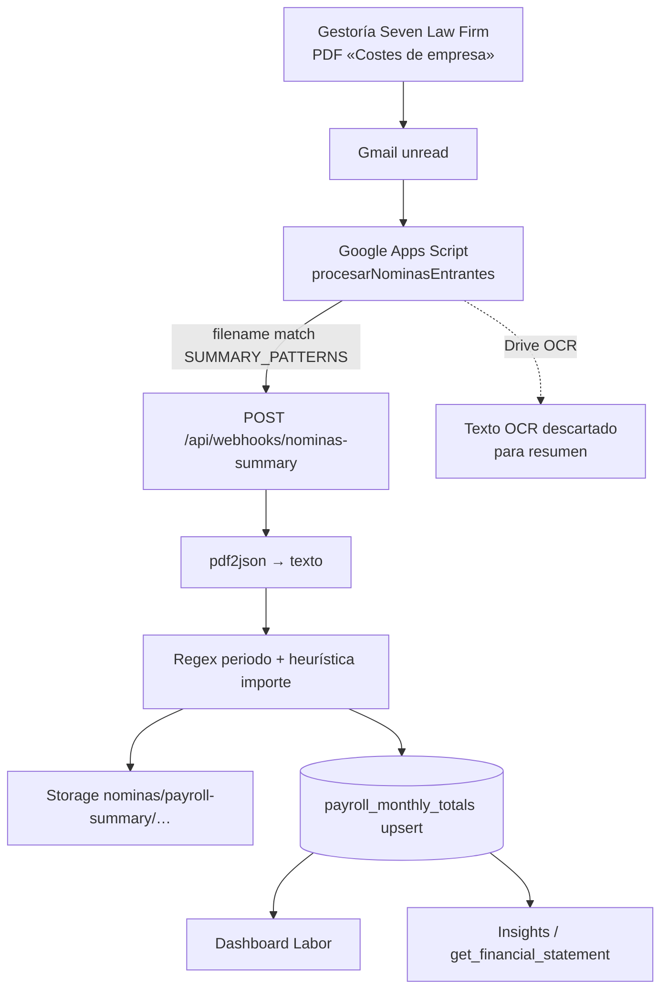

# FASE 1 — Validación del productor de `payroll_monthly_totals`

**Fecha:** 2026-07-24  
**Skills:** `gestor-nominas` + `auditor-payroll` + `db-supabase-master`  
**Modo:** solo lectura — **cero cambios de código / esquema / Labor / HE / Shadow**

---

## Veredicto (respuesta §7)

**Sí, con reservas.**

Evidencia a favor:

- Existe un único productor de escritura: `POST /api/webhooks/nominas-summary`.
- El importe almacenado **no es IA ni suma de conceptos inventada**: es un número en formato europeo extraído del texto del PDF resumen de gestoría.
- Re-extracción 2026-07-24 de los PDF en Storage: **mayo y junio coinciden exactamente** con `payroll_monthly_totals` (`12.285,92` y `12.111,84`).
- El periodo (`PAGA TOTAL DEL…AL…`) también coincide con `period_start` / `period_end`.

Reservas técnicas (bloquean “Sí” absoluto):

- El importe **no se ancla** a la etiqueta `TOTAL EMPRESA` / `TOTAL CENTRO`: se toma el **máximo** de todos los importes europeos en los **300 caracteres anteriores** al primer marcador. Hoy acierta porque el total es el mayor de esa ventana; un layout distinto o un número mayor espurio lo rompería.
- No hay hash, versionado, ni validación humana/cruzada.
- Solo hay **2 meses** en producción; julio no está cargado.
- Dependencia operativa de Gmail + GAS (sin cron en app).

---

## 1. Arquitectura completa del pipeline actual

**Nota crítica:** para el PDF **resumen**, el OCR de Drive en GAS **sí se ejecuta** pero **no se envía** al webhook. El productor de coste usa solo `fileBase64` + **pdf2json en servidor**.

---

## 2. Flujo detallado por paso

| # | Paso | Archivo | Función | Responsabilidad | Entrada | Salida |
|---|------|---------|---------|-----------------|---------|--------|
| 1 | Emisión | (externo) | Gestoría | Envía PDF resumen mensuales | — | Email + adjunto PDF |
| 2 | Buzón | Gmail | — | Almacena mensaje unread | SMTP | Thread Gmail |
| 3 | Detección | `context/script_nominas.txt` | `procesarNominasEntrantes` | Busca unread con PDF de remitentes configurados | Query Gmail | Threads |
| 4 | Filtro nombre | mismo | `_shouldExcludeAttachmentByFilename` | Omite «registro de jornada» | filename | boolean |
| 5 | Clasificación | mismo | `SUMMARY_PATTERNS` | Resumen vs nómina individual | filename | `isSummary` |
| 6 | OCR (lado GAS) | mismo | `Drive.Files.insert({ocr:true})` | Extrae texto (útil **solo** para DNI en individuales) | PDF blob | texto (en resumen: **no usado**) |
| 7 | Transporte | mismo | `UrlFetchApp.fetch` | POST base64 + filename + emailDate | JSON | HTTP |
| 8 | Auth webhook | `src/app/api/webhooks/nominas-summary/route.ts` | `POST` | Bearer `WEBHOOK_SECRET` | Request | 401 o continúa |
| 9 | Decode PDF | mismo | `Buffer.from(fileBase64)` | Bytes PDF | base64 | Buffer |
| 10 | Texto PDF | mismo | `PDFParser` (pdf2json) | Texto nativo del PDF | Buffer | `textContent` string |
| 11 | Periodo | mismo | regex `PAGA TOTAL DEL…AL…` + `ymdFromDmy` | Fechas calendario | texto | `period_start/end`, luego `period_ym` |
| 12 | Importe | mismo | ventana 300 chars + `Math.max` | Heurística `total_company_cost` | texto | number |
| 13 | Storage | mismo | `storage.from('nominas').upload` | Guarda PDF (`upsert: true`) | Buffer | `file_path` |
| 14 | Persistencia | mismo | `.from('payroll_monthly_totals').upsert` | SSOT mensual | row | fila UNIQUE `period_ym` |
| 15 | Consumo | Labor / Insights | lecturas | Prorrateo / PyG | `total_company_cost` | UI / RPC |

Fuera de este pipeline (no escribe `payroll_monthly_totals`):

- `src/app/api/webhooks/nominas/route.ts` — recibos individuales.
- `src/app/api/nominas/open/route.ts` — servir PDF al usuario.

---

## 3. Productor localizado

| Rol | Ubicación exacta |
|-----|------------------|
| **Inserta / actualiza** `payroll_monthly_totals` | `src/app/api/webhooks/nominas-summary/route.ts` líneas 131–143 — `supabase.from('payroll_monthly_totals').upsert(..., { onConflict: 'period_ym' })` |
| **Genera** `total_company_cost` | Mismo archivo, línea 117: `const totalCompanyCost = Math.max(...positiveAmounts)` |
| **Interpreta el PDF** | Mismo archivo, líneas 52–65: `pdf2json` → `getRawTextContent()` |
| **Construye el “resumen” numérico** | No hay tabla intermedia de resumen: el “resumen” es el **PDF de gestoría** clasificado por filename; el webhook deriva periodo + un solo importe |

No hay otra escritura a `payroll_monthly_totals` en el codebase (grep confirmado).

---

## 4. Origen exacto de `total_company_cost`

### Qué **no** es

- No es IA.
- No es suma de conceptos de nóminas individuales.
- No es OCR de Drive (en el camino resumen).
- No es un cálculo de Hours Engine ni de tarifas.

### Qué **sí** es (código)

1. Extraer texto del PDF con **pdf2json** (capa de texto embebida del PDF, no OCR de imagen).
2. Localizar el índice del **primer** match de `/TOTAL\s+EMPRESA/i` o `/TOTAL\s+CENTRO/i` (el menor índice).
3. Tomar `textContent.slice(markerIndex - 300, markerIndex)`.
4. Capturar todos los matches `\d{1,3}(?:\.\d{3})*,\d{2}` (formato europeo con 2 decimales).
5. Parsear con `parseEuroNumber` (quita puntos de miles, coma → punto).
6. Filtrar `> 0`.
7. **`totalCompanyCost = Math.max(...positiveAmounts)`**.

### Evidencia empírica (Storage → re-extracción, 2026-07-24)

| Mes | Almacenado | Re-extraído | ¿Match? | Candidatos en ventana (extracto) |
|-----|------------|-------------|---------|----------------------------------|
| 2026-05 | 12285.92 | 12285.92 | Sí | 10860.66, 12056.53, 785.96, 3966.20, **12285.92** |
| 2026-06 | 12111.84 | 12111.84 | Sí | … 11917.62, 776.90, 4660.52, **12111.84** |

Contexto textual mayo (normalizado):

`… 3.966,20 12.285,92 TOTAL CENTRO 12.285,92 …`

Conclusión de origen: **valor leído del texto del PDF**, seleccionado por heurística **“máximo en ventana previa al rótulo”**, no por asociación etiqueta↔importe. En los PDF actuales ese máximo **coincide** con el total de centro/empresa.

---

## 5. Auditoría de precisión y margen de error

| Factor | Efecto | Riesgo |
|--------|--------|--------|
| pdf2json sobre PDF con texto nativo | Suele ser fiel si el PDF no es solo imagen | Bajo (en estos PDF funciona) |
| PDF escaneado sin texto | Fallaría periodo/importe (422) o texto vacío | Medio–Alto si gestoría cambia a imagen |
| Heurística `Math.max` en 300 chars | Puede elegir cifra distinta del TOTAL si hay otra mayor | **Alto** (diseño); **Bajo hoy** (datos actuales) |
| Orden TOTAL CENTRO vs TOTAL EMPRESA | Usa el primer marcador en el texto | Bajo si ambos importes iguales (visto en sample) |
| `parseEuroNumber` | Solo formato europeo con `,dd`; sin redondeo adicional | Muy bajo |
| `numeric(10,2)` en BD | Alineado a céntimos | Muy bajo |
| Upsert sin hash | Reenvío pisa valor; no guarda historial | Medio (ops) |
| GAS OCR no usado en resumen | No introduce error OCR en el coste | — (ruido ops) |

**Clasificación global del riesgo de divergencia PDF↔BD:**

- **Con layout actual de gestoría:** **Bajo** (demostrado en 2/2 meses).
- **Como diseño de productor a largo plazo:** **Medio–Alto** (heurística frágil documentada también en `AUDITORIA_DOCUMENTAL.md`).

---

## 6. Auditoría de campos almacenados

| Campo | Fuente | Transformación | Confianza |
|-------|--------|----------------|-----------|
| `total_company_cost` | Texto PDF (ventana pre-TOTAL) | Regex importes → `Math.max` → number | **Media** (Alta en may–jun verificados; Media por heurística) |
| `period_start` / `period_end` | Literal `PAGA TOTAL DEL dd/mm/yyyy AL dd/mm/yyyy` | `ymdFromDmy` | **Alta** |
| `period_ym` | Derivado de `period_start` | `slice(0,7)` | **Alta** |
| `file_path` | `filename` sanitizado + `period_ym` | `payroll-summary/{ym}/{safe}.pdf` | **Alta** (path); contenido: upsert Storage |
| `email_date` | `lastMessage.getDate()` en GAS | ISO string | **Media** (fecha email ≠ emisión contable) |
| `created_at` | default DB | now() en primer insert; upsert no garantiza “updated_at” | **Media** (no refleja rectificación) |
| `id` | `gen_random_uuid()` | — | N/A |

Datos prod actuales:

| period_ym | total_company_cost | file_path | email_date |
|-----------|-------------------|-----------|------------|
| 2026-05 | 12285.92 | `…/Costes de emrpesa El Fogo Torrat mayo.pdf` | 2026-05-31T15:52:16Z |
| 2026-06 | 12111.84 | `…/Costes de empresa El Fogo Torrat junio.pdf` | 2026-06-29T18:32:30Z |

(Obs.: typo «emrpesa» en filename mayo; el patrón `Costes de empres` igual clasifica como resumen.)

---

## 7. Puntos débiles (solo documentar)

1. **Heurística `Math.max`** — no valida que el número esté “ligado” al rótulo TOTAL.
2. **Sin `content_hash`** — no detecta PDF distinto con mismo `period_ym` vs mismo PDF reenviado.
3. **Upsert silencioso** — rectificación gestoría pisa el valor; sin historial / `superseded`.
4. **Sin auditoría de importación** (`import_runs`) — solo labels Gmail + email de error.
5. **Sin validación cruzada** con suma de recibos individuales.
6. **Clasificación por filename** — si gestoría cambia el nombre y no matchea `SUMMARY_PATTERNS`, el PDF puede ir al webhook de individuales (o fallar).
7. **Dependencia GAS** — si el trigger deja de correr, Labor muestra toast “falta nómina” (julio 2026 ausente).
8. **OCR inútil en resumen** — coste/tiempo Drive sin aportar al productor.
9. **Reenvío / duplicados de correo** — si el hilo se reprocesa, upsert pisa; si el label falla a medias, estados inconsistentes.
10. **Cambio de formato gestoría** — rompe regex `PAGA TOTAL` o layout de totales → 422 o importe erróneo sin alerta de negocio en BD.
11. **Cobertura temporal corta** — solo 2 meses; no demuestra estabilidad plurimensual.
12. **Consumidores leen cualquier fila** — no existe `validation_status`; un upsert malo entra directo en Labor/Insights.

---

## 8. Valoración del productor

| Criterio | Nota |
|----------|------|
| Unicidad del productor | ✅ Único writer |
| Trazabilidad al PDF | ✅ `file_path` en Storage |
| Fidelidad demostrada may–jun 2026 | ✅ Re-parse = stored |
| Robustez ante cambio de layout | ❌ Heurística frágil |
| Gobernanza (hash/versión/audit) | ❌ Ausente |
| Apto como SSOT de consumo hoy | **Sí, con reservas** |
| Apto como SSOT “definitivo” sin endurecer productor | **No todavía** |

---

## 9. Mejoras imprescindibles (prioridad)

Solo lo que aumenta fiabilidad del productor (no cosmética):

1. **Anclar el importe a la etiqueta** (`TOTAL EMPRESA` / `TOTAL CENTRO`) — dejar de usar `Math.max` ciego; tests golden con los PDF reales de Storage.
2. **`content_hash` + política de rectificación** — detectar mismo PDF vs PDF nuevo del mismo mes; no pisar sin dejar rastro.
3. **Registro de importación** (run + resultado + candidatos parseados) — poder auditar *por qué* salió un número.
4. **Alerta si mes calendario cerrado sin fila** — ops (julio ya evidencia el hueco).
5. **Validación cruzada opcional** Σ costes recibos ≈ total resumen (umbral) — warning, no sustituye el resumen.

---

## 10. Conclusión operativa

- **Hoy** Labor e Insights pueden seguir leyendo `payroll_monthly_totals.total_company_cost` como fuente oficial de coste empresa **porque** el dato proviene del PDF resumen de gestoría y, en los meses existentes, es reproducible al céntimo.
- **No** está demostrado que el productor sea robusto ante cambios de formato: la selección del importe es una heurística de máximo, no una lectura literal etiquetada.
- Antes de “cerrar” el pipeline SSOT definitivo, la mejora **#1 (anclar a etiqueta) + #2 (hash/rectificación)** son el mínimo de ingeniería; el resto del pipeline (portal, líneas por trabajador) no sustituye este refuerzo.

**Siguiente fase recomendada (cuando se autorice implementar):** parser etiquetado + tests golden sobre los PDF `payroll-summary/2026-05` y `2026-06` — sin tocar Labor / HE / Shadow.
