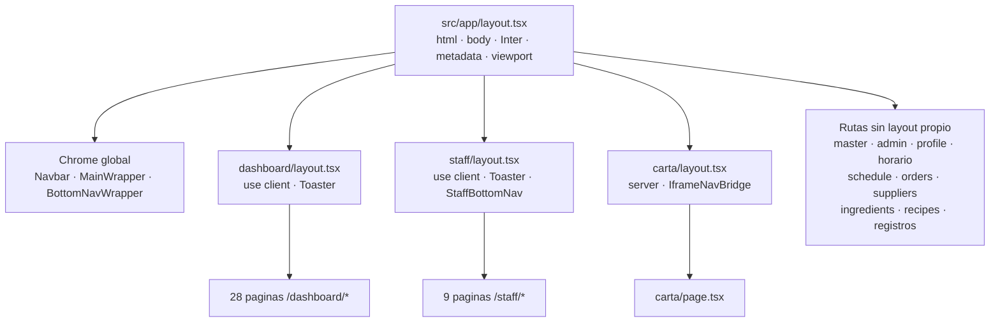
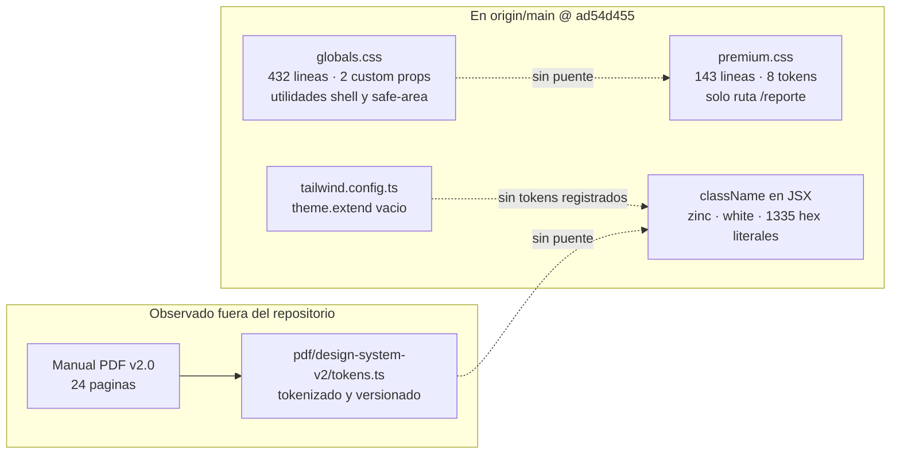

# CURRENT STATE — Radiografía del estado actual

> **Naturaleza de este documento.** Es descriptivo, no prescriptivo. No contiene propuestas, rediseños, refactors ni recomendaciones. Su única función es dejar constancia verificable de cómo está la aplicación hoy, para que las decisiones posteriores partan de hechos y no de impresiones.

| Campo | Valor |
|-------|-------|
| Fecha de la auditoría | 2026-07-28 |
| Rama auditada | `main` |
| Commit | `ad54d455205ba670a7d1e30b5aada24e65c6bd23` (2026-07-28 03:54:18 +0200) |
| Alcance | Arquitectura visual, sistema de diseño, componentes, tokens, patrones y documentación de UI |
| Método | Inspección directa del árbol de ficheros y conteos con `ripgrep`. Cada cifra de este documento es reproducible con los comandos del [Apéndice A](#apéndice-a--comandos-de-verificación) |
| Fuera de alcance | Lógica de negocio, esquema de base de datos, Hours Engine, pipeline de nóminas, Shadow Mode |

**Convención de evidencia.** Toda afirmación cuantitativa va acompañada del conteo obtenido. Toda afirmación cualitativa cita la ruta del archivo. Lo que no ha podido comprobarse aparece marcado literalmente como **no verificado** y se recoge además en el [Apéndice B](#apéndice-b--elementos-no-verificados).

---

## Aviso previo: discrepancia entre el entorno local y el repositorio

Durante la auditoría se detectó que cuatro artefactos relacionados con el sistema de diseño existen en el entorno de trabajo local pero **no están presentes en `origin/main`** en el commit auditado:

| Artefacto | Estado en `origin/main @ ad54d455` |
|-----------|-------------------------------------|
| `docs/design-system/README.md` | Ausente |
| `docs/design-system/Marbella-PDF-Design-System-v2.0.pdf` | Ausente |
| `src/lib/pdf/design-system-v2/` (kit completo de tokens) | Ausente |
| `.cursor/rules/pdf-design-system-v2.mdc` | Ausente |

`git log --all -- docs/design-system` no devuelve ningún commit, lo que confirma que estos archivos nunca se han versionado. `src/lib/pdf/` contiene únicamente `hidpi-render.ts` y `pavilion-crop.ts`. El color `#1F5FAF` del manual PDF aparece **0 veces** en `src/`.

Estos artefactos se documentan igualmente en la [sección 4](#4-sistema-de-diseño-actual) porque son directamente relevantes para el objeto de esta auditoría, pero se marcan de forma explícita como **contenido observado fuera del repositorio**. Ninguna afirmación sobre ellos es reproducible con el commit auditado.

---

## 1. Resumen ejecutivo

La aplicación es un sistema operativo táctil para hostelería construido sobre Next.js 16 App Router con React 19 y Tailwind CSS 3.4. Son 270 archivos `.tsx` y 312 `.ts` bajo `src/`, repartidos en 58 páginas, 4 layouts y 27 manejadores de ruta API, con 178 archivos de componentes organizados en 25 subcarpetas.

Los hechos estructurales que definen el estado actual del sistema visual son estos:

**No existe un sistema de diseño formalizado para la web.** `tailwind.config.ts` tiene `theme.extend` vacío, por lo que ningún color, espaciado, radio o tipografía del producto está registrado como token de Tailwind. La configuración se reduce a 14 líneas sin personalización de tema.

**shadcn/ui no está instalado.** No existe `components.json`, ni `class-variance-authority` ni `@radix-ui/*` figuran en `package.json`, y hay 0 usos de `cva(` en `src/`. Lo que ocupa `src/components/ui/` son 14 componentes propios de naturaleza heterogénea.

**Los tokens que existen son escasos y están aislados entre sí.** `globals.css` define 2 propiedades personalizadas, y solo dentro de un media query de escritorio. `src/app/reporte/premium.css` define 8 tokens que aplican exclusivamente a la ruta `/reporte`. No hay puente entre ambos conjuntos ni con Tailwind.

**El color se expresa como literales hexadecimales repartidos por el código.** Hay 1.335 literales hex en 179 archivos, además de 424 usos de `bg-[#`, 367 de `text-[#` y 166 de `border-[#`. El color dominante del producto, el petróleo `#36606F`, aparece 852 veces escrito a mano.

**El modo oscuro está configurado pero no existe.** `darkMode: "class"` está activo en la configuración y el layout raíz fija `<html className="light">`, mientras que las variantes `dark:` aparecen **0 veces** en los 585 archivos de `src/`.

**Hay patrones de UI muy consistentes que nunca se han encapsulado en componentes.** La tarjeta Bento (`rounded-xl` 916 usos, `shadow-sm` 338, `border-zinc-100` 323) se repite de forma reconocible en todo el producto, pero se escribe inline cada vez porque no existe un componente `Card`. Lo mismo ocurre con botones (1.012 `<button>` crudos), tablas (25 `<table>` sin abstracción común) y formularios (sin primitivas de campo).

**La convención de UI vive en reglas para agentes de IA, no en el código.** `.cursor/rules/BAR-LA-MARBELLA-AI-OPERATING-PROTOCOL.mdc` establece objetivos táctiles de 48px, retícula Bento, uso obligatorio de `cn()` y prohibición de estilos inline. En el código hay 94 usos de `style={{` y 36 objetivos táctiles de 44px, lo que indica que la regla no está mecanizada.

**Existe una pieza madura y bien especificada, pero es de PDF y está fuera del repositorio.** El PDF Design System v2.0 tiene manual editorial de 24 páginas, kit de tokens en TypeScript, regla de agente y script de previsualización. No está versionado y su paleta (`#1F5FAF`) no coincide con la de la web (`#36606F`).

---

## 2. Arquitectura visual existente

### 2.1 Cifras estructurales

| Elemento | Cantidad |
|----------|----------|
| `page.tsx` | 58 |
| `layout.tsx` | 4 |
| `route.ts` (API) | 27 |
| Route groups `(nombre)` | 0 |
| Parallel routes `@slot` | 0 |
| Intercepting routes | 0 |
| `template.tsx` / `default.tsx` | 0 |
| Páginas cliente (`'use client'`) | 26 |
| Páginas servidor | 32 |

### 2.2 Jerarquía de layouts

Solo el layout raíz define `<html>` y `<body>`. Los otros tres son envoltorios de segmento.

| Layout | `html`/`body` | Directiva | Qué aporta |
|--------|---------------|-----------|------------|
| `src/app/layout.tsx` | Sí | Server | Fuente Inter, `metadata`, `viewport`, y toda la cadena de providers y chrome global |
| `src/app/dashboard/layout.tsx` | No | `'use client'` | `<main className="w-full">` + `Toaster` de sonner |
| `src/app/staff/layout.tsx` | No | `'use client'` | `Toaster` + `StaffBottomNav`, con padding condicional según ruta |
| `src/app/carta/layout.tsx` | No | Server | `IframeNavBridge`, `dynamic = 'force-dynamic'`, `revalidate = 0` |

El layout raíz monta, en este orden: `UnreadNotificationsShell`, `SileoProvider`, `ServiceWorkerRegistration`, `ClientDisplayModeReporter`, `PushNotificationsPrompt`, `Navbar`, `MainWrapper`, `BottomNavWrapper`, `UsageAuthenticatedTracker` y `ChatMarbellaLazy`.



### 2.3 Sistema de navegación

La navegación global se compone de tres piezas montadas en el layout raíz, cada una con su propia lógica de visibilidad basada en `pathname`:

| Componente | Ruta | Comportamiento |
|------------|------|----------------|
| `Navbar` | `src/components/Navbar.tsx` | Barra superior. Oculta en `/login`, carta fullscreen y `/reporte` |
| `MainWrapper` | `src/components/MainWrapper.tsx` | Aplica padding de cabecera y pie según ruta |
| `BottomNavWrapper` | `src/components/BottomNavWrapper.tsx` | Portaliza la barra inferior en `document.body`. Excluye `/login`, carta fullscreen, `/staff/*` y `/reporte` |

Los helpers de visibilidad viven en `src/lib/carta-fullscreen-path.ts`: `isFullscreenCartaPath`, `isStaffShellPath`, `isAppShellScrollPage`, `isInternalScrollShellPath`.

`StaffBottomNav` (`src/components/StaffBottomNav.tsx`) se monta desde **dos puntos distintos**: a través de `BottomNavWrapper` para rutas fuera de `/staff/*`, y directamente desde `staff/layout.tsx` para las rutas `/staff/*` salvo `/staff/carta`.

La navegación contextual de segmento la cubren `DashboardSwitcher` (carrusel admin/master/staff, sin cambio de URL), `DashboardDetailLayout` (cabecera con botón de retroceso, usada en múltiples páginas de dashboard), `SubNavVentas` (pestañas en `/dashboard/sala` y `/dashboard/ventas`) y `TabBar` (pestañas locales de pabellón).

### 2.4 Control de acceso

No existe `middleware.ts`. El guard vive en `src/proxy.ts`, que exporta `proxy(request: NextRequest)` con un `config.matcher`. Su responsabilidad incluye bypass de `/api/*`, lista de rutas públicas (`/carta`, `/eventos`, `/pedido`, `/reporte`, `/propuestas`), redirección de `/staff` a `/staff/dashboard`, verificación de sesión, puertas por rol y tracking de uso.

El guard se duplica en las páginas: 20 archivos `page.tsx` contienen llamadas explícitas a `redirect()` como segunda barrera.

### 2.5 Estados de ruta y metadatos

| Archivo | Segmentos que lo tienen |
|---------|-------------------------|
| `error.tsx` | Raíz y `/staff` |
| `loading.tsx` | Solo raíz |
| `not-found.tsx` | Solo raíz |

`export const metadata` aparece en 2 ubicaciones: el layout raíz y `src/app/dashboard/insights/page.tsx`. No hay ningún uso de `generateMetadata` en todo `src/app/`. `export const viewport` existe únicamente en el layout raíz.

---

## 3. Componentes existentes

### 3.1 Distribución por subcarpeta

178 archivos en 25 subcarpetas más la raíz. 159 de los 175 archivos `.tsx` llevan `'use client'`.

| Subcarpeta | Archivos | Contenido |
|------------|----------|-----------|
| (raíz) | 28 | Chrome global, campanas, modales de caja, formularios de compra |
| `carta/` | 23 | Carta digital: grids, modales de edición, Plato Marbella |
| `tips/` | 14 | Propinas: dashboard, reparto, modales de desglose |
| `ui/` | 14 | Colección de primitivas y componentes de dominio |
| `pavilion/` | 12 | Pabellón: pestañas, actividades, visor PDF |
| `profile/` | 11 | Perfil: documentos, nóminas, condiciones laborales |
| `dashboards/` | 9 | Vistas de dashboard por rol y secciones |
| `modals/` | 9 | Modales de asistencia, exportación y selección |
| `kds/` | 7 | Kitchen Display System |
| `staff/` | 7 | Carta de personal, acordeón de menú |
| `ingredients/` | 5 | Wizard y edición de ingredientes |
| `usage/` | 6 | Analítica de uso interno |
| `web-analytics/` | 5 | Analítica web |
| `orders/` | 4 | Pedidos a proveedor |
| `reservas/` | 4 | Reservas y encargos |
| `schedule/` | 4 | Editor de horarios |
| `time/` | 3 | Filtro temporal |
| `albaranes/`, `chat/`, `dashboard/`, `eventos/`, `recipes/` | 2 c/u | Módulos menores |
| `cash-closing/`, `consumo-personal/`, `ledger/`, `public/` | 1 c/u | Módulos de un solo archivo |

### 3.2 Archivos de mayor tamaño

16 archivos `.tsx` superan las 1.000 líneas.

| Líneas | Archivo |
|--------|---------|
| 2.894 | `src/app/dashboard/history/page.tsx` |
| 2.139 | `src/app/dashboard/albaranes/AlbaranesHistoricoClient.tsx` |
| 1.860 | `src/components/staff/MenuAccordion.tsx` |
| 1.800 | `src/components/ingredients/IngredientWizard.tsx` |
| 1.747 | `src/app/recipes/[id]/page.tsx` |
| 1.711 | `src/app/dashboard/insights/InsightsClient.tsx` |
| 1.684 | `src/components/dashboards/StaffDashboardView.tsx` |
| 1.444 | `src/app/staff/reservas/ReservasClient.tsx` |
| 1.400 | `src/components/schedule/ScheduleDayEditor.tsx` |
| 1.319 | `src/app/dashboard/movements/page.tsx` |
| 1.205 | `src/components/dashboards/AdminDashboardView.tsx` |
| 1.194 | `src/components/ingredients/IngredientEditModal.tsx` |
| 1.187 | `src/app/dashboard/ventas/page.tsx` |

`src/types/supabase.ts` (4.412 líneas) y `src/app/dashboard/albaranes/actions.ts` (2.409) son mayores, pero no son componentes de interfaz.

### 3.3 Contenido de `src/components/ui/`

Los 14 archivos de esta carpeta son todos componentes cliente. Mezclan primitivas genéricas con componentes de dominio:

| Archivo | Líneas | Naturaleza |
|---------|--------|-----------|
| `modal.tsx` | 377 | Primitiva genérica |
| `LoadingSpinner.tsx` | 34 | Primitiva genérica |
| `Avatar.tsx` | 56 | Primitiva genérica |
| `ActionButton.tsx` | 40 | Primitiva genérica |
| `ImageLightbox.tsx` | 189 | Primitiva genérica |
| `PinchZoomViewport.tsx` | 247 | Primitiva genérica |
| `PullToRefresh.tsx` | 108 | Primitiva genérica |
| `ShrinkToFitCell.tsx` | 178 | Primitiva genérica |
| `PremiumCountUp.tsx` | 115 | Primitiva de presentación |
| `LiveClock.tsx` | 40 | Dominio |
| `WorkTimer.tsx` | 93 | Dominio (fichaje) |
| `RecipeCard.tsx` | 87 | Dominio (recetas) |
| `DenominationZoomModal.tsx` | 107 | Dominio (caja) |
| `QuickCalculatorModal.tsx` | 672 | Dominio (caja) |

No existen en esta carpeta `Button.tsx`, `Input.tsx`, `Select.tsx`, `Field.tsx`, `Card.tsx` ni `Table.tsx`.

### 3.4 Primitivas ausentes y su sustitución de facto

| Primitiva | Estado | Sustitución observada |
|-----------|--------|----------------------|
| Botón | `ActionButton.tsx` existe con **0 importaciones** en todo `src/` | 1.012 `<button>` crudos con clases inline |
| Tarjeta | No existe | Cadena de clases repetida inline |
| Tabla | No existe | 25 `<table>` HTML nativos en 18 archivos |
| Campo de formulario | No existe | 272 `<input>`, 58 `<select>`, 7 `<textarea>` sueltos |
| Modal | `src/components/ui/modal.tsx` existe y **se usa en 25 archivos** | Conviven 58 archivos `*Modal*.tsx` y 120 `fixed inset-0` |

### 3.5 Formularios

Solo hay 7 elementos `<form>` en todo el proyecto, en `src/app/login/page.tsx`, `src/app/reporte/page.tsx`, `src/components/ChangePasswordModal.tsx`, `src/components/EditProfileModal.tsx`, `src/components/ledger/ManagerLedgerView.tsx`, `src/components/usage/UsageFilters.tsx` y `src/components/web-analytics/WebAnalyticsFilters.tsx`.

No hay librería de formularios: `react-hook-form` y `@hookform/resolvers` no figuran en `package.json`. No se usa `useActionState` ni `useFormStatus`. El patrón dominante es estado controlado con `useState` y manejadores `onClick`, sin elemento `<form>` envolvente.

### 3.6 Tablas

25 elementos `<table>` distribuidos en 18 archivos. Los que más concentran son `src/app/dashboard/ventas/page.tsx` (4), `src/app/dashboard/history/page.tsx` (2), `src/app/dashboard/movements/page.tsx` (2) y `src/components/dashboards/DashboardVentasSection.tsx` (2). No hay ningún uso de `role="table"` y no existe componente compartido de tabla.

En paralelo hay 295 usos de `grid-cols-*`, que cubren tanto maquetación general como estructuras pseudo-tabulares.

### 3.7 Gráficos

`recharts` (`^2.15.4`) está declarado en `package.json` y se importa desde **un único archivo**: `src/app/dashboard/insights/InsightsClient.tsx`, que usa `Bar`, `BarChart`, `Cell`, `ComposedChart`, `Line`, `ResponsiveContainer`, `Tooltip`, `XAxis` e `YAxis`. El resto de visualizaciones del producto no usan librería de gráficos.

### 3.8 Gestión de estado

| Mecanismo | Alcance |
|-----------|---------|
| `useState` | Patrón dominante en todo el árbol de componentes |
| Zustand (`src/store/aiStore.ts`) | 2 consumidores: `Navbar.tsx` y `chat/ChatMarbella.tsx` |
| Context (`src/contexts/UnreadNotificationsContext.tsx`) | 4 consumidores |

### 3.9 Componentes con propósito solapado

Se registran como observación factual, sin juicio:

| Grupo | Archivos | Líneas |
|-------|----------|--------|
| Editores de carta de personal | `staff/StaffCartaEditor.tsx`, `staff/StaffCartaInlineEditor.tsx`, `staff/StaffCartaView.tsx` | 624 / 636 / 123 |
| Lightbox de imagen | `ui/ImageLightbox.tsx`, `carta/CartaImageLightbox.tsx` | 189 / 44 |
| Modales de nóminas | `NominasModal.tsx`, `profile/NominasMenuModal.tsx` | 276 / 50 |
| Carpetas de nombre casi idéntico | `components/dashboard/` (2 archivos, layout) y `components/dashboards/` (9 archivos, vistas) | — |

---

## 4. Sistema de diseño actual

### 4.1 Mapa de sistemas coexistentes

Hay tres sistemas de estilo que operan en paralelo sin conexión entre ellos. Solo los dos primeros están en el repositorio.



### 4.2 Tailwind

`tailwind.config.ts` son 14 líneas. Declara `darkMode: "class"`, tres rutas de contenido y nada más: `theme.extend` es un objeto vacío y `plugins` un array vacío. La versión declarada es `^3.4.1` y la instalada es 3.4.1.

`postcss.config.mjs` carga únicamente `tailwindcss` y `autoprefixer`.

Consecuencia comprobable: ningún color, tamaño, radio, sombra o fuente del producto está registrado como token de Tailwind. Todo lo que no sea la escala por defecto de Tailwind 3.4 se expresa como valor arbitrario en el JSX.

### 4.3 shadcn/ui

No está instalado. La comprobación es concluyente en cuatro frentes: no existe `components.json`; `class-variance-authority` y `@radix-ui/*` no figuran en `package.json`; hay 0 coincidencias de `cva(` o `@radix-ui` en `src/`; y `src/components/ui/` contiene componentes propios, no primitivas shadcn.

Existe un rastro de un intento anterior: `src/app/dashboard/import/page.tsx` conserva en sus primeras líneas imports comentados de `Button`, `Card` y `Alert` de shadcn.

### 4.4 Modo oscuro

Está configurado pero no implementado. `darkMode: "class"` está activo en la configuración, el layout raíz fija `<html lang="es" className="light">`, y las variantes `dark:` aparecen **0 veces** en los 585 archivos de `src/`. No hay `next-themes`, ni provider de tema, ni ningún código que alterne la clase `dark` o lea una preferencia almacenada.

La única aparición de `[color-scheme:dark]` está en `PurchaseMultiSourceForm.tsx` y afecta al selector nativo de fecha, no al tema de la aplicación.

### 4.5 Tipografía

Tres familias se cargan mediante `next/font/google`, cada una desde un punto distinto:

| Familia | Punto de carga | Alcance |
|---------|----------------|---------|
| Inter | `src/app/layout.tsx` | Global, vía `inter.className` en `<body>` |
| Teko 700 | `src/lib/fonts/kds-mesa-number.ts` | Número de mesa en KDS. Define la variable CSS `--font-kds-mesa-number`, que no se aplica en ningún layout |
| Share Tech Mono | `src/components/ui/WorkTimer.tsx` | Cronómetro de fichaje |

Una cuarta familia, Outfit, se carga por `@import url(...)` de Google Fonts desde `src/app/reporte/premium.css`, es decir, en tiempo de ejecución y solo para la ruta `/reporte`.

El README del proyecto menciona la fuente Geist en su texto heredado de `create-next-app`; Geist aparece **0 veces** en `src/`.

### 4.6 Iconografía

`lucide-react` (`^0.563.0`) se importa en 154 archivos y es la única familia de iconos del producto. No hay `react-icons` ni imports de `.svg` como componente. `next.config.ts` incluye `lucide-react` en `experimental.optimizePackageImports`.

Existe uso puntual de emoji como elemento de interfaz en `staff/history/page.tsx`, `recipes/import/page.tsx` y en textos de notificaciones push.

### 4.7 PDF Design System v2.0 — contenido observado fuera del repositorio

> Todo lo de esta subsección procede del entorno de trabajo local. **No es reproducible con el commit auditado.**

Es el único sistema del ecosistema con manual, tokens tipados, regla de agente y script de previsualización. El manual tiene 24 páginas organizadas en cuatro bloques: fundamentos, estructura, componentes y aplicación.

Fundamentos declarados en el manual:

| Aspecto | Especificación |
|---------|----------------|
| Principio rector | «Claridad antes que decoración». Cada documento debe leerse en menos de 30 segundos |
| Paleta | Azul corporativo `#1F5FAF`, azul claro `#4F8EDC`, gris oscuro `#2F3A45`, gris medio `#6B7280`, gris claro `#D9E2EC`, blanco `#FFFFFF` |
| Regla de color | El azul corporativo nunca supera el 10% de la superficie de una página |
| Proporción declarada | 62% blanco, 22% gris claro, 9% y 7% para el resto |
| Tipografía | Inter, familia única. Cinco niveles de jerarquía como máximo |
| Escala | 28 pt título principal, 18 pt título de sección, 14 pt subtítulo, 10 pt párrafo |
| Espaciado | Unidad base de 8 pt. Escala 8/12/16/24/32/48/64 |
| Retícula | A4 vertical, 12 columnas, gutter 16 pt, márgenes 36/32 pt, ancho de texto máximo 8 columnas |
| Iconografía | 32 símbolos lineales, grid 24×24 pt, trazo 1,6 pt, esquinas redondeadas |

El manual especifica además componentes editoriales: tarjetas KPI (con ocho variantes y la regla de «un único mensaje por tarjeta»), tablas (cabecera con contraste, filas alternadas, cifras a la derecha, fila de totales con regla superior), gráficos, alertas en cuatro tipos y dos tamaños, checklists en tres formatos, líneas temporales y directrices de fotografía. Cierra con ocho buenas prácticas, seis errores comunes y una checklist final de publicación.

El kit TypeScript replicaba estos valores en `DS_COLORS`, `DS_TYPE`, `DS_SPACE`, `DS_PAGE` y `DS_COMPANY`, con archivos separados para geometría (`layout.ts`), cabecera y pie (`chrome.ts`), componentes (`components.ts`) y fábrica de documento (`create-document.ts`).

El `README.md` de la carpeta registraba el estado de migración por documento: jornada y encargos migrados a v2, pedido a proveedor marcado como «Legacy confirmado (DS v2 rechazado)».

**Relación con la web: ninguna.** El azul del manual, `#1F5FAF`, aparece 0 veces en `src/`. El azul que usa la web es otro.

---

## 5. Tokens encontrados

### 5.1 Tokens declarados como propiedades CSS

Es el inventario completo. Son diez en total.

**En `src/app/globals.css`** — dos, y únicamente dentro de un `@media (min-width: 1024px)`, en el selector `.month-cal-shell`:

| Token | Valor |
|-------|-------|
| `--marbella-cal-header` | `calc(3.5rem + env(safe-area-inset-top, 0px))` |
| `--marbella-cal-bottom` | `calc(5rem + env(safe-area-inset-bottom, 0px))` |

No existe bloque `:root` ni `.dark` en ningún archivo CSS del proyecto.

**En `src/app/reporte/premium.css`** — ocho, bajo el selector `.reporte-container`, con alcance limitado a la ruta `/reporte`:

| Token | Valor |
|-------|-------|
| `--primary` | `#6366f1` |
| `--primary-hover` | `#4f46e5` |
| `--bg` | `#0f172a` |
| `--card-bg` | `rgba(30, 41, 59, 0.7)` |
| `--card-border` | `rgba(255, 255, 255, 0.1)` |
| `--text-main` | `#f8fafc` |
| `--text-muted` | `#94a3b8` |
| `--accent` | `#22d3ee` |

Este archivo aplica además `background: #0f172a !important` al `body` mediante `body:has(.reporte-container)`, lo que convierte `/reporte` en la única pantalla oscura del producto.

### 5.2 Utilidades personalizadas de `globals.css`

`globals.css` tiene 432 líneas. Trece utilidades definidas en `@layer utilities` funcionan como tokens de facto para el shell y las áreas seguras:

| Utilidad | Función |
|----------|---------|
| `.bg-marbella-shell` | Fondo de aplicación: `#5b8fb9` con degradados de `#46769c`, `#4f84ab`, `#68a0c7` y `#7eb0d4`, `background-attachment: fixed` |
| `.pt-safe`, `.pb-safe` | Padding de área segura |
| `.h-header-safe`, `.mt-header-safe`, `.pt-header-safe`, `.top-header-safe` | Altura de cabecera fija en `calc(3.5rem + env(safe-area-inset-top))` |
| `.carta-modal-shell-max`, `.carta-plato-modal-shell` | Altura de modal de carta con `94svh` y áreas seguras |
| `.scroll-end-touch`, `.scroll-end-touch-cards` | Hueco al final de listas táctiles: `+6rem` y `+15rem` |
| `.scroll-pb-end`, `.scroll-pb-end-cards` | `scroll-padding-bottom` equivalente |

El mismo archivo contiene un bloque de layout de calendario para escritorio (11 clases `.month-cal-*` y 8 clases `.day-modal-*`), una animación `animate-spinner-fade`, reglas de impresión (`@page` con margen 15mm), y sobrescrituras del widget de chat n8n con los colores `#f8fafc`, `#f1f5f9` y `#3F5E7A`.

### 5.3 Paleta de facto

Ningún color del producto está tokenizado. Los que funcionan como colores de marca aparecen escritos a mano:

| Color | Ocurrencias en `src/` | Rol observado |
|-------|----------------------|---------------|
| `#36606F` | 852 | Petróleo. Cabeceras y superficies de acento |
| `#5B8FB9` / `#5b8fb9` | 100 + 3 = 103 | Azul Marbella. Fondo de aplicación |
| `#5E35B1` | 25 | Púrpura. Variante `primary` de `ActionButton` |
| `#407080` | 9 | Petróleo secundario. KDS y calculadora |
| `#1F5FAF` | 0 | Azul del manual PDF. Ausente de la web |

Volumen total de color no tokenizado:

| Métrica | Valor |
|---------|-------|
| Literales hexadecimales en `.tsx`/`.ts` | 1.335 |
| Archivos que contienen literales hex | 179 |
| `bg-[#` | 424 |
| `text-[#` | 367 |
| `border-[#` | 166 |

Clases de paleta estándar de Tailwind más frecuentes:

| Clase | Usos |
|-------|------|
| `bg-white` | 1.085 |
| `text-white` | 936 |
| `text-zinc-400` | 399 |
| `border-zinc-200` | 354 |
| `bg-zinc-50` | 350 |
| `border-zinc-100` | 323 |
| `text-zinc-500` | 314 |
| `text-zinc-900` | 232 |
| `text-gray-400` | 178 |

La familia `zinc` y la familia `gray` conviven.

### 5.4 Escala tipográfica de facto

| Clase Tailwind | Usos |
|----------------|------|
| `text-sm` | 594 |
| `text-xs` | 492 |
| `text-lg` | 94 |
| `text-base` | 79 |
| `text-xl` | 53 |
| `text-2xl` | 36 |
| `text-3xl` | 27 |

En paralelo existe una escala arbitraria en píxeles cuyo volumen supera al de los tamaños pequeños de Tailwind:

| Clase arbitraria | Usos |
|------------------|------|
| `text-[10px]` | 658 |
| `text-[9px]` | 275 |
| `text-[11px]` | 266 |
| `text-[8px]` | 163 |
| `text-[7px]` | 112 |
| `text-[12px]` | 59 |

Suman 1.533 usos de micro-tipografía definida fuera de la escala.

Distribución de pesos:

| Peso | Usos |
|------|------|
| `font-black` | 1.453 |
| `font-bold` | 655 |
| `font-semibold` | 223 |
| `font-medium` | 115 |
| `font-normal` | 19 |
| `font-extrabold` | 4 |
| `font-light` | 1 |

`font-black` (900) es, con diferencia, el peso dominante del producto.

### 5.5 Radio, sombra y espaciado de facto

| Radio | Usos | | Sombra | Usos | | Espaciado | Usos |
|-------|------|---|--------|------|---|-----------|------|
| `rounded-xl` | 916 | | `shadow-sm` | 338 | | `gap-2` | 544 |
| `rounded-2xl` | 395 | | `shadow-2xl` | 131 | | `gap-1` | 348 |
| `rounded-full` | 212 | | `shadow-md` | 88 | | `p-4` | 335 |
| `rounded-lg` | 209 | | `shadow-lg` | 78 | | `gap-3` | 248 |
| `rounded-md` | 42 | | `shadow-xl` | 50 | | `p-3` | 191 |

### 5.6 Breakpoints

| Prefijo | Usos |
|---------|------|
| `md:` | 1.122 |
| `sm:` | 773 |
| `lg:` | 213 |
| `xl:` | 13 |
| `2xl:` | 0 |

---

## 6. Patrones de UI identificados

Los patrones que siguen se han identificado por repetición estadística en el código, no por estar declarados en ninguna especificación.

### 6.1 Tarjeta Bento

Es el patrón visual más consistente del producto. La combinación `bg-white` + `rounded-xl` + `shadow-sm` + `border-zinc-100` se repite de forma reconocible en dashboards, listados, paneles y secciones.

Ejemplos verbatim:

- `src/app/dashboard/eventos/page.tsx` — `className="rounded-xl border border-zinc-100 bg-white p-4 shadow-sm"`
- `src/components/web-analytics/WebAnalyticsKpis.tsx` — `className="rounded-xl border border-zinc-100 bg-white p-4 shadow-sm"`
- `src/components/dashboards/DashboardVentasSection.tsx` — `className="bg-white rounded-xl shadow-sm border border-zinc-100 overflow-hidden ..."`
- `src/app/admin/mapeo/MapeoClient.tsx` — `className="bg-white rounded-xl shadow-sm border border-zinc-100 overflow-hidden min-h-[400px]"`

El patrón está descrito en `.cursor/rules/BAR-LA-MARBELLA-AI-OPERATING-PROTOCOL.mdc` como «LAYOUT: Use "Bento Grid" (rounded-xl, shadow-sm, border-zinc-100)». No tiene componente que lo encapsule.

### 6.2 Cabecera petróleo sobre panel blanco

Contenedor blanco redondeado sobre fondo azul de aplicación, con cabecera en petróleo `#36606F`. Es el patrón de página del área administrativa, implementado en `src/components/dashboard/DashboardDetailLayout.tsx` (66 líneas) y replicado manualmente en otras pantallas. `src/components/ui/modal.tsx` expone una prop `headerVariant: 'white' | 'petroleum'` que traslada el mismo patrón a los modales.

### 6.3 Modal centrado con portal y bloqueo de scroll

`src/components/ui/modal.tsx` (377 líneas) implementa portal a `document.body`, backdrop `bg-black/40 backdrop-blur-sm`, centrado con `fixed inset-0 flex items-center justify-center`, ancho `max-w-sm` por defecto, altura `max-h-[calc(100dvh-2rem)]`, cierre por clic fuera y tracking de uso. Se usa en 25 archivos.

El patrón está normado en `.cursor/rules/modals.mdc`, con globs `components/**/*modal*.tsx`, `components/ui/modal.tsx` y `**/*Modal*.tsx`. La regla prohíbe explícitamente los bottom sheets con `items-end` salvo requisito documentado, los overlays ad hoc sin scroll-lock ni tracking, y duplicar portal o scroll-lock fuera de `Modal`.

En el código conviven 58 archivos `*Modal*.tsx`, 120 usos de `fixed inset-0`, 25 archivos con `createPortal` y 29 usos de `role="dialog"`.

### 6.4 Objetivo táctil de 48 píxeles

El producto está diseñado para uso táctil en barra. La regla de agente exige «TOUCH FIRST: All interactive elements must be min-height 48px».

| Expresión | Usos |
|-----------|------|
| `min-h-12` | 339 |
| `min-h-[48px]` | 322 |
| `min-h-[44px]` | 36 (en 13 archivos) |

Las dos primeras son equivalentes (`12 × 0.25rem = 3rem = 48px`) y suman 661 usos.

### 6.5 Adaptación a PWA y áreas seguras

El producto se instala como PWA y el CSS lo refleja: uso sistemático de `env(safe-area-inset-*)`, unidades `svh` en lugar de `vh` para modales de carta (con comentario explícito sobre el comportamiento de `dvh` en iOS/Android), altura de cabecera calculada, huecos de final de scroll y `.marbella-fixed-bottombar` con `translate3d`. Hay además una regla que difumina las barras fijas cuando hay un modal abierto: `html[data-modal-open="true"] .marbella-fixed-topbar/bottombar { filter: blur(6px); opacity: 0.35 }`.

`src/components/ui/PullToRefresh.tsx` implementa el gesto de recarga, montado desde `MainWrapper`.

### 6.6 Contador animado para KPI

`src/components/ui/PremiumCountUp.tsx` (115 líneas) anima valores numéricos con ease-out. Se usa en `DashboardVentasSection` (total, neto, ticket medio) y en `MasterShortcutGrid` (balance de tesorería). Otros KPI del producto no lo usan: `WebAnalyticsKpis` define un `KpiCell` local y `InsightsClient` pinta KPIs inline.

### 6.7 Texto que se encoge para caber

`src/components/ui/ShrinkToFitCell.tsx` exporta `ShrinkToFitText` y `ShrinkToFitInput`, que reducen el tamaño de fuente mediante `ResizeObserver` para que el contenido quepa en celdas estrechas. Es el mecanismo que sostiene las rejillas densas de horarios y asistencia.

### 6.8 Zero-Display

Regla de producto declarada tanto en `.cursor/rules/BAR-LA-MARBELLA-AI-OPERATING-PROTOCOL.mdc` como en `PROJECT_STATUS.md`: en vistas de lectura, no de formulario, cualquier valor igual a 0 debe mostrarse como espacio vacío.

La regla está mecanizada en un helper. `src/lib/utils.ts` exporta `formatDisplayValue`, documentado con el comentario «Cumple con la REGLA ZERO-DISPLAY del protocolo»:

```ts
export function formatDisplayValue(value: string | number): string | number {
    if (value === 0 || value === "0") return " ";
    if (typeof value === 'number' && Math.abs(value) < 0.1) return " ";
    return value;
}
```

Su adopción es marginal: `formatDisplayValue` aparece 6 veces en 2 archivos, y uno de ellos es su propia definición. El único consumidor es `src/app/dashboard/insights/InsightsClient.tsx`. Si el resto de pantallas aplica la regla con lógica propia o no la aplica es **no verificado**, y determinarlo requiere análisis semántico pantalla por pantalla.

### 6.9 UI que pinta y no calcula

`docs/ADR-HE-SSOT-001.md` establece la separación entre dominio y presentación con formulaciones explícitas: «UI (React) — pinta; no interpreta», «React nunca calcula negocio», «React solo pinta DTOs finales», «Ningún DTO enriquece calculando `extras = max(0, hours - contract)` en capa UI». Es la única regla arquitectónica de UI formalizada como ADR en el repositorio.

### 6.10 Feedback y notificaciones

`sonner` se importa en 88 archivos y hay 10 montajes de `<Toaster>` repartidos por el árbol, además de los que instalan `dashboard/layout.tsx` y `staff/layout.tsx`. En paralelo, `sileo` está declarado en `package.json` y `SileoProvider` se monta en el layout raíz.

---

## 7. Inconsistencias detectadas

Se enumeran como constataciones. No se propone solución para ninguna.

**7.1 — Dos azules corporativos incompatibles.** El manual PDF define el azul de marca como `#1F5FAF`. La web usa `#5B8FB9` como fondo y `#36606F` como color de acento. `#1F5FAF` aparece 0 veces en `src/`.

**7.2 — Tres sistemas de estilo sin puente.** Tailwind sin tokens, `globals.css` con utilidades de shell, y `premium.css` con su propio conjunto de variables. Ningún valor se comparte entre ellos.

**7.3 — Modo oscuro configurado y muerto.** `darkMode: "class"` activo, `<html className="light">` fijo, 0 variantes `dark:`.

**7.4 — Objetivo táctil con dos valores.** Conviven 661 usos de 48px con 36 usos de `min-h-[44px]` en 13 archivos, frente a una regla que fija 48px como mínimo.

**7.5 — Prohibición de estilos inline con 94 excepciones.** La regla dice «Never use inline CSS styles (always Tailwind)». Hay 94 usos de `style={{`, concentrados en `tips/TipsDashboardView.tsx` (22), `pavilion/ActivitiesTab.tsx` (7), `staff/actividades/gestion/page.tsx` (6) y `horario/page.tsx` (6).

**7.6 — Dos familias de gris.** `zinc` es la dominante, pero `gray` mantiene presencia significativa (`text-gray-400` con 178 usos, entre otras).

**7.7 — Componente de botón existente y sin usar.** `src/components/ui/ActionButton.tsx` no tiene ninguna importación en `src/`. En paralelo hay 1.012 `<button>` crudos.

**7.8 — Carpetas de nombre casi idéntico.** `src/components/dashboard/` (2 archivos, layout) y `src/components/dashboards/` (9 archivos, vistas).

**7.9 — Tres editores de carta de personal solapados.** `StaffCartaEditor.tsx` (624), `StaffCartaInlineEditor.tsx` (636) y `StaffCartaView.tsx` (123).

**7.10 — Estándar de modal parcialmente adoptado.** El primitivo se usa en 25 archivos, pero hay 58 archivos `*Modal*.tsx` y 120 usos de `fixed inset-0`.

**7.11 — Metadatos en 2 de 58 rutas.** Solo el layout raíz y `/dashboard/insights` exportan `metadata`. No hay ningún `generateMetadata`.

**7.12 — Estados de ruta solo en la raíz.** `loading.tsx` y `not-found.tsx` existen únicamente en el segmento raíz; `error.tsx` en raíz y `/staff`. Los 56 segmentos restantes no tienen estados propios.

**7.13 — Barra inferior montada desde dos puntos.** `StaffBottomNav` se monta a través de `BottomNavWrapper` y directamente desde `staff/layout.tsx`, con la coordinación resuelta mediante comprobaciones de `pathname`.

**7.14 — Variable de fuente declarada y no aplicada.** `src/lib/fonts/kds-mesa-number.ts` define `--font-kds-mesa-number`, que no se aplica en ningún layout.

**7.15 — Fuente cargada en tiempo de ejecución.** `premium.css` importa Outfit con `@import url(...)` de Google Fonts, fuera del mecanismo `next/font` que usa el resto del producto.

**7.16 — Escala tipográfica duplicada.** 1.375 usos de la escala Tailwind conviven con 1.533 usos de micro-tipografía arbitraria en píxeles de 7 a 12.

**7.17 — Doble capa de guard.** El control de acceso vive en `src/proxy.ts` y se repite con `redirect()` en 20 archivos `page.tsx`.

**7.18 — Rastro de shadcn eliminado.** `src/app/dashboard/import/page.tsx` conserva imports comentados de `Button`, `Card` y `Alert`.

**7.19 — Design system fuera del control de versiones.** El artefacto de diseño más maduro del ecosistema no está en el repositorio ni en su historial.

**7.20 — Helper de Zero-Display prácticamente sin adoptar.** `formatDisplayValue` existe en `src/lib/utils.ts` y está documentado como implementación de la regla, pero solo lo consume un archivo: `src/app/dashboard/insights/InsightsClient.tsx`. La regla es normativa en dos documentos y su mecanización cubre una pantalla.

---

## 8. Convenciones existentes

### 8.1 Convenciones escritas

| Fuente | Alcance | Contenido |
|--------|---------|-----------|
| `.cursor/rules/BAR-LA-MARBELLA-AI-OPERATING-PROTOCOL.mdc` | `alwaysApply: true` | Matriz de ocho perfiles. El perfil `arquitecto-ui-kiosco` fija: estilo «Apple Human Interface for Hospitality», objetivos táctiles de 48px, retícula Bento, Tailwind exclusivo, `cn()` obligatorio, `shrink-0` en botoneras y `flex-1` en contenido elástico, y construcción de fechas inmune a zona horaria |
| `.cursor/rules/modals.mdc` | Globs de modales | Tabla de requisitos visuales y lista de prohibiciones para modales |
| `context/LLM_PROMPT.md` | Documento operativo | Sección «UX táctil»: targets ≥48px, Bento, `shrink-0`/`flex-1`. Sección «Zero-Display» |
| `docs/ADR-HE-SSOT-001.md` | ADR congelado | Separación dominio/presentación: la UI pinta, no calcula |
| `docs/PLAN_ASISTENCIA_UNIFICADA.md` | Pantalla de asistencia | Especificación visual concreta: tarjeta `rounded-2xl shadow-xl` sobre `#5B8FB9`, cabecera `#36606F`, celdas `min-h-[85px]`, cabecera de días con `bg-gradient-to-b from-red-500 to-red-600` |
| `PROJECT_STATUS.md` | Changelog | 1.264 líneas, 4 encabezados. Registro cronológico donde constan decisiones visuales puntuales y la nota «Primary Color: #5B8FB9 (Azul Marbella)» |

Formato ADR observado en `ADR-HE-SSOT-001.md`: título con identificador, tabla de metadatos (Estado, Fecha, Skills, Alcance), secciones numeradas como `# PUNTO N`, tablas de invariantes y prohibiciones, y bloques finales `## Resolución` y `## Estado del documento`. No existe plantilla ADR separada en el repositorio.

No existen `RFC`, guía de estilo web, `CONTRIBUTING.md` ni plantilla de commit.

### 8.2 Convenciones de facto en el código

| Convención | Evidencia |
|------------|-----------|
| `cn()` de `@/lib/utils` para componer clases | 161 archivos importan de `@/lib/utils`. `clsx` y `tailwind-merge` solo se usan dentro de `src/lib/utils.ts` |
| Componentes cliente por defecto | 159 de 175 archivos `.tsx` en `src/components/` llevan `'use client'` |
| Nomenclatura PascalCase para componentes, sufijo `Modal`, `View`, `Client` o `Panel` según rol | Observable en todo el árbol |
| Alias de import `@/` | Definido en `tsconfig.json` con `@/*` → `./src/*` y `@components/*` → `./src/components/*` |
| Server Actions por feature en archivos `actions.ts` | Presentes en múltiples subcarpetas de `src/app/` |
| Guard de rutas en `src/proxy.ts` en lugar de `middleware.ts` | Convención propia del proyecto |

### 8.3 Convenciones de tooling

`eslint.config.mjs` extiende únicamente `eslint-config-next/core-web-vitals` y `eslint-config-next/typescript`. No hay reglas personalizadas de estilo, Tailwind ni accesibilidad.

`tsconfig.json` tiene `strict: true`.

`next.config.ts` declara `experimental.optimizePackageImports` para `lucide-react` y `date-fns`, `serverActions.bodySizeLimit: "12mb"` y un patrón remoto de imágenes para `**.supabase.co`.

`vercel.json` contiene solo definiciones de cron. `.githooks/pre-commit` sincroniza `context/LLM_PROMPT.md` cuando cambia `PROJECT_STATUS.md`.

### 8.4 Convenciones de commit

`git log` muestra tres estilos conviviendo: imperativo en inglés (`Fix AdminDashboardView JSX ternary that broke the Vercel build`), prefijos convencionales (`feat(ui):`, `fix(shadow):`, `docs:`) y descriptivo en español (`UI: etiquetas en botones de caja`). Hay también mensajes de una sola palabra sin significado externo.

---

## 9. Deuda visual

Se cuantifica lo observable. No se propone remediación.

**9.1 — Color no tokenizado.** 1.335 literales hexadecimales en 179 archivos, más 957 usos de valores arbitrarios en clases (`bg-[#` 424, `text-[#` 367, `border-[#` 166). Cambiar el petróleo de marca implica tocar 852 ocurrencias.

**9.2 — Componentes monolíticos.** 16 archivos `.tsx` superan las 1.000 líneas. El mayor es `src/app/dashboard/history/page.tsx` con 2.894.

**9.3 — Patrones repetidos sin encapsular.** El patrón de tarjeta se escribe inline cada vez. Los botones se estilan inline 1.012 veces. Las tablas se construyen desde cero 25 veces.

**9.4 — Overlays duplicados.** 120 usos de `fixed inset-0` frente a 25 consumidores del primitivo `Modal`.

**9.5 — Micro-tipografía fuera de escala.** 1.533 usos de tamaños arbitrarios entre 7px y 12px. El más frecuente, `text-[10px]`, con 658 usos, supera a cualquier tamaño nombrado salvo `text-sm` y `text-xs`.

**9.6 — Peso tipográfico saturado.** `font-black` con 1.453 usos frente a 19 de `font-normal`. La jerarquía por peso tiene poco recorrido efectivo cuando el peso base ya es 900.

**9.7 — Segundo sistema de tema para una sola ruta.** `premium.css` mantiene 143 líneas, 8 tokens, 4 keyframes, su propia familia tipográfica cargada en runtime y una sobrescritura de `body` con `!important`, todo para `/reporte`.

**9.8 — Configuración de tema declarada y no usada.** `darkMode: "class"` sin ninguna variante `dark:`.

**9.9 — Componente muerto.** `ActionButton.tsx` sin consumidores.

**9.10 — Accesibilidad sin verificación mecanizada.** Existen 520 atributos `aria-*`, 97 `role=`, 120 `alt=`, 40 `onKeyDown`, 14 `tabIndex` y 7 `sr-only`, pero no hay reglas de linting de accesibilidad ni tests. La cobertura real es **no verificada**.

**9.11 — Artefactos sueltos en la raíz del repositorio.** `yesterday_dashboard.tsx` (118 KB), `roll-drap-negro.png` (106 KB), `youtube.png` (103 KB), `Nuevo Documento de texto.txt` (0 bytes) y una veintena de scripts de depuración sueltos (`test.js`, `debug_db.js`, `check_rls.mjs`, entre otros).

**9.12 — README genérico.** `README.md` conserva el texto de `create-next-app`, incluida la mención a la fuente Geist que no se usa, con secciones añadidas sobre STT y voz. No describe la arquitectura ni las convenciones del producto.

---

## 10. Elementos suficientemente maduros

Se listan por evidencia de adopción y estabilidad, sin emitir recomendación sobre su futuro.

**10.1 — El primitivo `Modal`.** Es el único componente del proyecto con las tres condiciones de un estándar: implementación completa (portal, backdrop, bloqueo de scroll, tracking, variantes de cabecera), adopción real (25 archivos) y norma escrita que lo respalda (`.cursor/rules/modals.mdc`).

**10.2 — La utilidad `cn()`.** 161 archivos la importan. `clsx` y `tailwind-merge` no se usan directamente en ningún otro punto. La convención está efectivamente cerrada.

**10.3 — El patrón de tarjeta Bento.** Aunque no exista componente, el patrón está descrito en la regla de agente y se aplica de forma consistente. La combinación `rounded-xl` + `shadow-sm` + `border-zinc-100` es reconocible como lenguaje visual del producto.

**10.4 — El objetivo táctil de 48 píxeles.** 661 usos consistentes, respaldados por dos documentos normativos. Las 36 desviaciones de 44px son la excepción.

**10.5 — `lucide-react` como familia única.** 154 archivos, sin ninguna familia de iconos competidora, y optimización de bundle ya configurada en `next.config.ts`.

**10.6 — Inter como tipografía de aplicación.** Cargada con `next/font/google` en el layout raíz y aplicada globalmente. Las otras familias tienen alcances acotados y justificados por dominio.

**10.7 — La adaptación a PWA y áreas seguras.** Las trece utilidades de `globals.css` resuelven de forma sistemática un problema real y recurrente (notch, barras del sistema, comportamiento de `dvh` en iOS). Están comentadas explicando el porqué.

**10.8 — La separación «UI pinta, no calcula».** Formalizada como ADR, con invariantes enumerados y prohibiciones explícitas. Es la regla arquitectónica de UI más madura del repositorio.

**10.9 — El PDF Design System v2.0.** Reúne manual editorial, tokens tipados, regla de agente, script de previsualización y registro de estado de migración por documento. Es el artefacto de diseño más completo del ecosistema. Su madurez está condicionada por no estar versionado.

---

## 11. Áreas sin especificación formal

Se enumeran las áreas donde no existe documento, token ni componente que fije el criterio. La ausencia se ha comprobado; su tratamiento queda fuera del alcance de este documento.

| Área | Estado |
|------|--------|
| **Botones** | Sin especificación, sin componente en uso, sin variantes definidas. 1.012 instancias estiladas individualmente |
| **Campos de formulario** | Sin componentes `Input`, `Select`, `Textarea`, `Label`, `Field` ni `FormError`. Sin librería de formularios. Sin criterio de validación ni de presentación de errores |
| **Tablas** | Sin componente, sin especificación de cabecera, alineación, filas alternadas, totales, ordenación, paginación ni comportamiento responsive. El manual PDF sí las especifica, pero solo para PDF |
| **Paleta web** | Sin tokens. Sin roles semánticos definidos (primario, superficie, borde, texto, éxito, error, aviso). Sin ratios de contraste documentados |
| **Tipografía web** | Sin escala definida. Sin correspondencia entre nivel semántico y clase. Sin criterio para la micro-tipografía |
| **Espaciado** | Sin escala declarada. El manual PDF fija una retícula de 8pt que no tiene equivalente en la web |
| **Estados de carga** | `LoadingSpinner` existe, pero no hay criterio sobre cuándo usar spinner, esqueleto o carga optimista. `loading.tsx` solo en la raíz |
| **Estados vacíos** | Sin componente ni criterio. Sin patrón de ilustración, texto o acción |
| **Estados de error** | `error.tsx` en 2 de 59 segmentos. Sin taxonomía de errores en interfaz |
| **Feedback y toasts** | `sonner` y `sileo` coexisten. 10 montajes dispersos de `<Toaster>`. Sin criterio de posición, duración ni tipo |
| **Accesibilidad** | Sin especificación, sin reglas de linting, sin tests, sin objetivo WCAG declarado |
| **Responsive** | Sin breakpoints documentados. `2xl:` sin usar, `xl:` con 13 usos. Sin criterio de comportamiento por dispositivo |
| **Iconografía web** | Sin catálogo, sin tamaños normalizados, sin correspondencia icono/acción. El manual PDF define 32 símbolos, pero para PDF |
| **Gráficos** | Recharts en un único archivo. Sin paleta de series, sin criterio de ejes, leyendas ni tooltips. El manual PDF los especifica solo para PDF |
| **Modo oscuro** | Configurado, sin implementar, sin decisión documentada |
| **Densidad** | Sin criterio. La micro-tipografía sugiere modos de alta densidad no formalizados |
| **Movimiento** | Dos animaciones sueltas (`animate-spinner-fade` en `globals.css`, cuatro keyframes en `premium.css`) y transiciones inline. Sin duraciones, curvas ni criterio de `prefers-reduced-motion` |
| **Navegación** | Sin especificación de jerarquía, sin criterio de cuándo usar barra inferior, sub-nav o retroceso |
| **Nomenclatura de componentes** | Convención observable pero no escrita |
| **Contenido y microcopia** | Sin guía de tono, capitalización, formato de fechas, moneda ni unidades |

---

## Apéndice A — Comandos de verificación

Todos los conteos de este documento se obtienen ejecutando lo siguiente desde la raíz del repositorio, en el commit `ad54d455`.

```bash
# Recuento de archivos
find src -name "*.tsx" | wc -l                      # 270
find src -name "*.ts"  | wc -l                      # 312
find src/app -name "page.tsx"   | wc -l             # 58
find src/app -name "layout.tsx" | wc -l             # 4
find src/app -name "route.ts"   | wc -l             # 27
find src/components -type f \( -name "*.tsx" -o -name "*.ts" \) | wc -l   # 178
find src/components -mindepth 1 -maxdepth 1 -type d | wc -l               # 25

# Componentes cliente y servidor
rg -l '^["'"'"']use client' src/app --glob "page.tsx" | wc -l   # 26
rg -l '^["'"'"']use client' src/components | wc -l              # 159

# shadcn/ui
ls components.json                                  # no existe
rg -l 'class-variance-authority|@radix-ui' src/ | wc -l         # 0

# Modo oscuro
rg -o 'dark:[a-z]' src/ | wc -l                     # 0
rg -l 'next-themes' src/ package.json | wc -l       # 0

# Color
rg -o '#36606F' src/ | wc -l                        # 852
rg -o '#5B8FB9' src/ | wc -l                        # 100
rg -o '#5E35B1' src/ | wc -l                        # 25
rg -o '#407080' src/ | wc -l                        # 9
rg -o '#1F5FAF' src/ | wc -l                        # 0
rg -o '#[0-9a-fA-F]{6}' src/ -g '*.tsx' -g '*.ts' | wc -l       # 1335
rg -l '#[0-9a-fA-F]{6}' src/ -g '*.tsx' -g '*.ts' | wc -l       # 179
rg -o 'bg-\[#' src/     | wc -l                     # 424
rg -o 'text-\[#' src/   | wc -l                     # 367
rg -o 'border-\[#' src/ | wc -l                     # 166

# Patrones de componente
rg -o '<button' src/ | wc -l                        # 1012
rg -o '<table'  src/ | wc -l                        # 25
rg -l '<table'  src/ | wc -l                        # 18
rg -o '<form'   src/ | wc -l                        # 7
rg -o '<input'  src/ | wc -l                        # 272
rg -o '<select' src/ | wc -l                        # 58
find src -name "*Modal*.tsx"    | wc -l             # 58
rg -o 'fixed inset-0' src/      | wc -l             # 120
rg -l 'createPortal' src/       | wc -l             # 25
rg -o 'role="dialog"' src/      | wc -l             # 29
rg -l 'components/ui/modal' src/| wc -l             # 25
rg -o 'style=\{\{' src/         | wc -l             # 94
rg -l "from '@/lib/utils'" src/ | wc -l             # 161
rg -l "from 'lucide-react'" src/| wc -l             # 154
rg -l "from 'recharts'" src/    | wc -l             # 1
rg -n 'ActionButton' src/                           # solo su propia definición
rg -o 'formatDisplayValue' src/ | wc -l             # 6
rg -l 'formatDisplayValue' src/ | wc -l             # 2 (uno es su definición)

# Objetivos táctiles
rg -o 'min-h-12\b' src/       | wc -l               # 339
rg -o 'min-h-\[48px\]' src/   | wc -l               # 322
rg -o 'min-h-\[44px\]' src/   | wc -l               # 36

# Escala tipográfica y pesos
for t in text-xs text-sm text-base text-lg text-xl text-2xl text-3xl; do
  printf "%-10s " "$t"; rg -o "\b$t\b" src/ | wc -l
done
for t in 7px 8px 9px 10px 11px 12px; do
  printf "text-[%s] " "$t"; rg -o "text-\[$t\]" src/ | wc -l
done
for w in font-black font-bold font-semibold font-medium font-normal; do
  printf "%-15s " "$w"; rg -o "\b$w\b" src/ | wc -l
done

# Radio, sombra, espaciado, breakpoints
for c in rounded-xl rounded-2xl rounded-full shadow-sm shadow-2xl gap-2 p-4; do
  printf "%-14s " "$c"; rg -o "\b$c\b" src/ | wc -l
done
for b in 'sm:' 'md:' 'lg:' 'xl:' '2xl:'; do
  printf "%-6s " "$b"; rg -o "\b$b" src/ | wc -l
done

# Accesibilidad
rg -o 'aria-[a-z]+' src/ | wc -l                    # 520
rg -o 'role="' src/      | wc -l                    # 97
rg -o 'sr-only' src/     | wc -l                    # 7

# Archivos de más de 1000 líneas
find src -name "*.tsx" | xargs wc -l | awk '$1>1000 && $2!="total"'   # 16

# Ausencia del design system en el historial
git log --all -- docs/design-system                 # sin resultados
```

---

## Apéndice B — Elementos no verificados

Se declara explícitamente todo aquello que no ha podido comprobarse con la evidencia disponible.

| Elemento | Motivo |
|----------|--------|
| Grado de cumplimiento real de la regla Zero-Display fuera de `InsightsClient.tsx` | El helper `formatDisplayValue` solo tiene un consumidor. Saber si las demás pantallas aplican la regla con lógica propia requiere análisis semántico, distinguiendo vistas de lectura de formularios |
| Cobertura efectiva de accesibilidad | Los conteos de `aria-*`, `role` y `alt` miden presencia, no corrección. No hay auditoría automatizada ni manual |
| Proporción de inputs controlados frente a no controlados | Requiere análisis de AST |
| Contraste real de las combinaciones de color en uso | No se ha ejecutado ningún cálculo de ratio WCAG |
| Motivo por el que el PDF Design System v2 nunca se commiteó | No hay registro en el historial ni documento que lo explique |
| Si existió una instalación de shadcn/ui posteriormente eliminada | La única evidencia son imports comentados en `dashboard/import/page.tsx`; no hay rastro en el historial de git |
| Existencia de rutas bajo `/auth` | `src/proxy.ts` excluye `/auth` del redirect a login, pero no existe la carpeta `src/app/auth/` |
| Comportamiento visual en ejecución | Esta auditoría es estática. No se ha levantado la aplicación ni se han capturado pantallas |
| Grado de uso real de cada componente en producción | No hay telemetría de renderizado disponible para este análisis |
| Correspondencia entre el manual PDF y la implementación del kit TypeScript | El kit no está en el repositorio; la comparación se basa en lectura del entorno local |

---

*Documento generado el 2026-07-28 sobre `main @ ad54d455`. Radiografía del estado actual, sin propuestas.*
