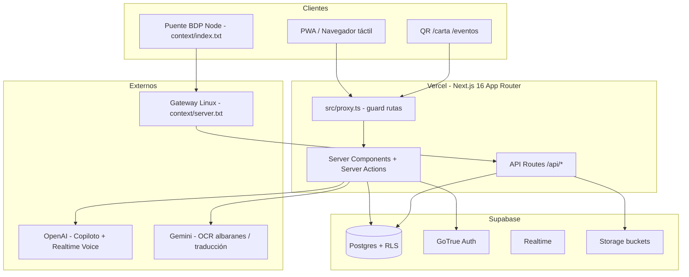

# Propuesta de mejora — Contexto LLM Bar La Marbella

**Objetivo:** Elevar `context/LLM_PROMPT.md` de ~74/100 a ~90/100 para consumo autónomo por LLMs externos.  
**Principio rector:** Un LLM debe poder responder "¿dónde está X?", "¿qué regla aplica?", "¿qué rompo si cambio Y?" sin abrir el repo.

---

## 1. Reestructuración global del documento

### 1.1 Nueva tabla de contenidos propuesta

Reordenar el documento en bloques de consumo rápido → profundidad:

```
0.  Mantenimiento y fuentes de verdad (existente, ampliar)
1.  Identidad y dominios de negocio (existente, corregir)
2.  Stack y dependencias (existente, corregir LiveKit)
3.  Reglas duras NO negociables (existente, añadir chef/notificaciones)
4.  Arquitectura técnica (NUEVO — diagrama + capas)
5.  Mapa de localización — "¿Dónde toco qué?" (NUEVO — crítico)
6.  Rutas App Router (existente §5, corregir y ampliar)
7.  API Routes (existente §6, ampliar auth/errores)
8.  Server Actions — índice completo (NUEVO)
9.  Componentes UI por dominio (NUEVO)
10. Base de datos — tablas, RPCs, triggers, storage (existente §7, ampliar)
11. Auth, RBAC y proxy — matriz rol×ruta (existente §4, reescribir)
12. Integraciones externas (BDP, IA, push) (parcial §8, ampliar)
13. Flujos de negocio paso a paso (NUEVO)
14. Variables de entorno — lista completa (existente §9, ampliar)
15. DevOps, despliegue y automatización (NUEVO)
16. Testing y calidad (NUEVO — declarar ausencia)
17. Documentación satélite — qué leer y cuándo (NUEVO)
18. Prompt corto de inicio de sesión (existente §10, actualizar)
19. Estado actual — changelog auto-sync (existente §11, sin cambios manuales)
```

### 1.2 Convenciones de formato para LLMs

Añadir al inicio del documento:

- **Tablas** para rutas, permisos, env vars, tablas DB.
- **Bloques `RUTA → ARCHIVO → RPC`** en cada dominio.
- **Marcadores `⚠️ TRAMPA`** para errores comunes (dual date-utils, `.not(in)`, proxy kds).
- **Enlaces relativos** siempre con ruta desde raíz (`src/...`, `supabase/migrations/...`).
- **Prohibido** referenciar rutas sin verificar existencia de `page.tsx`.

---

## 2. Secciones nuevas — detalle completo

### 2.1 Sección 4 (nueva): Arquitectura técnica

**Contenido obligatorio:**

#### Diagrama de capas (mermaid recomendado)



#### Descripción de capas

| Capa | Ubicación | Responsabilidad |
|------|-----------|-----------------|
| Guard de rutas | `src/proxy.ts` | Auth `getSession()`, RBAC por rol, bypass `/api`, `/carta`, `/eventos` |
| UI Server | `src/app/**/page.tsx` | SSR, fetch inicial, redirects |
| UI Client | `src/components/**` | Interactividad táctil, Realtime, modales |
| Server Actions | `src/app/**/actions.ts`, `src/app/actions/*.ts`, `src/lib/actions/*.ts` | Mutaciones autenticadas |
| API Routes | `src/app/api/**/route.ts` | Webhooks, cron, serving documentos, copilot HTTP |
| Datos | Supabase Postgres | RLS, RPCs, triggers de negocio crítico |
| Bridge TPV | `context/index.txt` → `AgenteBDP/index.js` | Poll SQL Server BDP → POST gateway |
| Gateway | `context/server.txt` | Normalización UTC, upsert Supabase |

#### Patrones obligatorios

- **SSR Supabase:** `createClient()` en `src/utils/supabase/server.ts`; browser en `client.ts`.
- **Timeouts SSR:** `withTimeout` / `ssrWithTimeout` en layout y páginas críticas (anti hang `getSession`).
- **Build:** Webpack forzado (`npm run dev/build --webpack`), no Turbopack en prod.
- **Server Actions body:** límite 12 MB (`next.config.ts`) para fotos albarán.

---

### 2.2 Sección 5 (nueva): Mapa de localización

**Tabla maestra — funcionalidad → punto de entrada:**

| Funcionalidad | Ruta UI | Page/Client principal | Server Actions | RPCs / tablas clave |
|---------------|---------|----------------------|----------------|---------------------|
| Sala radar | `/dashboard/sala` | `dashboard/sala/page.tsx` | — | `estado_sala` |
| KDS cocina | `/dashboard/kds` | `dashboard/kds/page.tsx`, `useKDSv2.ts` | — | `kds_orders`, `kds_order_lines` |
| Ventas | `/dashboard/ventas` | `dashboard/ventas/page.tsx` | — | `tickets_marbella`, `get_daily_sales_stats` |
| PyG / Insights | `/dashboard/insights` | `InsightsClient.tsx` | `insights/actions.ts` | `get_financial_statement`, `get_period_card_payments` |
| Tesorería movimientos | `/dashboard/movements` | `movements/page.tsx` | `get-treasury-snapshot.ts` | `treasury_log`, `v_treasury_movements_balance` |
| Cierre caja | Modal en dashboard | `CashClosingModal.tsx` | `cash-closing-photos.ts` | `cash_closings`, `get_closing_sales_breakdown` |
| Historial cierres | `/dashboard/history` | `history/page.tsx` | — | `cash_closings` + Storage `cash_closings` |
| Albaranes histórico | `/dashboard/albaranes` | `AlbaranesHistoricoClient.tsx` | `albaranes/actions.ts` | `purchase_invoices`, triggers stock |
| Escáner albaranes | `/dashboard/scanner` | `ScannerClient.tsx` | `scanner/actions.ts` | Gemini OCR, `purchase_invoice_attachments` |
| Mapeo línea | Modal | `LineMappingModal.tsx` | `confirmInvoiceLineMappingAction` | `supplier_item_mappings`, `invoice_line_price_to_purchase_unit` |
| Propinas gestión | `/dashboard/propinas` | `TipsDashboardView.tsx` | — | `get_tip_pool_preview`, `confirm_tip_distribution` |
| Mis propinas staff | `/staff/propinas` | `StaffPropinasView.tsx` | — | mismo RPC preview |
| Fichaje / consumo | `/staff/dashboard` | `StaffDashboardView.tsx`, `ConsumptionModal.tsx` | `staff/actions.ts` | `time_logs`, `process_staff_consumption` |
| Horarios | Modal en staff/admin | `ScheduleDayEditor.tsx` | `overtime.ts` | `shifts`, `fn_labor_effective_ordinary_rate` |
| Horas extra admin | `/dashboard/overtime` | `overtime/page.tsx` | `overtime.ts` | `weekly_snapshots`, `get_weekly_worker_stats` |
| Reservas | `/staff/reservas` | `ReservasClient.tsx` | — | `reservations`, `gestionar_reservas` |
| Carta QR | `/carta` | `PublicCarta.tsx`, `MenuAccordion.tsx` | — | `v_public_menu_items` |
| Carta staff | `/staff/carta` | `StaffCartaView.tsx` | `dashboard/carta/actions.ts` | `digital_menu_overrides` |
| Eventos admin | `/dashboard/eventos` | `eventos/page.tsx` | `eventos/actions.ts` | `events`, `event_orders` |
| Pedido evento público | `/eventos/[slug]` | `eventos/[slug]/page.tsx` | `create_event_order` RPC | anon OK |
| Copiloto chat | FAB global | `ChatMarbella.tsx` | `lib/copilot/actions.ts` | `ai_chat_sessions`, `ai_call_logs` |
| Notificaciones | Campana navbar | `NotificationsBell.tsx` | `actions/notifications.ts` | `user_notifications` |
| Perfil empleado | `/profile` | `profile/page.tsx` | `actions/profile.ts` | `profiles`, `employee_documents` |
| Pedidos proveedor | `/orders/new` | `orders/new/page.tsx` | — | `purchase_orders`, `order_drafts` |
| Recetas | `/recipes`, `/recipes/[id]` | `recipes/**` | — | `recipes`, `get_recipe_cost` |
| Ingredientes | `/ingredients` | `ingredients/page.tsx` | — | `ingredients`, `ingredient_price_history` |
| Inventario | `/dashboard/inventory` | `inventory/page.tsx` | `inventory/actions.ts` | `stock_movements` |
| Master hub | `/master/dashboard` | `master/dashboard/page.tsx` | — | solo `hhector7722@gmail.com` |

**⚠️ TRAMPA — Utilidades de fecha:**

| Archivo | Usar para |
|---------|-----------|
| `src/utils/date-utils.ts` | **SSOT operativo:** TPV, Madrid, `parseTPVDate`, `formatTicketTimeMadrid`, `parseRadiografiaTimestamp` |
| `src/lib/date-utils.ts` | Solo ISO week / utilidades UTC internas — **NO** para UI de negocio |

---

### 2.3 Sección 8 (nueva): Índice Server Actions

**`src/app/actions/` (compartidas):**

| Archivo | Dominio |
|---------|---------|
| `overtime.ts` | Fichajes, horarios, snapshots, `updateWeeklyWorkerConfig` |
| `get-dashboard-data.ts` | KPIs dashboard admin |
| `get-treasury-snapshot.ts` | Snapshot tesorería |
| `cash-box-inventory.ts` | Inventario físico caja, autorrelleno |
| `cash-closing-photos.ts` | Subida fotos cierre |
| `notifications.ts` | Push web + CRUD notificaciones |
| `profile.ts` | Avatar, documentos empleado, DNI |
| `recalculate.ts` | Recálculo balances horas |
| `import-legacy.ts` | Importación legacy + Gemini traducción |
| `translate-ca-es.ts` | Traducción catalán→español vía Gemini |

**`src/app/dashboard/*/actions.ts` (por módulo):**

- `albaranes/actions.ts` — mapeo, stock, exclusión, auto-mapeo, delete invoice
- `scanner/actions.ts` — OCR, append página multipágina
- `albaranes-precios/actions.ts` — wizard precios legacy foto
- `insights/actions.ts` — fetch PyG, card payments, gráficos
- `carta/actions.ts` — overrides menú, portadas, i18n
- `carta/photo-actions.ts` — subida imágenes normalizadas
- `eventos/actions.ts` — CRUD eventos, productos, pack
- `consumo-personal/actions.ts` — orden grid consumo
- `inventory/actions.ts`, `inventory/waste/actions.ts`, `inventory/ledger/actions.ts`
- `recetas-import/actions.ts`, `recetas-tpv/actions.ts`, `recipes/actions.ts`

**`src/lib/actions/albaranes.ts`:** Legacy FormData `confirmarMapeoAction` — **no usar** en flujo histórico activo.

**`src/app/staff/actions.ts`:** Fichaje, consumo personal, `submitPersonalConsumption`.

**Regla:** Toda Server Action debe verificar sesión (`getSession`) y respetar RLS; no confiar solo en proxy.

---

### 2.4 Sección 9 (nueva): Componentes UI por dominio

| Carpeta `src/components/` | Componentes clave | Notas |
|---------------------------|-------------------|-------|
| `albaranes/` | `LineMappingModal`, `LineEditModal`, `AlbaranesHistoricoClient` | Touch 48px; tríada dimensional |
| `carta/` | `MenuAccordion`, `PlatoMarbellaMenuView`, `PublicCarta`, `CartaImageLightbox` | QR + staff comparten lógica |
| `cash-closing/` | `CashClosingModal`, `ClosingStep1Parts`, `CashDenominationForm` | Fotos obligatorias |
| `chat/` | `ChatMarbella`, `ChatMarbellaLazy` | Montado en root layout |
| `copilot/` | (si existe) o en `lib/copilot/` | Tools con RBAC |
| `dashboards/` | `StaffDashboardView`, `MasterShortcutGrid`, `DashboardSwitcher` | Hubs por rol |
| `kds/` | Componentes tablero cocina | Con `useKDSv2` |
| `modals/` | `AttendanceDetailModal`, `StaffSelectionModal`, `ConsumptionModal` (en staff) | Patrones táctiles |
| `schedule/` | `ScheduleDayEditor`, `ScheduleDayProfitabilityBar` | Solo Hector ve rentabilidad |
| `tips/` | `TipsDashboardView`, `StaffPropinasView`, `SanctionedTipMoney` | Doble vista manager/staff |
| `ui/` | shadcn-like primitives | Usar `cn()` siempre |
| Root | `Navbar`, `BottomNavWrapper`, `StaffBottomNav`, `NotificationsBell`, `OnboardingOverlay`, `ServiceWorkerRegistration` | Layout global |

**Layouts:**

- `src/app/layout.tsx` — Navbar + BottomNav + Chat + SW + Notificaciones + Onboarding
- `src/app/staff/layout.tsx` — Nav inferior staff (Pedidos, Caja modal, sin Propinas en barra)
- `src/app/dashboard/layout.tsx` — Shell admin
- `src/app/carta/layout.tsx` — IframeNavBridge, sin auth

---

### 2.5 Sección 11 (reescrita): Auth, RBAC y proxy

**Matriz rol × rutas `/dashboard/*` (verificada en `src/proxy.ts`):**

| Ruta | admin | manager | supervisor | staff | chef |
|------|:-----:|:-------:|:----------:|:-----:|:----:|
| `/dashboard` (hub) | ✅ | ✅ | ❌→staff | ❌→staff | ❌→staff |
| `/dashboard/insights` | ✅ | ✅ | ❌ | ❌ | ❌ |
| `/dashboard/sala`, ventas, movements, history, labor, overtime, ledger, inventory, carta, kds, etc. | ✅ | ✅ | ❌ | ❌ | ❌ |
| `/dashboard/propinas` | ✅ | ✅ | ✅ | ✅ | ✅ |
| `/dashboard/albaranes`, `/dashboard/scanner` | ✅ | ✅ | ✅ | ✅ | ✅ |
| `/dashboard/eventos` (lectura staff) | ✅ | ✅ | ✅ | ✅ | ✅ |
| `/dashboard/kds` | ✅ | ✅ | ❌ | ❌ | ❌ |

**⚠️ CORRECCIÓN respecto al prompt actual:** `/dashboard/kds` **NO** está en `staffDashboardAllowed`. Staff usa sala/KDS vía otras vías o solo admin — verificar producto antes de abrir acceso.

**Roles en `profiles.role`:** `admin`, `manager`, `supervisor`, `staff`, `chef`.

**Master exclusivo:** `isMasterDashboardUser` → email `hhector7722@gmail.com` → `/master/dashboard`.

**Público sin login:** `/carta`, `/carta/*`, `/eventos`, `/eventos/*`, `/api/*` (webhooks con Bearer propio).

**Auth pattern:**
- Proxy/guards: `getSession()` (nunca `getUser()` en hot path)
- Layout: `getSession()` con timeout 4s
- Server Actions: `getSession()` + toast/throw en error

---

### 2.6 Sección 13 (nueva): Flujos de negocio paso a paso

#### Flujo A — Ingesta venta TPV → Dashboard

1. BDP SQL Server → `context/index.txt` poll (`VENTAS_WHERE`, UTC `toIso()`)
2. POST → gateway `context/server.txt` o directo `/api/webhooks/bdp/ventas`
3. Upsert `tickets_marbella` + líneas + `cobro_efectivo|tarjeta|pendiente`
4. UI ventas/insights lee RPCs; hora display vía `formatTicketTimeMadrid`

#### Flujo B — Telemetría sala → KDS

1. `context/index.txt` extrae comandas → POST `/api/webhooks/bdp/telemetria`
2. Upsert `estado_sala`; `timestamp_tpv` = min horas válidas del ticket
3. Trigger/sync → `kds_orders` / `kds_order_lines`
4. UI `/dashboard/kds` con Realtime; key estable `mesa-{mesa}-{ticket}`

#### Flujo C — Escáner albarán → stock

1. Foto → `/dashboard/scanner` → Gemini OCR → `purchase_invoices` + líneas `pending_mapping`
2. Mapeo en `LineMappingModal` → `supplier_item_mappings` (tríada dimensional)
3. RPC `invoice_line_price_to_purchase_unit` para precio catálogo
4. Trigger `handle_invoice_line_mapped_stock` → `stock_movements` `PURCHASE` ref `ALB-LINE-<uuid>`
5. `sync_purchase_invoice_status` → cabecera `mapped` cuando todas las líneas resueltas
6. Estados especiales: `excluded` (portes), `expense_only` (gasto PyG sin stock)

#### Flujo D — Fichaje staff con consumo

1. Entrada: `handleClockAction('in')` → `time_logs`
2. Salida: abre `ConsumptionModal` → grid vía `get_consumption_modal_recipes`
3. Si carrito vacío → bloqueo UI; servidor rechaza `items.length === 0`
4. `process_staff_consumption` RPC → movimientos stock
5. Si RPC falla → log + salida permitida con `consumptionSkipped` (política 2026-05-20)

#### Flujo E — Cierre de caja

1. `CashClosingModal` paso 1: clima, ventas TPV sync auto, fotos obligatorias datáfono + ticket BDP
2. `get_closing_sales_breakdown(p_date)` para desglose
3. INSERT `cash_closings` + upload Storage `cash_closings`
4. Historial `/dashboard/history` con URLs firmadas

#### Flujo F — Propinas

1. Preview: `get_tip_pool_preview` desde último `tip_distribution_history`
2. Sanciones: `shadowAmount` en JSON (migración 2026-06-04)
3. Confirmación manager: `confirm_tip_distribution` → `tip_distribution_lines`
4. Staff ve `/staff/propinas`; manager gestiona `/dashboard/propinas`

#### Flujo G — Horas extra y snapshots

1. Verificar `profiles.AcumulaHoras` **antes** de lógica
2. Si TRUE: extras → `HorasBanco`; si FALSE: alerta pago
3. Fin de semana: `rpc_recalculate_all_balances` (pg_cron lunes madrugada)
4. Tarifa: `fn_worker_effective_overtime_rate` (snapshot → término → perfil)

---

### 2.7 Sección 14 (ampliada): Variables de entorno

**Tabla completa verificada en código:**

| Variable | Obligatoria | Uso |
|----------|:-----------:|-----|
| `NEXT_PUBLIC_SUPABASE_URL` | ✅ | Cliente + servidor Supabase |
| `NEXT_PUBLIC_SUPABASE_ANON_KEY` | ✅ | Cliente browser + SSR anon |
| `SUPABASE_SERVICE_ROLE_KEY` | ✅ webhooks/cron | Bypass RLS en ingestas |
| `WEBHOOK_SECRET` | ✅ | Bearer en `/api/webhooks/bdp/*`, nominas |
| `GEMINI_API_KEY` | ✅ scanner | OCR albaranes, traducción, import |
| `OPENAI_API_KEY` | ✅ copilot | Chat, transcribe, Realtime voice |
| `CRON_SECRET` | ✅ prod | `/api/cron/*` |
| `NEXT_PUBLIC_MARBELLA_WEB_ORIGIN` | opcional | postMessage carta iframe |
| `NEXT_PUBLIC_VAPID_PUBLIC_KEY` | push | Service Worker subscription |
| `VAPID_PRIVATE_KEY` | push | Server `notifications.ts` |
| `VAPID_SUBJECT` | opcional | mailto: para web-push |
| `SUPABASE_URL` | fallback | Algunos cron usan alias |

**Variables OBSOLETAS en `.env.example` (no usar para implementación nueva):**

- `STT_PROVIDER`, `WHISPER_COMMAND`, `VOICE_WS_*`, `NEXT_PUBLIC_VOICE_WS_URL` — arquitectura voice-server legacy; producción usa `/api/copiloto/transcribe` + OpenAI Realtime.

**LiveKit:** paquetes instalados pero **sin uso en código** — no configurar env LiveKit.

---

### 2.8 Sección 15 (nueva): DevOps

| Artefacto | Propósito |
|-----------|-----------|
| `npm run dev/build --webpack` | Build estable Vercel |
| `npm run sync:llm-prompt` | Regenera §11 de LLM_PROMPT |
| `npm run setup:githooks` | Activa pre-commit sync |
| `.cursor/hooks.json` | Sync al guardar PROJECT_STATUS |
| `vercel.json` | Crons 03:00 cleanup-audio, 03:30 cleanup-order-pdfs |
| `context/index.txt` → TPV `AgenteBDP/index.js` | Despliegue puente |
| `context/server.txt` | Gateway Linux receptor |
| `context/DEPLOY_BDP_VENTAS.txt` | Runbook despliegue ventas |

**CI/CD:** No hay `.github/workflows`. Despliegue vía Vercel git integration.

---

### 2.9 Sección 16 (nueva): Testing

Declarar explícitamente:

- **No hay** Jest, Vitest, Playwright ni Testing Library configurados.
- Scripts ad-hoc en raíz: `test-supabase.js`, `test_tickets.mjs`, etc.
- Validación manual + lint `npm run lint`.
- LLM **no debe** asumir pipeline CI de tests.

---

## 3. Secciones incompletas — qué añadir

### 3.1 §1 Identidad

**Añadir dominios:**
- Notificaciones in-app y push
- Horarios y plantilla de personal
- Perfil y documentación empleado
- PWA instalable
- Onboarding primer acceso

**Eliminar:**
- Referencia implícita a `/dashboard/finanzas` como ruta activa

**Reescribir:**
- "Finanzas" → "Insights `/dashboard/insights`" (PyG + cash flow + gráficos rentabilidad)

### 3.2 §2 Stack

**Corregir:**
- Voz: `OpenAI Realtime API` (no LiveKit en runtime)
- Añadir: `web-push`, `@dnd-kit/*`, `react-easy-crop`, `recharts`, `sharp`, `sileo` (prod en layout)
- Nota: `@n8n/chat` en package.json sin imports — dependencia huérfana

### 3.3 §5 Rutas

**Añadir rutas omitidas:**

| Ruta | Notas |
|------|-------|
| `/` | Redirect por rol vía home |
| `/login` | Auth |
| `/dashboard/eventos/pedidos` | Vista agregada pedidos |
| `/test-sileo` | Página prueba toasts (dev) |

**Eliminar:**
- `/dashboard/finanzas`

**Nota staff:**
- `/staff` → redirect `/staff/dashboard` (no hay `staff/page.tsx`)

### 3.4 §7 DB

**Añadir tablas:**

| Tabla | Propósito |
|-------|-----------|
| `user_notifications` | Notificaciones in-app |
| `manager_ledger` | Apuntes gerencia |
| `import_runs` | Tracking imports legacy |
| `notification_recipient_rules` | Reglas destinatarios push |

**Añadir buckets Storage:**

`albaranes`, `cash_closings`, `carta_items`, `employee_documents`, `nominas`, `orders`, `ai_assets`, `suppliers`

**Añadir RPCs omitidas (muestra):**

- `get_staff_consumption_day_detail`
- `staff_consumption_recipe_usage_counts`
- `auto_map_invoice_lines_fuzzy`
- `mark_invoice_line_expense_only` (si existe en migración)

**Documentar colisión:** `20260604150000_*` duplicado.

### 3.5 §8 KDS/BDP

**Añadir:**
- KDS v2 pipeline y hook `useKDSv2.ts`
- Referencia `context/HORAS_SNAPSHOTS_Y_ARRASTRE.md` para nóminas
- Referencia `context/Mapa_Tablas_BDP.txt` para esquema TPV origen

### 3.6 §11 Changelog

**Acción automática:** El próximo sync eliminará referencias a `staff/page.tsx` si se limpia `PROJECT_STATUS.md` fuente.

**Manual:** Revisar que hitos 🚧 (`expense_only`) se reflejen en §7 cuando se complete.

---

## 4. Tablas adicionales recomendadas

### 4.1 Tabla de webhooks — auth y respuestas

| Ruta | Auth | Éxito | Error típico |
|------|------|-------|--------------|
| `POST /api/webhooks/bdp/ventas` | Bearer `WEBHOOK_SECRET` | 200 upsert | 401, 500 Supabase |
| `POST /api/webhooks/bdp/telemetria` | Bearer | 200 | idem |
| `POST /api/webhooks/bdp/caja` | Bearer | 200 | idem |
| `POST /api/webhooks/albaranes` | — | **410 Gone** | No usar |
| `POST /api/webhooks/nominas` | Bearer + service role | 200 | PDF parse |
| `GET /api/cron/*` | Bearer `CRON_SECRET` | 200 JSON | 401 |

### 4.2 Tabla copilot — tools por rol

Documentar desde `src/lib/copilot/permissions.ts`:

- `staff`: subset lectura operativa
- `supervisor` / `chef`: alineados supervisor
- `manager` / `admin`: todas las tools en `ACTION_SCHEMA`

### 4.3 Tabla estados albarán línea

| status | Stock | PyG | UI |
|--------|:-----:|:---:|-----|
| `pending_mapping` | ❌ | ❌ | Lápiz mapear |
| `mapped` | ✅ PURCHASE | ✅ | Tick verde |
| `excluded` | ❌ | ❌ | Portes/ajuste |
| `expense_only` | ❌ | ✅ gasto | Botón gasto sin stock |

---

## 5. Diagramas recomendados

1. **Capas arquitectura** (§4) — incluido arriba
2. **Flujo albarán** — scanner → mapeo → trigger stock → sync cabecera
3. **Flujo auth** — request → proxy → getSession → profile.role → redirect
4. **Flujo BDP tiempo** — SQL Server UTC → gateway → Supabase → UI Madrid
5. **Mapa navegación por rol** — admin vs staff vs público

---

## 6. Resúmenes recomendados (bloques copy-paste)

### 6.1 Bloque "primer mensaje" actualizado (reemplaza §10)

Incluir: Insights no finanzas, OpenAI voice no LiveKit, notificaciones, dual date-utils, kds no staff.

### 6.2 Bloque "antes de tocar DB"

- Leer migración más reciente del dominio
- RLS obligatorio
- Triggers albaranes no desactivar sin reemplazo
- RPC SECURITY DEFINER: revisar grants

### 6.3 Bloque "antes de tocar UI táctil"

- min-h-12, shrink-0 en botoneras
- zero-display en lectura
- toast.error en fallos críticos

---

## 7. Acciones de mantenimiento continuo

| Evento | Acción |
|--------|--------|
| Nueva ruta `page.tsx` | Actualizar §5/§6 manual + mapa localización |
| Nueva migración con tabla/RPC | Actualizar §7 + tipos `src/types/supabase.ts` |
| Cambio `proxy.ts` | Actualizar matriz RBAC inmediatamente |
| Cambio env var | Actualizar §14 + `.env.example` |
| Feature completada | Mover en PROJECT_STATUS; §11 auto |
| Dependencia nueva | Actualizar §2 |

---

## 8. Sincronización con otros artefactos

| Artefacto | Relación |
|-----------|----------|
| `PROJECT_STATUS.md` | Fuente §11; changelog funcional |
| `context/LLM_PROMPT.md` | Destino producción prompt-ready |
| `llm_context_v2.md` | Borrador ampliado para revisión humana |
| `.env.example` | Debe reflejar §14 (tarea separada) |
| `README.md` | Marcar legacy o reescribir (tarea separada) |

---

## 9. Priorización de implementación

| Prioridad | Mejora | Esfuerzo | Impacto |
|:---------:|--------|:--------:|:-------:|
| P0 | Corregir finanzas/kds/LiveKit | Bajo | Crítico |
| P0 | Mapa localización §5 nuevo | Medio | Crítico |
| P1 | Matriz RBAC completa | Medio | Alto |
| P1 | Flujos negocio paso a paso | Alto | Alto |
| P1 | Env vars completas | Bajo | Alto |
| P2 | Índice server actions | Medio | Alto |
| P2 | Componentes por dominio | Medio | Medio |
| P2 | Tablas/buckets DB ampliados | Medio | Alto |
| P3 | Diagramas mermaid | Bajo | Medio |
| P3 | Testing/DevOps explícito | Bajo | Medio |

---

*Documento generado por auditoría 2026-06-05. Implementación consolidada en `llm_context_v2.md`.*
