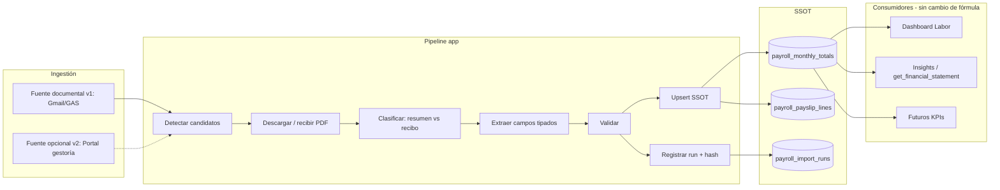

# INTEGRACIÓN · Nóminas

Cómo entra en Marbella el coste de personal que calcula la gestoría. Es el origen único del coste ordinario definido en [dominio/COSTE-LABORAL](../dominio/COSTE-LABORAL.md).

> **Nota de reconciliación (2026-07-29).** El documento original se declaraba «solo diseño, sin implementación». **Parte del diseño está implementada** y parte no. Lo implementado, verificado sobre el código y las migraciones: el analizador con versión etiquetada, la huella de contenido para evitar duplicados, la tabla de ejecuciones de importación con sus políticas de acceso, y las validaciones previas a la escritura. Lo que sigue siendo solo diseño está marcado en el cuerpo.
>
> El texto original se conserva porque su razonamiento sigue siendo válido. Su encabezado de estado no lo era.

**Alcance:** cadena de ingestión desde el correo de la gestoría hasta el total mensual consumible.
**Cadena:** correo entrante → script de Google → webhook → huella de contenido → lectura del documento → validaciones → registro de ejecución y total mensual.
**Código de la parte externa:** [`integrations/apps-script/nominas.gs`](../../../integrations/apps-script/nominas.gs).

---

## 1. Resumen ejecutivo

Hoy Dashboard Labor e Insights **ya consumen** `payroll_monthly_totals.total_company_cost` como coste ordinario oficial (prorrateo por días naturales).

El eslabón débil no es el consumo: es la **alimentación**. El total mensual llega de forma semi-automática (Gmail → Google Apps Script → webhook), con parser frágil y sin auditoría/hash/rectificaciones formales.

**Objetivo de arquitectura:** cerrar el pipeline para que cada mes exista exactamente una fila validada de coste empresa en `payroll_monthly_totals`, reproducible y auditable, sin cálculos paralelos en UI.

> **Hallazgo crítico de auditoría:** no existe hoy un “login al portal de nóminas” en el código. La fuente operativa real es el **correo de gestoría** (Seven Law Firm / cuentas configuradas) + GAS. El diseño trata ese canal como *Portal lógico v1* (origen documental oficial) y deja un *Portal técnico v2* (scraper/API) como fase opcional si el negocio exige consulta directa.

---

## 2. Auditoría previa — qué existe / qué falta

### 2.1 Inventario de piezas existentes

| Capacidad | Existe | Ubicación | Notas |
|-----------|--------|-----------|-------|
| Detección de PDFs nuevos | ✅ Parcial | `context/script_nominas.txt` → `procesarNominasEntrantes()` | Gmail `is:unread` + adjuntos PDF; no es portal web |
| Clasificación resumen vs individual | ✅ | GAS `SUMMARY_PATTERNS` | «Costes de empresa», «Resumen de Nómina» |
| Exclusión “Registro de jornada” | ✅ | GAS `EXCLUDED_FILENAME_REGEXES` | |
| OCR en origen | ✅ | GAS + Google Drive OCR | Evita timeout Vercel en individuales |
| Extracción DNI | ✅ | GAS + fallback `webhooks/nominas` | Validación letra DNI/NIE |
| Parser resumen coste empresa | ✅ Frágil | `src/app/api/webhooks/nominas-summary/route.ts` | pdf2json + max importe en 300 chars antes de TOTAL EMPRESA/CENTRO |
| Upsert `payroll_monthly_totals` | ✅ | mismo webhook | `onConflict: period_ym` |
| Storage PDF resumen | ✅ | bucket `nominas` → `payroll-summary/{YYYY-MM}/…` | |
| Ingestión nómina individual | ✅ | `src/app/api/webhooks/nominas/route.ts` | Storage + `nominas` + opcional `employee_documents` |
| Lectura PDF en app | ✅ | `src/app/api/nominas/open/route.ts` + modales perfil | No escribe SSOT de costes |
| RLS / storage policies | ✅ | migraciones `20260322…`–`20260401…` | |
| Excepciones ingestión | ⚠️ Tabla vacía de uso | `nominas_excepciones` | Schema existe; webhook actual no la rellena de forma sistemática |
| Consumo Labor (ordinario) | ✅ | `labor-cost-ssot` / `payroll-ordinary-daily` | Solo lee `total_company_cost` + fechas |
| Consumo Insights / PyG | ✅ | RPC `get_financial_statement` | Prorratea `payroll_monthly_totals` por días solapados |
| Login portal gestoría | ❌ | — | No hay Playwright/Puppeteer/credenciales portal |
| Descarga programada desde portal | ❌ | — | |
| Hash PDF / idempotencia fuerte | ❌ | — | Upsert por `period_ym` sin `content_hash` |
| Validación cruzada (suma fichas vs TOTAL) | ❌ | — | |
| Extracción bruto/neto/SS por trabajador | ❌ | — | Individuales solo guardan PDF + DNI/periodo |
| Rectificaciones versionadas | ❌ | — | Upsert pisa el valor anterior sin historial |
| Auditoría de importación (runs) | ❌ | — | Solo labels Gmail + email error |
| Cron en app (Vercel/Supabase) | ❌ | — | Dependencia de trigger GAS (time-driven externo) |
| OCR server-side robusto | ❌ / huérfano | `tesseract.js` citado en auditoría como huérfano | No es el camino productivo |

### 2.2 Flujo actual (as-is)

```mermaid
flowchart TD
  A[Gestoría PDF por Gmail] --> B[GAS procesarNominasEntrantes]
  B -->|Resumen costes empresa| C[POST /api/webhooks/nominas-summary]
  B -->|Nómina individual + DNI OCR| D[POST /api/webhooks/nominas]
  C --> E[Storage nominas/payroll-summary/…]
  C --> F[(payroll_monthly_totals)]
  D --> G[Storage nominas/{userId}/…]
  D --> H[(nominas / employee_documents)]
  F --> I[Dashboard Labor ordinario]
  F --> J[Insights get_financial_statement]
  H --> K[UI perfil: ver PDF]
```

### 2.3 Huecos respecto al objetivo “portal → SSOT”

| Paso deseado | Estado |
|--------------|--------|
| 1. Detectar nuevas nóminas | ✅ vía Gmail unread (no portal) |
| 2. Descargarlas | ✅ adjunto Gmail |
| 3. Extraer datos | ⚠️ resumen: solo periodo + 1 importe; individual: DNI + mes heurístico |
| 4. Validar consistencia | ❌ |
| 5. Insert/update `payroll_monthly_totals` | ✅ básico |
| 6. Duplicados | ⚠️ upsert `period_ym` (no hash) |
| 7. Rectificaciones | ❌ sin historial |
| 8. Auditoría importación | ❌ formal |

---

## 3. Modelo de datos actual vs SSOT

### 3.1 `payroll_monthly_totals` (hoy)

| Columna | Tipo | Rol |
|--------|------|-----|
| `id` | uuid | PK |
| `period_ym` | text UNIQUE | Clave natural `YYYY-MM` |
| `period_start` / `period_end` | date | Periodo PDF (días naturales) |
| `total_company_cost` | numeric(10,2) | **Único importe que consumen Labor + Insights** |
| `file_path` | text | PDF resumen en Storage |
| `email_date` | text nullable | Trazabilidad débil |
| `created_at` | timestamptz | Alta (no `updated_at`) |

**Veredicto:** suficiente como SSOT de **coste ordinario de empresa** para los consumidores actuales, **si** `total_company_cost` es fiable y siempre presente.

### 3.2 Campos que faltan para un SSOT “cerrado” (documentados — no implementar aún)

#### A) Enriquecimiento de `payroll_monthly_totals` (fila mes empresa)

| Campo propuesto | Motivo |
|-----------------|--------|
| `content_hash` (sha256 del PDF) | Idempotencia / detectar mismo PDF |
| `source` (`gmail_summary` \| `portal` \| `manual`) | Origen |
| `source_message_id` / `source_filename` | Auditoría |
| `issued_at` / `email_received_at` | Fecha emisión vs recepción |
| `validation_status` (`pending` \| `validated` \| `rejected` \| `superseded`) | Gate de consumo |
| `validation_notes` | Motivo rechazo |
| `gross_wages_total` | Agregado opcional (si el resumen lo trae) |
| `employer_ss_total` | Agregado SS empresa |
| `net_wages_total` | Agregado neto (control) |
| `revision` / `supersedes_id` | Rectificaciones |
| `updated_at` | Trazabilidad upsert |
| `imported_at` / `import_run_id` | FK a auditoría |

#### B) Tabla satélite (nueva) — detalle por trabajador

Los campos pedidos (trabajador, bruto, neto, SS, coste ordinario mensual…) **no caben** en una sola fila `UNIQUE(period_ym)` sin romper el SSOT de empresa.

Propuesta: `payroll_payslip_lines` (o ampliar `nominas` con columnas de coste):

| Campo | Motivo |
|-------|--------|
| `user_id` / `dni` | Trabajador |
| `period_ym` | Mes |
| `gross_salary` | Bruto |
| `net_salary` | Neto |
| `employer_ss_cost` | SS empresa |
| `employee_ss_cost` | SS trabajador (opcional) |
| `company_cost` | Coste empresa del recibo |
| `file_path` / `content_hash` | PDF |
| `validation_status` | |
| `import_run_id` | |

**Regla SSOT:**  
`payroll_monthly_totals.total_company_cost` = **autoridad** del coste empresa.  
La suma de líneas individuales es **control cruzado**, no sustituto (pueden diferir por bonus, pagas extras, ajustes de centro).

#### C) Auditoría — `payroll_import_runs`

| Campo | Motivo |
|-------|--------|
| `id`, `started_at`, `finished_at` | |
| `source`, `trigger` (`cron` \| `gmail` \| `manual`) | |
| `files_seen`, `files_ok`, `files_failed` | |
| `period_ym_targets` | |
| `status`, `error_summary` | |
| `payload_meta` jsonb | |

---

## 4. Arquitectura propuesta (to-be)



### Principios

1. **Un solo número de coste empresa por mes** en `payroll_monthly_totals`.
2. **Resumen PDF = productor de `total_company_cost`** (como hoy).
3. **Recibos individuales = evidencia + líneas**, no redefinen el total salvo política explícita de “mes sin resumen”.
4. **Consumidores solo leen** `total_company_cost` (+ fechas). Cero tarifas, cero OCR en UI.
5. **Nada se marca `validated` sin pasar el gate**; Labor ya avisa si falta mes — en el futuro puede exigir `validation_status=validated`.

---

## 5. Pipeline detallado (8 pasos)

### 1) Detectar nuevas nóminas

- **v1 (reutilizar):** GAS query Gmail unread + patrones resumen/individual.
- **v1b (endurecer):** persistir `gmail_message_id` + hash para no reprocesar.
- **v2 (nuevo, opcional):** job que liste documentos del portal (si hay API/credenciales).

### 2) Descargar

- **v1:** bytes del adjunto → base64 webhook (ya existe).
- **v2:** download URL portal → mismo contrato interno `IngestPayrollPdfCommand`.

### 3) Extraer

Contrato mínimo de extracción:

| Campo | Resumen empresa | Recibo individual |
|-------|-----------------|-------------------|
| Trabajador | N/A (agregado) | Nombre + DNI → `profiles` |
| Año / mes | De `PAGA TOTAL DEL..AL..` | Periodo en PDF (preferir) / filename (fallback) |
| Coste empresa | `TOTAL EMPRESA` / `TOTAL CENTRO` | Coste empresa del recibo |
| Salario bruto | Si aparece en resumen | Sí |
| Salario neto | Si aparece | Sí |
| SS empresa | Si aparece | Sí |
| Coste ordinario mensual | = coste empresa del periodo (SSOT) | Línea |
| Fecha emisión | Cabecera PDF / email | Idem |
| Origen documento | `gmail_summary` / `gmail_payslip` / `portal` | |
| Hash PDF | sha256 | sha256 |
| Estado validación | derivado del gate | |

Mejora parser resumen (fase implementación): anclar importe a etiqueta exacta, no `max()` en ventana 300 chars (riesgo actual documentado en `AUDITORIA_DOCUMENTAL.md`).

### 4) Validar consistencia

Reglas propuestas:

| ID | Regla | Acción si falla |
|----|-------|-----------------|
| V1 | Periodo parseable y coherente (`start ≤ end`, mismo `period_ym`) | `rejected` |
| V2 | `total_company_cost > 0` | `rejected` |
| V3 | Hash ya importado con mismo coste → noop | OK idempotente |
| V4 | Hash distinto + mismo `period_ym` → posible rectificación | Exige confirmación / `revision++` |
| V5 | Si hay N recibos del mes: `|Σ company_cost − total_company_cost| ≤ umbral` (p.ej. 1 € o 0,5 %) | `validated_with_warning` o bloqueo |
| V6 | DNI de recibo existe en `profiles` | Excepción + `nominas_excepciones` |
| V7 | Mes futuro / fuera de rango negocio | `rejected` |

### 5) Insertar / actualizar `payroll_monthly_totals`

- Upsert por `period_ym` **solo si** gate OK.
- Escribir `file_path`, hash, source, `updated_at`, `import_run_id`.
- No tocar consumidores.

### 6) Duplicados

- Clave dura: `content_hash` único en runs/documentos.
- Clave de negocio mes: `period_ym` (una fila activa `validated`).

### 7) Rectificaciones

- Nueva versión: `revision = n+1`, fila anterior `validation_status = superseded`.
- O tabla `payroll_monthly_totals_history` append-only.
- Política: Labor/Insights leen solo `validation_status = validated` (cambio de query futuro; hoy leen cualquier fila).

### 8) Auditoría

- Una fila `payroll_import_runs` por ejecución.
- Eventos por archivo (ok/fail + mensaje).
- Reutilizar idea de `nominas_excepciones` o unificar en `payroll_import_events`.

---

## 6. Funciones reutilizables vs nuevas

### Reutilizables (no reinventar)

| Pieza | Reuso |
|-------|-------|
| GAS `procesarNominasEntrantes` | Detector + transportador v1 |
| `POST /api/webhooks/nominas-summary` | Núcleo upsert empresa (a refactorizar en lib) |
| `POST /api/webhooks/nominas` | Ingestión recibos + match DNI |
| `parseEuroNumber` / periodo `PAGA TOTAL` | Extraer a módulo compartido |
| Storage bucket `nominas` | Persistencia PDF |
| `allocatePayrollToNaturalDays` | Consumo Labor (ya SSOT) |
| `get_financial_statement` | Consumo Insights |
| Labels Gmail + mail error | Alertas ops (completar con tabla runs) |

### Nuevas (necesarias para cerrar SSOT)

| Pieza | Responsabilidad |
|-------|-----------------|
| `lib/payroll/parse-company-summary.ts` | Extracción tipada + tests golden PDF |
| `lib/payroll/parse-payslip.ts` | Bruto/neto/SS/coste por recibo |
| `lib/payroll/validate-month.ts` | Gate V1–V7 |
| `lib/payroll/content-hash.ts` | sha256 |
| `lib/payroll/upsert-monthly-total.ts` | Escritura SSOT + rectificaciones |
| `lib/payroll/import-run.ts` | Auditoría |
| Tabla(s) propuestas §3 | Modelo definitivo |
| (Opcional) `scripts/gas` versionado en repo | Evitar drift del script Gmail |
| (Opcional) `portal-adapter` | Solo si hay portal real |

**No crear:** segundo cálculo de coste ordinario en UI; adaptadores temporales que lean `profiles.monthly_cost`.

---

## 7. Integración con consumidores (verificación)

| Consumidor | Campo usado hoy | ¿Listo cuando el pipeline alimente la tabla? |
|------------|-----------------|-----------------------------------------------|
| `/dashboard/labor` | `total_company_cost`, `period_start/end` | **Sí** — sin cambios de fórmula |
| Insights PyG | misma tabla vía RPC | **Sí** |
| Insights M.O. horaria | HE extras + prorrateo | Independiente del ordinario nómina |
| Futuros KPIs M.O. | deben leer solo esta tabla | **Sí**, contrato estable |

Condición de éxito: para un mes `YYYY-MM`, existe fila con `total_company_cost` = TOTAL EMPRESA del PDF resumen; Labor e Insights muestran ese importe (prorrateado por días naturales donde aplique).

---

## 8. Modelo de datos definitivo (propuesto)

### Capa SSOT empresa (obligatoria)

`payroll_monthly_totals` enriquecida (§3.2.A) — **única fuente** de coste mensual empresa.

### Capa evidencia (recomendada)

`payroll_payslip_lines` — detalle trabajador + importes del recibo.

### Capa auditoría (obligatoria para “cerrar”)

`payroll_import_runs` (+ events).

### Capa documentos (ya existe)

`nominas` / `employee_documents` / Storage — siguen sirviendo la UI de descarga; el coste **no** se lee de ahí.

---

## 9. Plan de implementación por fases

| Fase | Entregable | Riesgo que cierra |
|------|------------|-------------------|
| **F0 — Diseño** (este doc) | Arquitectura acordada | Scope |
| **F1 — Extracción robusta** | Lib parser resumen + tests con PDFs reales; sin cambiar schema | Importe incorrecto |
| **F2 — Auditoría + hash** | `import_runs` + `content_hash`; webhook escribe auditoría | Duplicados / opacidad |
| **F3 — Schema SSOT** | Columnas validación/revisión en `payroll_monthly_totals` | Rectificaciones |
| **F4 — Gate de validación** | Solo `validated` consumible (Labor/Insights query) | Datos basura |
| **F5 — Líneas por trabajador** | Parser recibo + tabla líneas + check Σ≈TOTAL | Control de calidad |
| **F6 — Ops** | Cron backup si GAS cae; alertas mes faltante D+N | Dependencia Gmail |
| **F7 — Portal v2 (opcional)** | Adapter portal si negocio lo exige | Sustituir email |

**Orden recomendado:** F1 → F2 → F3 → F4 → F5. F7 solo con requisito explícito de portal.

---

## 10. Conclusión

| Pregunta | Respuesta |
|----------|-----------|
| ¿`payroll_monthly_totals` puede ser el SSOT de coste empresa? | **Sí** — ya lo es para Labor/Insights |
| ¿Está cerrado el pipeline automático? | **No** — ingestión Gmail frágil, sin hash/validación/rectificación/auditoría formal |
| ¿Hace falta portal web scrapado? | **No para v1**; el “portal” operativo actual es el correo de gestoría |
| ¿Faltan columnas? | **Sí** para gobernanza (hash, status, revision, source); **sí** tablas satélite para bruto/neto/SS por trabajador |
| ¿Implementar ahora? | **No** — este documento es el diseño previo |

**Siguiente paso de implementación (cuando se autorice):** Fase F1 — extraer el parser de `nominas-summary` a librería testeable con PDFs golden, sin tocar Labor ni Hours Engine.
