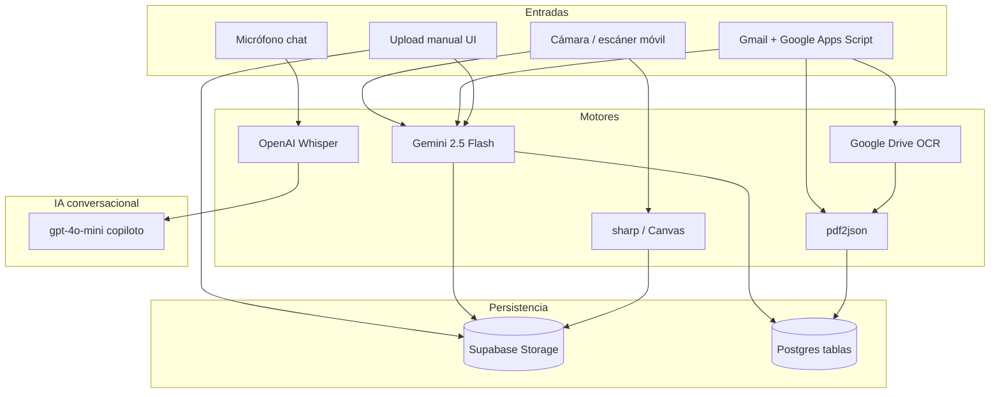

# Auditoría documental e IA — Bar La Marbella

> **MATERIAL NO NORMATIVO — SPIKE-AUDITORIA-DOCUMENTAL**
>
> Esto es un análisis fechado el 2026-07-18, no una norma. **No autoriza ninguna decisión** y puede describir un sistema que ya no existe.
>
> La norma vigente vive en `marbella-os/`; la jerarquía que la ordena, en `marbella-os/CANON.md`. Ante cualquier discrepancia gana el documento normativo, sin discusión.

**Fecha:** 2026-07-18  
**Alcance:** repositorio completo (`marbella-app`) — solo análisis, sin cambios de código  
**Fuente de verdad de estado del producto:** `PROJECT_STATUS.md`  
**Skills aplicadas en la auditoría:** `tester-especialista-marbella` (calidad/seguridad documental), `db-supabase-master` (Storage/RLS/tablas), `comprador-logistica-albaranes` (flujos de compra), `migrador-legacy-appsheet` (GAS/Gmail), `analista-bi-marbella` (insights vs extracción)

---

## Índice

1. [Resumen ejecutivo](#1-resumen-ejecutivo)
2. [Mapa del proyecto](#2-mapa-del-proyecto)
3. [1. OCR](#3-1-ocr)
4. [2. PDFs](#4-2-pdfs)
5. [3. Imágenes](#5-3-imágenes)
6. [4. Audio](#6-4-audio)
7. [5. Vídeo](#7-5-vídeo)
8. [6. Scripts](#8-6-scripts)
9. [7. APIs y Server Actions](#9-7-apis-y-server-actions)
10. [8. Supabase Storage](#10-8-supabase-storage)
11. [9. Base de datos](#11-9-base-de-datos)
12. [10. Procesamiento IA](#12-10-procesamiento-ia)
13. [11. Extracción de datos](#13-11-extracción-de-datos)
14. [12. Procesos manuales / heurísticos](#14-12-procesos-manuales--heurísticos)
15. [13. Oportunidades MinerU](#15-13-oportunidades-mineru)
16. [14. Oportunidades Vision Models](#16-14-oportunidades-vision-models)
17. [15. Oportunidades Whisper](#17-15-oportunidades-whisper)
18. [16. Flujo documental (diagramas)](#18-16-flujo-documental-diagramas)
19. [17. Duplicidades](#19-17-duplicidades)
20. [18. Recomendaciones por prioridad](#20-18-recomendaciones-por-prioridad)
21. [Dependencias](#21-dependencias)
22. [Riesgos](#22-riesgos)
23. [Inventario de archivos clave](#23-inventario-de-archivos-clave)

---

## 1. Resumen ejecutivo

La aplicación **ya tiene un pipeline documental operativo**, pero está **fragmentado en varios motores** y dominios de negocio:

| Dominio | Entrada | Motor de extracción | Persistencia |
|---------|---------|---------------------|--------------|
| Albaranes (compra) | Foto móvil / escáner | **Gemini 2.5 Flash** (visión) | Storage `albaranes` + `purchase_invoices` / líneas |
| Precios desde imagen | Foto albarán | **Gemini 2.5 Flash** | Solo propone → `ingredients` (sin guardar PDF) |
| Actividades pabellón | PDF Gmail / subida manual | **Gemini 2.5 Flash** (PDF inline) | Storage `pavilion_activities` + `activity_occurrences` |
| Recetas desde ficha | PDF / imagen | **Gemini 2.5 Flash** | `recipes` + `recipe_ingredients` |
| Nóminas individuales | PDF Gmail (GAS) | **Google Drive OCR** (origen) + fallback **pdf2json** | Storage `nominas` + `nominas` / `employee_documents` |
| Resumen nóminas empresa | PDF Gmail | **pdf2json** + regex importes | `payroll_monthly_totals` |
| Chat / voz | Audio webm | **OpenAI Whisper** + Realtime | Texto → copiloto (`gpt-4o-mini`) |
| Documentos RRHH (DNI, contrato…) | Upload manual | **Ninguno** (solo Storage) | `employee-documents` |
| Fotos producto / carta / cierre | Upload | **sharp** / Canvas (normalización, no OCR) | Buckets públicos/privados |
| Jornadas (scripts offline) | PDF plantilla | **pdf2json** + regex | Solo CLI / auditoría |

**Hallazgos críticos:**

1. **`tesseract.js` está en `package.json` pero no se importa en ningún archivo** — dependencia huérfana.
2. **No hay MinerU, PaddleOCR, EasyOCR, Unstructured, Azure/Google Vision SDK, Textract ni pgvector en uso.**
3. **Motor de visión único en producción: Gemini 2.5 Flash** (REST directo, no AI SDK).
4. **Whisper ya está integrado** para el chat; LiveKit está en dependencias pero **no se usa en `src/`**.
5. **Columna `recipes.embedding` existe en tipos/BD pero no hay código que la escriba o consulte** — RAG no implementado.
6. **Adjuntos del chat (imagen/PDF) son stub** (“próximamente”).
7. **Webhook de albaranes por email está retirado (410 Gone)**; vía operativa = escáner in-app.

---

## 2. Mapa del proyecto

```
marbella-app/
├── src/
│   ├── app/
│   │   ├── api/                    # Routes: webhooks, copiloto, cron, docs
│   │   ├── dashboard/
│   │   │   ├── scanner/            # Escáner albaranes (Gemini)
│   │   │   ├── albaranes/          # Histórico + mapeo líneas
│   │   │   ├── albaranes-precios/  # OCR precios sin persistir factura
│   │   │   ├── recetas-import/     # OCR fichas receta
│   │   │   ├── carta/              # Fotos normalizadas (sharp)
│   │   │   └── import/             # Excel/CSV (no visión)
│   │   ├── staff/actividades/      # PDF pabellón + revisión OCR
│   │   └── actions/                # Avatar, cash-closing photos, import-legacy
│   ├── lib/
│   │   ├── pavilion/               # parser Gemini + importer + matching
│   │   ├── pavilion-activities/    # ingest PDF + date-parse
│   │   ├── pdf/                    # pdfjs render + crop visual
│   │   ├── albaran-price-match.ts  # fuzzy match post-OCR
│   │   ├── scanner-image-*.ts      # compress + quality heurística
│   │   ├── copilot/                # tools OpenAI
│   │   └── server/normalize-product-photo.ts  # sharp
│   ├── components/chat/            # Whisper + Realtime + stub adjuntos
│   └── hooks/useVoiceRecorder.tsx
├── scripts/                        # CLI pdf2json (jornadas) + utilidades
├── context/                        # GAS: nominas, actividades, albaranes legacy
├── supabase/migrations/            # buckets + tablas documentales
└── public/                         # vídeos fichaje, manuals estáticos
```

### Stack documental declarado (`package.json`)

| Paquete | Uso real |
|---------|----------|
| `tesseract.js` | **No usado** |
| `pdf2json` | Nóminas webhooks + scripts jornadas |
| `pdfjs-dist` | Visor PDF pabellón + PDF→PNG pedidos |
| `sharp` | Normalización fotos carta/recetas |
| `canvas` (npm) | Alias webpack `false`; Canvas del navegador sí |
| `jspdf` / `jspdf-autotable` | **Generación** PDF (salida), no extracción |
| `html-to-image` | Captura UI (calculadora), no OCR |
| `react-easy-crop` | Crop avatar / fotos |
| `@ai-sdk/openai` + `ai` | Copiloto chat (`streamText`) |
| `papaparse` / `xlsx` | Imports tabulares |
| `@livekit/*` | **Dependencias sin uso en `src/`** |

---

## 3. 1. OCR

### 3.1 Motores buscados vs encontrados

| Tecnología buscada | ¿Presente? | Notas |
|--------------------|------------|-------|
| Tesseract / pytesseract / tesseract.js | Declarado, **no cableado** | `package.json` → 0 imports |
| PaddleOCR, EasyOCR, RapidOCR, Surya | No | — |
| pdfplumber, pdf2image, poppler, fitz, PyMuPDF | No | — |
| unstructured, camelot, tabula | No | — |
| Google Vision / Azure Vision / Textract | No (SDK) | Drive OCR sí, vía **GAS** nóminas |
| Vision API genérica | Sí | **Gemini 2.5 Flash** `generateContent` + `inline_data` |
| pdf2json | Sí | Texto nativo PDF (nóminas, scripts) |
| pdfjs `getTextContent` | Sí | Crop visual pabellón (no OCR semántico) |

### 3.2 Inventario de funciones OCR / visión

#### A) Escáner de albaranes — Gemini Vision

| Campo | Detalle |
|-------|---------|
| **Archivo** | `src/app/dashboard/scanner/actions.ts` |
| **Función** | `extractAlbaranWithGemini` → `processScannerImage` / `appendScannerPageToInvoiceAction` |
| **Propósito** | Extraer cabecera (nº, fecha, bases, IVA, total) y líneas de albarán desde foto |
| **Flujo** | UI foto → `compressImageFileToDataUri` → `assessScannerImageReadability` → Server Action → Gemini JSON → Storage + `purchase_invoices` + `purchase_invoice_lines` |
| **Quién llama** | `ScannerClient.tsx` (`/dashboard/scanner`); también `AlbaranesHistoricoClient.tsx` (añadir hoja) |

Funciones auxiliares en el mismo archivo:

- `parseBase64DataUri` — parsea `data:mime;base64,...`
- `normalizeGeminiAlbaranData` — completa IVA/base si faltan
- `mapScannerLineToInsert` — mapea línea Gemini → fila BD

#### B) Precios desde imagen — Gemini Vision

| Campo | Detalle |
|-------|---------|
| **Archivo** | `src/app/dashboard/albaranes-precios/actions.ts` |
| **Función** | `extractAlbaranPricesFromImageAction` |
| **Propósito** | Extraer líneas (nombre, precio, unidad) y proponer match a ingredientes |
| **Flujo** | FormData imagen → Gemini → `matchIngredientCandidates` → UI revisión → `applyAlbaranPriceUpdatesAction` |
| **Quién llama** | `AlbaranesPreciosClient.tsx` |
| **Limitación** | No persiste el documento en Storage |

#### C) Actividades pabellón — Gemini Vision sobre PDF

| Campo | Detalle |
|-------|---------|
| **Archivo** | `src/lib/pavilion/parser.ts` |
| **Función** | `callGeminiOcr` → `parsePdf` / `parsePdfFromFile` |
| **Propósito** | Convertir PDF de ocupación CEM (rejilla P1–P4, horarios) en `Occupation[]` |
| **Flujo** | PDF base64 → Gemini JSON `{date, occupations[]}` → fecha filename prioriza → matching → import |
| **Quién llama** | Webhook `pavilion-activities`; `revision/actions.ts` (`prepareReviewAction`); scripts CLI si usan `parsePdfFromFile` |

#### D) Importación de recetas — Gemini Vision

| Campo | Detalle |
|-------|---------|
| **Archivo** | `src/app/dashboard/recetas-import/actions.ts` |
| **Función** | `extractRecipesFromDocumentAction` |
| **Propósito** | Extraer fichas de receta (nombre, ingredientes, elaboración…) desde PDF/imagen |
| **Flujo** | FormData → Gemini → propuestas → `applyValidatedRecipesAction` |
| **Quién llama** | `RecetasImportClient.tsx` |

#### E) Nóminas — Google Drive OCR (fuera de Next) + pdf2json

| Campo | Detalle |
|-------|---------|
| **Archivo origen** | `context/script_nominas.txt` (Google Apps Script) |
| **Función** | `Drive.Files.insert(..., {ocr: true})` + extracción texto + regex DNI |
| **Propósito** | Evitar timeouts Vercel; enviar `extractedDni` al webhook |
| **Fallback servidor** | `src/app/api/webhooks/nominas/route.ts` — pdf2json si no hay DNI válido en payload |
| **Resumen empresa** | `src/app/api/webhooks/nominas-summary/route.ts` — solo pdf2json + regex importes |

#### F) Heurística pre-OCR (no es OCR)

| Archivo | Función | Propósito |
|---------|---------|-----------|
| `src/lib/scanner-image-quality.ts` | `assessScannerImageReadability` | Gradiente/varianza → aviso foto borrosa |
| `src/lib/scanner-image-compress.ts` | `compressImageFileToDataUri` | Resize ≤1200px JPEG 0.8 |

#### G) pdfjs texto (visualización, no OCR IA)

| Archivo | Función | Propósito |
|---------|---------|-----------|
| `src/lib/pdf/pavilion-crop.ts` | `detectCropBoundsThroughP4` | Busca labels PEDX/PEIX/P1–P4 en texto nativo del PDF |
| `src/lib/pdf/hidpi-render.ts` | `renderPdfPageHiDpi*` | Render Canvas HiDPI del visor |

### 3.3 UI que menciona OCR explícitamente

- `src/app/staff/actividades/revision/page.tsx` — botón «Re-procesar con OCR»; comentario «If date exists and we don't force OCR…»
- Comentarios en `parser.ts`, `scanner/actions.ts`, docs en `context/LLM_PROMPT.md` y `PROJECT_STATUS.md`

---

## 4. 2. PDFs

### 4.1 Flujos de entrada (consumo)

| Flujo | Entrada | Procesamiento | Salida | Storage | Limitaciones |
|-------|---------|---------------|--------|---------|--------------|
| Actividades pabellón (email) | PDF adjunto Gmail → GAS → JSON base64 | `ingestPavilionActivityPdf` + try Gemini `parsePdf` | `pavilion_activity_sheets` + opcional `activity_occurrences` | `pavilion_activities/{YYYY-MM-DD}/…` | Max 10 MB; header `%PDF-`; si IA falla, PDF queda guardado (error silenciado en webhook) |
| Actividades (manual) | Upload/pegar PDF (Hector) | Mismo ingest | Idem | Idem | Solo master dashboard user |
| Revisión OCR | PDF ya en Storage | Download → `parsePdf` → `preMatchOccupations` | UI revisión → confirm import | — | Solo Hector |
| Nóminas individuales | PDF Gmail | Drive OCR + DNI / pdf2json | Filas `nominas` + `employee_documents` | `nominas/{profileId}/…` | Depende de texto OCR; PDFs imagen sin Drive OCR fallan en fallback |
| Nóminas resumen | PDF totales | pdf2json + ventana 300 chars + TOTAL | `payroll_monthly_totals` | `nominas/payroll-summary/…` | Heurística frágil de importe |
| Recetas import | PDF o imagen ≤12 MB | Gemini | Propuestas receta | No (hasta apply) | Manager/admin |
| Chat adjunto PDF | `.pdf` | **Stub** | Toast «próximamente» | — | No hay pipeline |
| Documentos RRHH | PDF/Word/img | Solo upload | Metadata `employee_documents` | `employee-documents` | Sin extracción |

### 4.2 Flujos de salida (generación)

| Flujo | Archivo | Propósito |
|-------|---------|-----------|
| Pedidos a proveedores | `src/utils/orders/pdf-generator.ts` + UI orders | Genera PDF → bucket `orders` |
| PDF→PNG portapapeles | `src/utils/orders/pdf-to-image.ts` | Primera página → PNG (clipboard/share) |
| Jornadas / timesheet | `src/lib/staff/timesheet-pdf.ts` (+ node wrapper) | jsPDF + autotable |
| Export eventos | `src/app/api/eventos/[eventId]/export/route.ts` | Export (revisar si PDF) |
| Cron limpieza | `src/app/api/cron/cleanup-order-pdfs/route.ts` | Borra PDFs viejos en `orders` |
| Scripts simulación | `scripts/export-plantilla-simulation-pdfs.ts` | Genera PDFs offline |

### 4.3 Lectura / visualización PDF

| Componente | Ruta UI | Backend |
|------------|---------|---------|
| `PavilionActivityPdfViewer.tsx` | Tabs PDF en modal día / revisión | pdfjs CDN worker + crop |
| `PavilionActivityPdfModal.tsx` | Subida/gestión PDFs día | ingest + Storage |
| `CompanyPdfDocumentModal.tsx` | Docs empresa perfil | Open proxy |
| APIs `nominas/open`, `employee-documents/open` | Abrir PDF inline | Download service/user |

### 4.4 Multipart / upload PDF

- Server Actions con `FormData` + `application/pdf`: `extractRecipesFromDocumentAction`, `uploadPavilionActivityAction` (base64)
- Webhooks: JSON `fileBase64` (no multipart multipart/form-data clásico)
- Cliente directo Supabase: contratos, comunicados, nóminas manuales

---

## 5. 3. Imágenes

### 5.1 Inventario de uploads de imagen

| Componente / página | Ruta UI | Backend | Procesamiento |
|---------------------|---------|---------|---------------|
| `ScannerClient.tsx` | `/dashboard/scanner` | `processScannerImage` | Compress + quality + **Gemini OCR** + Storage |
| `AlbaranesHistoricoClient.tsx` | `/dashboard/albaranes` | `appendScannerPageToInvoiceAction` | Idem hoja extra |
| `AlbaranesPreciosClient.tsx` | `/dashboard/albaranes-precios` | `extractAlbaranPricesFromImageAction` | **Gemini** (sin Storage) |
| `RecetasImportClient.tsx` | `/dashboard/recetas-import` | `extractRecipesFromDocumentAction` | **Gemini** PDF/img |
| `ClosingStep1Parts.tsx` | Modal cierre caja | `uploadCashClosingPhotoAction` | Upload raw → `cash_closings` (**sin OCR**) |
| `MenuItemEditModal.tsx` | Carta | `uploadNormalizedCartaItemPhoto` | **sharp** → WebP `carta_items` |
| `MenuCategoryEditModal.tsx` | Carta categoría | `uploadNormalizedCategoryCoverPhoto` | **sharp** |
| `RecipeNamePhotoEditModal.tsx` | Recetas | `uploadNormalizedRecipePhoto` | **sharp** → `recipes` |
| `IngredientWizard` / página ingredients | `/ingredients` | Cliente Supabase | Upload directo `ingredients` |
| `suppliers/page.tsx` | `/suppliers` | Cliente Supabase | Logo → `suppliers` |
| `CashBoxEditModal.tsx` | Cajas | Cliente Supabase | `box_images` |
| `AvatarCropModal` + profile | `/profile` | `updateAvatar` / `/api/profile/avatar` | Crop → `avatars` |
| `DatosPersonalesModal.tsx` | Perfil DNI | `/api/employee-documents/dni` | Solo Storage (**sin OCR DNI**) |
| `ChatMarbella.tsx` | Chat | — | Stub adjuntos imagen |
| `QuickCalculatorModal.tsx` | Calculadora | — | `html-to-image` captura local |

### 5.2 Cámara / capture

- `capture="environment"` en: escáner albaranes, cierre caja (datáfono + ticket BDP), añadir hoja albarán.

### 5.3 Drag & drop / clipboard

- **Drag & drop de archivos:** no hay upload por DnD; `@dnd-kit` solo reordena recetas de consumo.
- **Clipboard:** copia de textos/URLs; `OrderSuccessModal` puede copiar PNG generado o PDF de pedido (salida, no ingestión).

### 5.4 next/image y sharp

- `next/image`: uso general de UI (no pipeline documental).
- `sharp`: centralizado en `src/lib/server/normalize-product-photo.ts` (trim, resize 1200×1500, WebP 85%).

---

## 6. 4. Audio

### Flujo completo actual (Whisper)

```
Usuario (ChatMarbella)
  ↓ hold-to-talk
useVoiceRecorder (MediaRecorder, audio/webm)
  ↓ Blob
POST /api/copiloto/transcribe (FormData file)
  ↓
OpenAI Whisper whisper-1 (language=es)
  ↓ { text }
Chat / copiloto (mensaje de texto)
  ↓
POST /api/copiloto → streamText gpt-4o-mini + tools
```

| Pieza | Archivo |
|-------|---------|
| Grabación | `src/hooks/useVoiceRecorder.tsx` |
| Transcribe API | `src/app/api/copiloto/transcribe/route.ts` |
| Consumidor | `src/components/chat/ChatMarbella.tsx` (`handleTranscription`) |
| Voz realtime (alternativa) | WebRTC → OpenAI Realtime; token `api/copiloto/voice/token` |
| Cleanup Storage | Cron `api/cron/cleanup-audio` → bucket `ai_assets` (>7 días) |

### Hallazgos audio

- **Whisper ya está en producción** para notas de voz del chat.
- **No hay** faster-whisper, ffmpeg, ni pipeline batch de audio.
- Campo `purchase_orders.voice_transcription` (texto) existe en modelo de pedidos; es resultado de texto, no archivo de audio almacenado en el flujo principal del chat.
- Bucket `ai_assets` preparado para media por usuario; **no se detectó upload activo desde la UI actual** (el cron limpia por si hubiera restos).
- README menciona `/api/ai/stt` — **ruta inexistente**; la real es `/api/copiloto/transcribe`.

---

## 7. 5. Vídeo

| Uso | Ubicación | Procesamiento |
|-----|-----------|---------------|
| Overlay fichaje entrada/salida | `src/lib/fichaje-overlay-videos.ts` + `public/icons/*.mp4` | Reproducción estática por email; **sin extracción de frames** |
| Manuales staff | `src/lib/staff-manuals.ts` + `public/docs/manuals/*.mp4` | Estáticos |
| Vídeo elaboración receta | `recipes/[id]/page.tsx` → bucket `recipe_videos` | Upload `video/*`; **sin transcripción ni OCR** |
| LiveKit | `package.json` | **No usado en `src/`** |

No hay: ffmpeg, thumbnail generation, frame extraction, análisis de vídeo con IA.

---

## 8. 6. Scripts

Clasificación de `scripts/`:

| Script | Categoría | Relación documental |
|--------|-----------|---------------------|
| `audit-pdf-bajas.ts` | **Auditoría PDF jornadas** | pdf2json + regex bajas/festivos |
| `audit-pdf-shift-windows.ts` | **Auditoría PDF jornadas** | Ventanas primera entrada / última salida |
| `generate-plantilla-calendar-from-pdfs.ts` | **ETL offline PDF→HTML** | Parse timesheets → calendario |
| `export-plantilla-simulation-pdfs.ts` | **Generación PDF** | jsPDF simulación plantilla |
| `generate-jose-delgado-timesheet.ts` | **Generación / util** | Timesheet puntual |
| `validate-schedule-simulation.ts` | Validación horarios | No OCR |
| `trace-baja-simulation.ts` | Debug simulación bajas | No OCR |
| `sync-llm-prompt-from-project-status.mjs` | Docs LLM | Sincroniza prompt desde PROJECT_STATUS |
| `setup-githooks.mjs` | DevOps | — |

**Fuera de `scripts/` pero scripts de producción:**

| Ubicación | Categoría |
|-----------|-----------|
| `context/script_nominas.txt` | Worker Gmail → webhooks nóminas (Drive OCR) |
| `context/script_actividades.txt` | Worker Gmail → webhook pabellón |
| `context/script_albaranes.txt` | Legacy → webhook **retirado** |
| `src/app/api/cron/cleanup-audio` | Cron Storage |
| `src/app/api/cron/cleanup-order-pdfs` | Cron Storage |
| `vercel.json` schedules | Orquestación cron |

No hay carpetas `tools/`, `jobs/`, `workers/`, `imports/` como packages separados; la lógica vive en `src/app/api`, `src/lib` y `scripts/`.

---

## 9. 7. APIs y Server Actions

### 9.1 API Routes que reciben documentos / media

| Ruta | Tipo media | Estado |
|------|------------|--------|
| `POST /api/copiloto/transcribe` | Audio | Activo (Whisper) |
| `POST /api/profile/avatar` | Imagen | Activo |
| `POST /api/employee-documents/dni` | Imagen DNI | Activo (sin OCR) |
| `GET /api/employee-documents/open` | Proxy PDF/img | Activo |
| `GET /api/nominas/open` | Proxy PDF | Activo |
| `POST /api/webhooks/nominas` | PDF base64 | Activo |
| `POST /api/webhooks/nominas-summary` | PDF base64 | Activo |
| `POST /api/webhooks/pavilion-activities` | PDF base64 | Activo (+ Gemini opcional) |
| `POST /api/webhooks/albaranes` | — | **410 Gone** |
| `GET /api/cron/cleanup-audio` | — | Purga `ai_assets` |
| `GET /api/cron/cleanup-order-pdfs` | — | Purga `orders` |
| `POST /api/copiloto` | Texto (chat) | Activo |
| `POST /api/copiloto/voice/token` | — | Sesión Realtime |
| `POST /api/copiloto/tools` | JSON tools | Activo |
| `POST /api/webhooks/bdp/*` | JSON TPV | Sin archivos |
| `POST /api/webhooks/reservations-push` | JSON push | Sin archivos |

**No hay endpoints FastAPI** en este repositorio (solo Next.js App Router).

### 9.2 Server Actions con archivos / visión

| Action | Media | OCR/IA |
|--------|-------|--------|
| `processScannerImage` | Imagen base64 | Gemini |
| `appendScannerPageToInvoiceAction` | Imagen base64 | Gemini |
| `extractAlbaranPricesFromImageAction` | Imagen FormData | Gemini |
| `extractRecipesFromDocumentAction` | PDF/imagen | Gemini |
| `applyValidatedRecipesAction` | — | Persistencia post-OCR |
| `uploadPavilionActivityAction` | PDF base64 | Ingest (+ parse vía otros) |
| `prepareReviewAction` / `confirmImportAction` | PDF Storage | Gemini + matching |
| `uploadCashClosingPhotoAction` | Imagen | No |
| `uploadNormalized*Photo` (carta/recetas) | Imagen | sharp |
| `updateAvatar` | Imagen | Crop previo |
| `translateCaToEsIfNeeded` (`import-legacy`) | Texto | Gemini texto |

---

## 10. 8. Supabase Storage

### Mapa bucket → escribe → lee → tipos

```
avatars (público)
  → escribe: updateAvatar, /api/profile/avatar
  → lee: UI perfil (URL pública)
  → tipos: jpeg/png/webp/gif · ruta {userId}/avatar_*

employee-documents (privado)
  → escribe: DocumentManager, NominasModal, ComunicadosModal, ContratoModal, /api/.../dni
  → lee: signed URL / proxy open
  → tipos: PDF, Word, imágenes · {userId}/{tipo}/...

nominas (privado)
  → escribe: webhooks nominas + nominas-summary
  → lee: /api/nominas/open
  → tipos: PDF · {profileId}/… · payroll-summary/…

albaranes (privado)
  → escribe: scanner actions (authenticated carpeta propia)
  → lee: albaranes/actions createSignedUrl (authenticated)
  → tipos: JPEG/PNG escáner · {userId}/{año}/{mes}/…

cash_closings (privado)
  → escribe/lee: cash-closing-photos actions
  → tipos: fotos datáfono + ticket BDP

suppliers (público)
  → escribe: suppliers/page (manager)
  → lee: logos UI
  → tipos: png/jpeg/webp/svg

carta_items (público)
  → escribe: photo-actions (carta)
  → lee: /carta, /staff/carta
  → tipos: WebP menú + covers

recipes (público, sin CREATE en migraciones repo)
  → escribe: uploadNormalizedRecipePhoto
  → lee: recetas UI
  → tipos: WebP

ingredients (público?, sin CREATE en migraciones repo)
  → escribe: ingredients UI / wizard
  → lee: getPublicUrl
  → tipos: image/*

recipe_videos (público)
  → escribe: recipes/[id]
  → lee: páginas receta
  → tipos: video/mp4

box_images (público)
  → escribe: CashBoxEditModal
  → lee: dashboards cajas
  → tipos: image/*

pavilion_activities (privado)
  → escribe: ingest webhook + upload manual
  → lee: visor PDF actividades
  → tipos: application/pdf · {YYYY-MM-DD}/…

orders (público, sql/fix_storage_rls.sql)
  → escribe: orders/new (PDF generado)
  → lee: share + cron cleanup
  → tipos: PDF pedido

ai_assets (público)
  → escribe: previsto por esquema IA (sin upload UI activo detectado)
  → limpia: cron cleanup-audio
  → tipos: media copiloto (diseño)
```

---

## 11. 9. Base de datos

### Tablas documentales / adjuntos

| Tabla | Uso |
|-------|-----|
| `purchase_invoices` | Cabecera albarán; `file_path`, `content_sha256`, `source`, `status` |
| `purchase_invoice_lines` | Líneas OCR; estados `pending` / `mapped` / `excluded` / `expense_only` |
| `purchase_invoice_attachments` | Hojas 2+ del mismo albarán |
| `supplier_item_mappings` | Aprendizaje nombre OCR → ingrediente |
| `pavilion_activity_sheets` | Metadatos PDF día; `gmail_message_id`, `file_path`, `activity_date` |
| `activity_occurrences` | Actividades extraídas (horarios, venues, source_pdf) |
| `activities` / `venues` / `activity_kinds` | Catálogo matching PDF |
| `employee_documents` | Metadatos RRHH (`tipo`, `storage_path`) |
| `nominas` | Legacy PDF nómina individual |
| `nominas_excepciones` | Fallos webhook |
| `payroll_monthly_totals` | Totales empresa + `file_path` |
| `cash_closings` | Paths fotos datáfono / BDP |
| `purchase_orders` | `pdf_url`, `voice_transcription` |
| `recipes` | `photo_url`, `elaboration_video_url`, `embedding` (sin uso app) |
| `ingredients` | `image_url` |
| `suppliers` | `image_url` |
| `cash_boxes` | `image_url` |
| `ai_chat_sessions` / `ai_chat_messages` / `ai_call_logs` | Historial copiloto; `media_url`, `content_type` |
| `import_runs` | Auditoría imports Excel (`file_hash_sha256`) |

**No hay** tablas dedicadas `ocr_jobs`, `document_pipeline`, `attachments` genéricas unificadas: cada dominio tiene su modelo.

---

## 12. 10. Procesamiento IA

### OpenAI

| Uso | Entrada | Salida |
|-----|---------|--------|
| Copiloto chat (`/api/copiloto`) | Mensajes UI + tools | Stream texto `gpt-4o-mini` + function calls → RPCs Supabase |
| Whisper (`/api/copiloto/transcribe`) | Audio webm | Texto ES |
| Realtime voice (`/api/copiloto/voice/token`) | Sesión autenticada | `client_secret` WebRTC + tools filtrados por rol |

### Google Gemini 2.5 Flash

| Uso | Entrada | Salida |
|-----|---------|--------|
| Albaranes scanner | Imagen base64 | JSON factura + líneas |
| Albaranes precios | Imagen | JSON líneas precio |
| Recetas import | PDF/imagen | JSON recetas[] |
| Pabellón parser | PDF base64 | JSON occupations[] |
| Traducción CA→ES | Texto | Texto ES |

Patrón: REST `generativelanguage.googleapis.com` + `response_mime_type: application/json`. **No usa** `@ai-sdk` para Gemini.

### Embeddings / RAG / pgvector

- Columna `recipes.embedding` en tipos generados.
- **Cero** llamadas a embeddings API, **cero** consultas vectoriales en `src/`.
- Matching de ingredientes/actividades es **fuzzy string** (Levenshtein/Jaccard), no vectorial.

### Anthropic / Claude / OpenRouter

- **No presentes** en código de aplicación.

### Insights financieros

- `dashboard/insights/actions.ts` valida con Zod datos de **RPCs SQL**, no extrae de documentos.

---

## 13. 11. Extracción de datos

### Por dominio

| Qué se extrae | Dónde | Método |
|---------------|-------|--------|
| Nº factura, fecha, IVA, totales, líneas albarán | scanner + albaranes-precios | Gemini JSON |
| Nombre producto OCR → ingrediente | `albaran-price-match.ts` | Levenshtein + Jaccard |
| Unidades compra (kg/l/ud…) | `canonicalPurchaseUnit`, `ingredient-pack-pricing` | Diccionario + norm |
| Actividad, hora inicio/fin, pistas P1–P4 | `pavilion/parser.ts` | Gemini |
| Fecha actividad | `date-parse.ts`, filename, subject email | Regex cascada |
| DNI/NIE | GAS + webhook nominas | Regex + letra control |
| Periodo e importe total nóminas | nominas-summary | Regex europeo + ventana |
| Meses ES en filename nómina | nominas/route | Diccionario meses |
| Filas jornada (Regular/Baja/…) | scripts audit/generate-plantilla | Regex pdf2json |
| Nombre empleado en timesheet | scripts | Regex `Empleado:\n... DNI` |
| Cantidad + unidad receta | `recipe-import-shared.ts` | parseNum / parseQuantityAndUnit |
| Señales catalán | `catalanSignalHits` | 30+ regex palabras |
| Labels columnas PDF pabellón | `pavilion-crop.ts` | Texto pdfjs |
| Nitidez foto | `scanner-image-quality.ts` | Gradientes (no NLP) |

### Entidades **no** extraídas automáticamente hoy

- Teléfonos, emails, direcciones desde documentos (salvo lo que Gemini pueda devolver en un prompt concreto — no hay pipeline RRHH/OCR DNI).
- Tablas complejas multipágina con layout (salvo lo que Gemini “vea”).
- Datos de tickets de cierre caja (solo se **almacenan fotos**, sin OCR).

---

## 14. 12. Procesos manuales / heurísticos

Candidatos claros a sustituir o complementar con pipeline documental moderno:

| Ubicación | Qué hace a mano | Por qué es frágil |
|-----------|-----------------|-------------------|
| `nominas-summary/route.ts` | Busca TOTAL CENTRO/EMPRESA + max importe en 300 chars previos | Layout OCR cambia → importe incorrecto |
| `nominas/route.ts` + GAS | Regex DNI con normalizaciones NIE/ceros | Fallos en PDFs escaneados mal |
| `albaran-price-match.ts` | Fuzzy strings sin embeddings | Homónimos / marcas distintas |
| `pavilion/matching.ts` | Similarity >0.6 uncertain | Actividades con nombres similares |
| `pavilion-activities/date-parse.ts` vs `parser.extractDateFromFilename` | Reglas de siglo distintas (`≥70` vs `>50`) | Inconsistencia de fechas |
| `scanner-image-quality.ts` | Umbrales fijos de nitidez | No entiende contenido |
| `normalizeGeminiAlbaranData` | Asume un tipo IVA / recalcula bases | Albaranes multi-IVA |
| Webhook pabellón | Traga error de parse IA | Ocurrencias no actualizadas sin aviso operativo fuerte |
| Scripts jornadas | Regex rígidos de layout plantilla | Cualquier cambio de plantilla rompe auditoría |
| Chat adjuntos | Stub | Usuario cree que puede adjuntar |

---

## 15. 13. Oportunidades MinerU

> MinerU: pipeline de parsing documental (PDF→markdown/JSON estructurado, tablas, layout). Útil donde hay **PDF nativo o escaneado con estructura tabular**.

### Candidatos MinerU

#### 1. PDF actividades pabellón (rejilla horaria)

| Campo | Valor |
|-------|-------|
| **Ubicación** | `src/lib/pavilion/parser.ts` + webhook + `/staff/actividades/revision` |
| **Dificultad** | Media-Alta (layout específico CEM, multi-columna P1–P4) |
| **Beneficio** | Alto — dominio operativo diario |
| **Qué sustituiría** | Prompt Gemini ad-hoc + JSON frágil; parte de matching manual |
| **Qué ganaría** | Layout estable, tablas/celdas, menos alucinaciones de horarios; posible híbrido MinerU→validación Zod→UI revisión |

#### 2. Resumen nóminas empresa (PDF gestoría)

| Campo | Valor |
|-------|-------|
| **Ubicación** | `api/webhooks/nominas-summary` + GAS |
| **Dificultad** | Media |
| **Beneficio** | Alto (finanzas / PyG) |
| **Qué sustituiría** | pdf2json + regex de importes y ventana 300 chars |
| **Qué ganaría** | Extracción fiable de tablas de totales; menos riesgo de coste de personal erróneo |

#### 3. Nóminas individuales (si se quiere más que DNI)

| Campo | Valor |
|-------|-------|
| **Ubicación** | webhook nominas + Drive OCR |
| **Dificultad** | Media |
| **Beneficio** | Medio (hoy solo hace falta DNI + archivo) |
| **Qué sustituiría** | Drive OCR + regex DNI (parcialmente) |
| **Qué ganaría** | Campos estructurados (bruto, neto, bases) si el negocio lo pide |

#### 4. Fichas de receta PDF

| Campo | Valor |
|-------|-------|
| **Ubicación** | `recetas-import/actions.ts` |
| **Dificultad** | Media |
| **Beneficio** | Medio-Alto |
| **Qué sustituiría** | Gemini Vision genérico sobre PDF |
| **Qué ganaría** | Mejor extracción de listas de ingredientes / tablas; Gemini queda para semántica |

#### 5. Scripts auditoría jornadas (PDF plantilla)

| Campo | Valor |
|-------|-------|
| **Ubicación** | `scripts/audit-pdf-*.ts`, `generate-plantilla-calendar-from-pdfs.ts` |
| **Dificultad** | Baja-Media (offline) |
| **Beneficio** | Medio (calidad datos HR, no runtime app) |
| **Qué sustituiría** | Regex pdf2json |
| **Qué ganaría** | Auditorías más robustas ante cambios de plantilla |

#### 6. Albaranes foto (escáner)

| Campo | Valor |
|-------|-------|
| **Ubicación** | `scanner/actions.ts` |
| **Dificultad** | Alta (foto móvil, no PDF limpio) |
| **Beneficio** | Medio como sustituto puro; Alto como **complemento** (VLM + layout) |
| **Qué sustituiría** | Parcialmente Gemini |
| **Qué ganaría** | Mejor lectura de tablas densas si se convierte foto→PDF/page; MinerU solo brilla más tras preprocess |

**No candidatos fuertes MinerU:** avatares, logos, vídeos, overlays fichaje, fotos cierre sin requisito de datos estructurados (salvo que se quiera OCR de tickets).

---

## 16. 14. Oportunidades Vision Models

| Escenario | Estado actual | Valor de VLM |
|-----------|---------------|--------------|
| Foto albarán / factura | Gemini ya | Mejorar con modelo especializado + validación; o dual-pass |
| Precios desde foto | Gemini ya | Idem |
| PDF pabellón | Gemini ya | Vision + layout (o MinerU) |
| Ficha receta foto/PDF | Gemini ya | Idem |
| **Fotos cierre caja** (datáfono + ticket BDP) | Solo Storage | **Alto** — extraer totales y cruzar con TPV/caja |
| **Foto DNI** | Solo Storage | Medio — OCR datos personales (cumplimiento RGPD crítico) |
| Carteles / horarios fotografiados | No existe | Medio — si operaciones lo necesita |
| Tickets sueltos / gastos | No (salvo albarán) | Medio — “gasto sin stock” asistido |
| Adjuntos chat imagen | Stub | Alto UX — que el copiloto “vea” el adjunto |
| Pantallazos TPV | No | Medio — soporte incidencias |

Gemini **ya es** el VLM del proyecto; la oportunidad no es “introducir visión”, sino **ampliar a dominios ciegos** (cierres, DNI, chat) y **endurecer** los existentes (schema validation, reintentos, confianza).

---

## 17. 15. Oportunidades Whisper

| Flujo | Estado | Oportunidad |
|-------|--------|-------------|
| Chat nota de voz | **Whisper activo** | Mejorar UX (streaming, diarización, puntuación) |
| Llamada Realtime | Activo (STT/TTS OpenAI) | Ya cubre voz conversacional |
| Pedidos `voice_transcription` | Campo texto en pedidos | Unificar con mismo STT si se graba pedido por voz |
| Manuales / vídeos receta | Solo vídeo | Transcribir elaboraciones → texto buscable / copiloto |
| Reuniones / briefing staff | No existe | Bajo-Medio |
| LiveKit | Dependencia muerta | Evaluar eliminar o usar como alternativa Realtime |

**Conclusión Whisper:** no hace falta “introducir” Whisper; hace falta **decidir si extenderlo** a media almacenada (vídeos, `ai_assets`) y limpiar deuda (LiveKit, README `/api/ai/stt`).

---

## 18. 16. Flujo documental (diagramas)

### 16.1 Vista global



### 16.2 Albaranes (operativo)

```
Usuario
  ↓ selecciona proveedor + foto
/dashboard/scanner
  ↓ compress + quality check
processScannerImage
  ↓ Gemini Vision JSON
Storage bucket albaranes
  ↓
purchase_invoices + purchase_invoice_lines
  ↓ UI mapeo fuzzy
supplier_item_mappings + stock_movements
  ↓
Finanzas / costes
```

### 16.3 Actividades pabellón

```
Gmail CEM
  ↓ script_actividades.txt
POST /api/webhooks/pavilion-activities
  ↓ ingestPavilionActivityPdf
Storage pavilion_activities + pavilion_activity_sheets
  ↓ try parsePdf (Gemini)
Occupation[] → importOccupations
  ↓
activity_occurrences
  ↓
/staff/actividades + revisión OCR (Hector)
```

### 16.4 Nóminas

```
Gmail gestoría
  ↓ script_nominas.txt
  ├─ Drive OCR → extractedDni → POST /api/webhooks/nominas
  │                              ↓ pdf2json fallback
  │                            Storage nominas + tablas
  └─ PDF resumen → POST /api/webhooks/nominas-summary
                   ↓ pdf2json + regex importes
                 payroll_monthly_totals
```

### 16.5 Recetas desde documento

```
Manager
  ↓ PDF/imagen
/dashboard/recetas-import
  ↓ extractRecipesFromDocumentAction (Gemini)
Propuestas UI
  ↓ applyValidatedRecipesAction
recipes + recipe_ingredients
```

### 16.6 Audio copiloto

```
MediaRecorder webm
  ↓
/api/copiloto/transcribe (Whisper)
  ↓ texto
/api/copiloto (gpt-4o-mini + tools RPC)
```

### 16.7 Documentos sin IA

```
Upload DNI / contrato / comunicado / foto cierre / logo
  ↓
Storage + metadata
  ↓
(sin extracción)
```

---

## 19. 17. Duplicidades

| Duplicidad | Dónde | Impacto |
|------------|-------|---------|
| Cliente Gemini REST repetido | scanner, albaranes-precios, recetas-import, pavilion/parser, import-legacy | 4–5 implementaciones casi iguales (prompt + fetch + JSON.parse) |
| Fuzzy matching duplicado | `albaran-price-match.ts` vs `pavilion/matching.ts` | Dos Levenshtein/normalize |
| Extracción de fechas inconsistente | `parser.extractDateFromFilename` vs `date-parse.ts` | Reglas de siglo distintas |
| OCR “concepto” dual nóminas | Drive OCR (GAS) + pdf2json (server) | Complejidad ops |
| Buckets fotos producto | `carta_items` vs `recipes` vs `ingredients` | Tres pipelines de imagen similares |
| Generación PDF | orders pdf-generator vs timesheet-pdf vs jspdf scripts | Varias salidas sin capa común |
| STT documentado vs real | README `/api/ai/stt` vs `/api/copiloto/transcribe` | Confusión |
| LiveKit vs Realtime OpenAI | deps vs implementación | Dependencias muertas |
| tesseract.js vs Gemini | package vs runtime | Peso bundle/deps sin valor |
| Webhook albaranes vs scanner | 410 vs activo | Documentación legacy en `script_albaranes.txt` |

---

## 20. 18. Recomendaciones por prioridad

> Sin proponer arquitectura nueva: solo priorización de **oportunidades** detectadas.

### Prioridad Alta

1. **Endurecer extracción de resumen de nóminas** (hoy regex frágil) — impacto financiero directo.
2. **Pipeline pabellón más fiable** (errores de parse no silenciosos + mejor layout) — operativa diaria.
3. **Unificar cliente Gemini** (una sola capa de llamada + schema Zod) — reduce bugs y costes.
4. **OCR / VLM de fotos de cierre de caja** — fotos ya se exigen; datos no se explotan.
5. **Decidir destino de `tesseract.js` y LiveKit** (usar o eliminar) — higiene y superficie de ataque/deps.

### Prioridad Media

6. **MinerU (o equivalente layout) en PDFs pabellón y resumen nóminas** como complemento a Gemini.
7. **Mejorar matching ingredientes** (embeddings / pgvector aprovechando columna `recipes.embedding` o nueva tabla) tras OCR.
8. **Activar adjuntos del chat** (imagen/PDF → visión → copiloto).
9. **Recetas-import**: validación estructural más fuerte post-Gemini; opcional MinerU para tablas.
10. **Scripts jornadas**: sustituir regex rígidos por parser layout si se siguen usando en CI/auditoría.
11. **Extender Whisper a vídeos de receta/manuales** para búsqueda y copiloto.

### Prioridad Baja

12. OCR de DNI (solo si hay necesidad legal/operativa clara + DPIA RGPD).
13. Reabrir vía email de albaranes (explícitamente retirada por diseño; no priorizar).
14. Thumbnails/ffmpeg para `recipe_videos`.
15. Sustituir Realtime OpenAI por LiveKit (solo si hay requisito de producto).
16. RAG genérico sobre todos los PDFs RRHH (poco ROI vs dominios ya críticos).

---

## 21. Dependencias

### Runtime / servicios externos

| Dependencia | Rol documental |
|-------------|----------------|
| `GEMINI_API_KEY` | Visión/OCR principal |
| `OPENAI_API_KEY` | Whisper + chat + Realtime |
| Supabase Storage + Postgres | Persistencia |
| Google Apps Script + Gmail + Drive OCR | Ingesta nóminas/actividades |
| Vercel Cron + `CRON_SECRET` | Limpieza Storage |
| pdfjs worker CDN (unpkg) | Visor pabellón |

### npm relevantes

`tesseract.js` (huérfano), `pdf2json`, `pdfjs-dist`, `sharp`, `jspdf`, `html-to-image`, `ai`, `@ai-sdk/openai`, `@ai-sdk/react`, `@livekit/*` (huérfano runtime), `papaparse`, `xlsx`, `zod`, `react-easy-crop`, `canvas` (alias false).

---

## 22. Riesgos

| Riesgo | Severidad | Notas |
|--------|-----------|-------|
| Alucinaciones Gemini en importes/horarios | Alta | Sin segunda pasada ni score de confianza persistido |
| Heurística resumen nóminas | Alta | Error en `payroll_monthly_totals` distorsiona finanzas |
| Timeout Vercel en PDFs grandes | Alta | Motivo histórico del Drive OCR en nóminas |
| Error silencioso parse pabellón | Media-Alta | PDF guardado, calendario incompleto |
| PDFs escaneados + pdf2json | Media | Fallback nóminas sin Drive OCR |
| Inconsistencia fechas YY | Media | Dos reglas de siglo |
| RGPD en OCR DNI futuro | Alta si se implementa | Datos biométricos/identificativos |
| Bucket `ingredients`/`recipes` sin migración en repo | Media | Drift entorno |
| Dependencias muertas (tesseract, LiveKit) | Baja-Media | Mantenimiento / supply chain |
| Chat adjuntos stub | Baja UX | Expectativa vs realidad |
| Coste API Gemini+OpenAI sin caché | Media | Cada re-OCR cuesta |

---

## 23. Inventario de archivos clave

### Extracción / OCR / parsers

- `src/app/dashboard/scanner/actions.ts`
- `src/app/dashboard/scanner/ScannerClient.tsx`
- `src/lib/scanner-image-compress.ts`
- `src/lib/scanner-image-quality.ts`
- `src/app/dashboard/albaranes-precios/actions.ts`
- `src/lib/albaran-price-match.ts`
- `src/lib/pavilion/parser.ts`
- `src/lib/pavilion/importer.ts`
- `src/lib/pavilion/matching.ts`
- `src/lib/pavilion-activities/ingest.ts`
- `src/lib/pavilion-activities/date-parse.ts`
- `src/app/staff/actividades/revision/actions.ts`
- `src/app/dashboard/recetas-import/actions.ts`
- `src/lib/recipe-import-shared.ts`
- `src/app/actions/import-legacy.ts`
- `src/app/api/webhooks/nominas/route.ts`
- `src/app/api/webhooks/nominas-summary/route.ts`
- `src/app/api/webhooks/pavilion-activities/route.ts`
- `src/app/api/webhooks/albaranes/route.ts` (410)

### PDF visual / generación

- `src/lib/pdf/hidpi-render.ts`
- `src/lib/pdf/pavilion-crop.ts`
- `src/components/pavilion/PavilionActivityPdfViewer.tsx`
- `src/utils/orders/pdf-generator.ts`
- `src/utils/orders/pdf-to-image.ts`
- `src/lib/staff/timesheet-pdf.ts`

### Audio / IA conversacional

- `src/hooks/useVoiceRecorder.tsx`
- `src/app/api/copiloto/transcribe/route.ts`
- `src/app/api/copiloto/route.ts`
- `src/app/api/copiloto/voice/token/route.ts`
- `src/app/api/copiloto/tools/route.ts`
- `src/components/chat/ChatMarbella.tsx`
- `src/lib/copilot/*`

### GAS / contexto

- `context/script_nominas.txt`
- `context/script_actividades.txt`
- `context/script_albaranes.txt`
- `context/LLM_PROMPT.md`
- `context/INGREDIENTS_PRECIOS_Y_ALBARANES.md`

### Scripts CLI

- `scripts/audit-pdf-bajas.ts`
- `scripts/audit-pdf-shift-windows.ts`
- `scripts/generate-plantilla-calendar-from-pdfs.ts`
- `scripts/export-plantilla-simulation-pdfs.ts`

---

## Apéndice A — Matriz “¿Dónde encaja cada tecnología?”

| Tecnología | Encaja mejor en | No priorizar para |
|------------|-----------------|-------------------|
| **MinerU** | PDF pabellón, resumen nóminas, fichas receta PDF, scripts jornadas | Fotos cierre sueltas, avatares, vídeo |
| **VLM (Gemini u otro)** | Albaranes foto, chat adjuntos, tickets cierre, DNI (con cuidado) | PDFs con tablas densas si MinerU basta |
| **Whisper** | Ya chat; extender a vídeos/manuales | Sustituir Realtime conversacional |
| **Tesseract local** | Solo si se quiere OCR offline sin API | Sustituir Gemini en albaranes (calidad inferior típica) |
| **Embeddings / pgvector** | Match ingredientes post-OCR, RAG recetas | Sustituir OCR |

---

## Apéndice B — Estado respecto a `PROJECT_STATUS.md`

Coincide con el estado documentado del producto:

- Actividades pabellón: Gmail → webhook → Storage → revisión OCR.
- Albaranes: escáner in-app como vía única; webhook email retirado.
- Multipágina albaranes vía `purchase_invoice_attachments`.
- Cierres: fotos obligatorias datáfono + BDP (sin mención de OCR de esas fotos).
- Copiloto / voz: evolución hacia OpenAI (Whisper + Realtime); LiveKit residual.

---

*Fin del documento de auditoría. No se ha modificado código de aplicación; solo se ha añadido este informe.*

---

> **Fin de SPIKE-AUDITORIA-DOCUMENTAL · material no normativo del 2026-07-18.** Nada de lo anterior autoriza decisiones. La norma vigente está en `marbella-os/README.md`.
