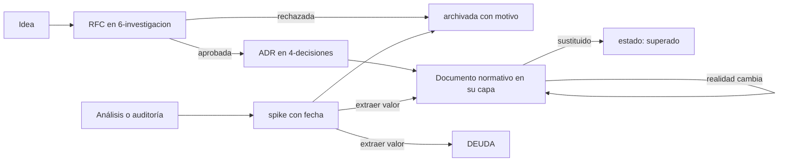

# CANON — Cómo se documenta Marbella

Este documento gobierna a todos los demás. Define qué es Marbella OS, qué clases de documento existen, cómo nacen, cómo cambian, cómo mueren y qué queda fuera. Ningún documento del corpus puede contradecirlo.

Si este documento y otro discrepan, gana este documento. Si este documento y el código discrepan, ver la sección 6.

---

## 1. Qué es Marbella OS

Marbella OS es el corpus documental oficial de Bar La Marbella. Es la **fuente única de verdad** para las decisiones de producto, experiencia, interfaz, lenguaje visual, diseño, arquitectura e implementación.

No es un manual de usuario. No es un blog de ingeniería. No es un registro de actividad. Es el conjunto de normas y descripciones que permite que cualquier persona o modelo tome una decisión correcta sobre el producto sin preguntar a nadie.

Vive en `marbella-os/` en la raíz del repositorio, en la rama `main`. No existe Marbella OS fuera de este directorio.

---

## 2. Las seis capas y su responsabilidad

Cada capa responde a **una** pregunta. Un documento que responda a dos preguntas está mal ubicado o mal delimitado.

| Capa | Pregunta que responde | Contenido |
|---|---|---|
| `1-producto/` | ¿Qué es Marbella y para quién? | Visión, principios, actores, capacidades, recorridos |
| `2-diseno/` | ¿Cómo se percibe y cómo se comporta? | Experiencia, lenguaje visual, tokens, componentes, patrones, contenido |
| `3-ingenieria/` | ¿Cómo está construido? | Arquitectura, frontend, datos, contratos, integraciones, seguridad, calidad, dominio, operación |
| `4-decisiones/` | ¿Por qué es así y no de otro modo? | Registro de decisiones de arquitectura (ADR) |
| `5-estado/` | ¿Dónde estamos? | Estado, hoja de ruta, historial, deuda |
| `6-investigacion/` | ¿Qué exploramos y qué exploramos ya? | Propuestas (RFC), análisis puntuales, archivo histórico |

`CANON.md`, `GLOSARIO.md` y `README.md` son transversales: viven en la raíz porque gobiernan o indexan a las seis capas.

---

## 3. Las tres clases de documento

Todo documento declara su clase en el front-matter. La clase determina cómo se puede cambiar.

### Constitucional

Norma de fondo. Cambia solo por decisión explícita acompañada de un ADR que la justifique. Su estabilidad se mide en años.

Son constitucionales: `CANON`, `1-producto/VISION`, `1-producto/PRINCIPIOS`, `2-diseno/EXPERIENCIA`, `2-diseno/LENGUAJE-VISUAL`.

Un cambio en un documento constitucional sin ADR asociado es un defecto de proceso, no una mejora.

### Vivo

Describe el presente. Se reescribe libremente para reflejar la realidad; su historia está en git, no acumulada dentro del propio documento. Declara fecha de última revisión y plazo de caducidad.

Son vivos: `GLOSARIO`, `README`, los catálogos y especificaciones de producto, los tokens, los componentes, la arquitectura, las integraciones, el estado, la hoja de ruta y la deuda.

**Un documento vivo nunca acumula historial.** Si necesitas saber cómo era antes, usa git. Si el historial tiene valor de negocio, va a `5-estado/CHANGELOG.md`.

### Inmutable

No se edita nunca después de publicarse. Se corrige publicando algo nuevo que lo sustituye.

Son inmutables: los ADR, `5-estado/CHANGELOG.md`, los contratos versionados de `3-ingenieria/contratos/`, los análisis de `6-investigacion/spikes/` y todo `6-investigacion/archivo/`.

**Inmutabilidad del texto no es vigencia de la decisión.** Un ADR es inmutable siempre, y puede estar `vigente` o `superado`. Confundir ambas cosas es el error que hoy comete `docs/ADR-HE-SSOT-001.md` al declararse «definitivamente congelado», expresión que un lector puede leer como «eternamente vigente». Lo correcto es: texto congelado, vigencia revisable, sustitución mediante otro ADR.

---

## 4. Front-matter obligatorio

Sin front-matter válido, un documento no existe para el índice y no es citable como norma.

```yaml
---
documento: NOMBRE-CORTO
clase: constitucional | vivo | inmutable
estado: borrador | propuesto | vigente | superado | archivado
capa: raiz | producto | diseno | ingenieria | decisiones | estado | investigacion
normativo: true | false
precedencia: 0 | 20 | 40 | 60 | 80 | 100
responsable: quién responde de que sea verdad
revisado: YYYY-MM-DD
caducidad: N meses | no aplica
depende_de: documento(s) en los que este se apoya, o nada
supersede: documento(s) que este sustituye, o —
---
```

Reglas de los campos:

- `documento` — nombre corto. Es **único en todo el corpus**: es la clave con la que unos documentos nombran a otros.
- `estado: borrador` — se está escribiendo. No es citable.
- `estado: propuesto` — completo, pendiente de aprobación. No es normativo todavía.
- `estado: vigente` — normativo. Es la única palabra que autoriza a citarlo como verdad.
- `estado: superado` — sustituido por otro documento, que debe estar nombrado en el campo `supersede` del sustituto.
- `estado: archivado` — solo valor histórico. **Explícitamente no normativo.**
- `caducidad` — plazo tras el cual el documento se considera sospechoso si no se ha revisado. Los inmutables llevan `no aplica`.
- `depende_de` — opcional. Lista de documentos en los que este se apoya: si cambian, este hay que revisarlo. No dice quién manda —eso es `precedencia`— sino qué se arrastra. Lo gobierna [ADR-0004](4-decisiones/ADR-0004-grafo-de-dependencias.md) y el grafo resultante se publica en [`.generated/GRAFO.md`](.generated/GRAFO.md).

### Los dos campos que declaran autoridad

Añadidos por [ADR-0002](4-decisiones/ADR-0002-metadatos-operables-y-validador.md). Existen porque este corpus se lee también por máquinas, y una máquina recibe fragmentos de texto sin la carpeta que los contiene ni el índice que los presenta. **Lo que no viaje dentro del documento, no llega.**

`normativo` declara si el documento autoriza decisiones. Es independiente de `clase` y de `estado`, y esa independencia es su motivo: `clase: inmutable` agrupa a los ADR, a los contratos versionados, al changelog y a los análisis fechados, que tienen rangos de autoridad muy distintos.

`precedencia` proyecta el orden de prevalencia de la sección 6 a un entero comparable sin razonar:

| Valor | Corresponde a |
|---|---|
| `100` | `CANON` |
| `80` | ADR vigente |
| `60` | constitucional |
| `40` | contrato versionado |
| `20` | vivo |
| `0` | cualquier documento con `normativo: false` |

La norma sigue siendo la sección 6. Este campo es su proyección operable, no su sustituto: si ambos discrepan, manda la sección 6 y el campo está mal.

**Un documento con `normativo: false` no autoriza nada**, con independencia de lo que afirme su texto y de lo asertivo que suene. Todo `6-investigacion/` lo lleva. <!-- af: AF-NO-NORMATIVO-NO-AUTORIZA -->

---

## 5. Dueño único por hecho

**Cada hecho vive en exactamente un documento. Los demás enlazan, no copian.** <!-- af: AF-DUENO-UNICO -->

Cuando un hecho lleva identificador estable, enlazar es citarlo. El registro de los que existen está en [`.generated/AFIRMACIONES.md`](.generated/AFIRMACIONES.md); la regla que los gobierna, en [ADR-0003](4-decisiones/ADR-0003-identidad-de-afirmacion.md).

No hay excepciones, ni siquiera «por comodidad de lectura». Duplicar un hecho garantiza que las dos copias divergirán, y entonces el corpus deja de ser fuente de verdad y pasa a ser un conjunto de opiniones fechadas.

Esta regla existe porque el corpus anterior la incumplía de forma sistemática: la fórmula del coste laboral diario estaba escrita en tres documentos distintos, y el changelog completo se duplicaba a mano en un cuarto.

Cuando dos documentos necesiten el mismo hecho:

1. Decide cuál es su dueño natural según la capa (sección 2).
2. Escríbelo allí una sola vez.
3. Desde el otro, enlaza al primero. Si el enlace resulta incómodo, es señal de que la frontera entre ambos documentos está mal trazada; corrige la frontera, no dupliques el hecho.

---

## 6. Jerarquía de autoridad ante conflicto

Marbella OS es normativo. El código es descriptivo. Esa asimetría se resuelve según la materia del conflicto:

- **Materia normativa** (producto, experiencia, lenguaje visual, tokens, contratos de componente, reglas de negocio): manda Marbella OS. Si el código difiere, **el código tiene un defecto** y así debe registrarse en `5-estado/DEUDA.md`.
- **Materia descriptiva** (qué pantallas existen hoy, qué tablas hay, qué integración está activa): manda el código. Si el documento difiere, **el documento está caduco** y debe corregirse.

Cuando dos documentos vigentes se contradicen, el orden de prevalencia es:

```
CANON  >  ADR vigente  >  constitucional  >  contrato versionado  >  vivo  >  archivado (nunca)
```

Un documento `archivado` no gana nunca, ni siquiera contra el silencio. Si algo solo está escrito en un documento archivado, ese algo **no está documentado**.

---

## 7. Convención de nombres

- Documentos: `MAYUSCULAS-CON-GUIONES.md`. Un solo idioma: español, sin acentos en el nombre del fichero.
- Capas: `N-nombre/` con dígito de orden.
- ADR: `ADR-NNNN-slug-en-minusculas.md`, numeración global secuencial de cuatro dígitos. La numeración es global y no por dominio, para que una decisión transversal tenga sitio.
- RFC: `RFC-NNNN-slug-en-minusculas.md`, numeración global independiente de la de los ADR.
- Contratos: `NOMBRE-vN.md`. La versión forma parte del nombre porque un contrato publicado no se edita.
- Análisis archivados: `YYYY-MM-DD-slug.md`. La fecha va delante porque es el dato que determina su credibilidad.
- Plantillas: prefijo `_`, por ejemplo `_PLANTILLA-ADR.md`. No son documentos y no llevan estado.

Prohibido: espacios en nombres de fichero, mezcla de convenciones dentro de una capa, y sufijos de versión en documentos vivos (`-v2`, `-final`, `-nuevo`). Un documento vivo tiene una sola versión: la actual.

---

## 8. Ciclo de vida



Cuatro reglas del ciclo:

1. **Una RFC no se queda en el limbo.** Termina como ADR o archivada con el motivo escrito. Si lleva más de un trimestre sin resolverse, se archiva por caducidad.
2. **Un análisis nunca es norma.** Un informe de auditoría alimenta un documento, una entrada de deuda o una decisión; después se archiva. Nunca se cita como fuente de verdad.
3. **Nada se borra, todo se archiva.** El archivo es barato; perder el porqué de una decisión es caro.
4. **Sustituir es explícito.** El sustituto nombra al sustituido en `supersede`, y el sustituido pasa a `estado: superado`. Nunca se deja al lector deducirlo.

---

## 9. Puerta de cambio

Un cambio que altere comportamiento visible, norma de diseño o regla de negocio debe hacer una de estas dos cosas:

- actualizar el documento correspondiente en el mismo cambio, o
- declarar explícitamente por qué no procede.

Un cambio de comportamiento sin rastro documental es deuda desde el minuto uno.

Correspondencias obligatorias:

- Cambia una regla de negocio → el documento de `3-ingenieria/dominio/` que la gobierna.
- Cambia un color, un radio, una sombra o un espaciado → `2-diseno/TOKENS.md`, nunca el componente directamente.
- Cambia el contrato de un componente → `2-diseno/SISTEMA-DE-COMPONENTES.md`.
- Aparece o desaparece una pantalla o capacidad → `1-producto/MAPA-DE-CAPACIDADES.md`.
- Se toma una decisión estructural → un ADR nuevo.
- Se acepta un compromiso a sabiendas → `5-estado/DEUDA.md`, con coste y disparador.

---

## 10. Generación en un solo sentido

Los artefactos derivados se generan **desde** Marbella OS y viven en `marbella-os/.generated/`. Nunca se editan a mano y nunca son fuente de nada.

La dirección importa. El mecanismo anterior iba al revés: `context/LLM_PROMPT.md` se mantenía a mano y su sección 17 se rellenaba automáticamente copiando el changelog de `PROJECT_STATUS.md`, duplicando cientos de líneas por diseño. El resultado inevitable fue un documento que nadie podía verificar.

Regla: si un fichero se puede derivar, se deriva; si se deriva, no se edita; si no se edita, no se discute. <!-- af: AF-DERIVADO-NO-SE-EDITA -->

Cada derivado responde a una pregunta, y ninguno es norma:

| Derivado | Responde a |
|---|---|
| [`CARGA-DE-CONTEXTO.md`](.generated/CARGA-DE-CONTEXTO.md) | Qué debo leer para tocar esto |
| [`AFIRMACIONES.md`](.generated/AFIRMACIONES.md) | Dónde vive este hecho y cómo lo cito |
| [`GRAFO.md`](.generated/GRAFO.md) | Qué se rompe si cambio esto |
| [`OBSOLESCENCIA.md`](.generated/OBSOLESCENCIA.md) | Qué toca revisar y cuándo |
| `PRECEDENCIA.json` | Lo mismo, para una máquina que no lee markdown |

Que sean baratos de regenerar es lo que permite que existan. Un derivado que hubiera que mantener a mano sería una copia, y una copia diverge.

---

## 11. Qué no entra en Marbella OS

- **Código.** Ni scripts, ni SQL, ni ficheros ejecutables con extensión disfrazada.
- **Datos.** Volcados de esquema, exportaciones, listados de tablas ajenas, capturas de pantalla como fuente de dato.
- **Activos operativos.** Imágenes de producto, vídeos, PDF generados. Los manuales de diseño en PDF son la única excepción y viven junto a su documento, declarados como activo.
- **Documentación de terceros.** Las dependencias documentan lo suyo; vendorizarlo aquí lo convierte en deuda de mantenimiento.
- **Configuración de herramienta.** Las reglas de agentes y editores viven en su directorio; pueden **derivar** de Marbella OS, nunca introducir norma propia.
- **Material comercial.** Propuestas, presupuestos y ofertas a clientes no son producto.
- **Registros de actividad.** Trazas, logs, informes de ejecución.

La regla de decisión, cuando haya duda: si el fichero no se puede leer para tomar una decisión sobre el producto, no es documentación.

### Dónde está escrita esa frontera

Excluir algo de Marbella OS no basta para que deje de estorbar: sigue en el repositorio, y cualquier indexador lo encuentra. El 95 % de los ficheros markdown de este repositorio son copias de skills de terceros que treinta herramientas de agente instalan por su cuenta.

Por eso la frontera se declara además en un manifiesto ejecutable, [`INDEXACION.md`](../INDEXACION.md), en la raíz del repositorio. Clasifica todo directorio que contenga markdown como corpus, derivado, satélite o ruido, y `npm run validate:corpus` falla si aparece uno sin clasificar. Vive fuera de `marbella-os/` porque no es norma de producto: es configuración de la frontera, y por tanto queda excluida por esta misma sección.

---

## 12. Reglas para agentes de IA

Marbella OS está escrito para ser leído tanto por personas como por modelos. Un agente que trabaje en este repositorio debe:

1. **Leer `README.md` primero.** Es el índice y declara qué documento gobierna cada materia.
2. **No citar documentos que no estén `vigente`.** Un documento `archivado`, `superado`, `borrador` o `propuesto` no autoriza ninguna decisión.
3. **No citar nada con `normativo: false`.** Por asertivo que suene su texto, no autoriza nada. Si es la única fuente disponible, decir que es material no normativo al usarlo.
4. **Ante dos documentos que se contradigan, gana el de `precedencia` mayor.** Si empatan, decide la sección 6 y hay que resolver la duplicación, no elegir.
5. **No inventar.** Si un hecho no está en Marbella OS ni en el código, decirlo explícitamente en lugar de rellenar el hueco.
6. **No duplicar.** Ante la tentación de repetir un hecho «para que se entienda», enlazar.
7. **Respetar la puerta de cambio** de la sección 9 en cada modificación de comportamiento.
8. **Preferir corregir la frontera antes que añadir un documento.** El corpus crece por necesidad, no por acumulación.
9. **No editar `marbella-os/.generated/`.** Se regenera; lo que se edite a mano se pierde y además hace fallar el validador.
10. **No indexar el repositorio entero.** [`INDEXACION.md`](../INDEXACION.md) declara qué directorios son conocimiento. Lo demás es documentación de terceros y no habla de este producto.

---

## 13. Salud del corpus

Cuatro señales de que esta arquitectura está degradándose. Cualquiera de ellas exige intervención, no tolerancia:

- Un hecho aparece escrito en dos documentos.
- Un documento vivo supera su plazo de caducidad sin revisión.
- Un análisis con fecha se está citando como norma.
- Existe una norma que solo vive en configuración de herramienta o en la cabeza de alguien.

El coste real de esta arquitectura no está en escribirla, está en mantenerla. Si las reglas 5, 9 y 10 no se cumplen, el corpus volverá exactamente al estado anterior, solo mejor ordenado al principio.

### Qué se comprueba solo

`npm run validate:corpus` verifica las reglas de este documento que una máquina puede verificar: front-matter presente y bien formado, vocabulario de los campos, coherencia entre `precedencia` y la sección 6, integridad de los enlaces de los documentos normativos, `supersede` apuntando a algo que existe, numeración de ADR sin huecos, convención de nombres de la sección 7, existencia de los directorios que los índices anuncian, sincronía de los derivados de la sección 10, cobertura del manifiesto de la sección 11, unicidad e integridad de los identificadores de afirmación y coherencia del grafo de dependencias. Falla el cambio si algo de eso se rompe.

Decidido en [ADR-0002](4-decisiones/ADR-0002-metadatos-operables-y-validador.md), que también explica lo que **no** comprueba.

Dos señales de esta misma sección avisan sin bloquear, porque su respuesta correcta no la puede elegir una máquina:

- **Un documento que lleva más de noventa días en `propuesto`.** La sección 8 admite ese estado como paso, no como destino. Aprobarlo o retirarlo son decisiones legítimas; dejarlo ahí no lo es.
- **Una regla de agente que no cita ningún documento del corpus.** O aplica una norma que está escrita aquí y debe enlazarla, o la norma solo vive dentro de la configuración de una herramienta, que es el caso que esta sección describe. Las dos que hay hoy están registradas en [DEUDA](5-estado/DEUDA.md).

### Dónde se comprueba

En tres sitios, con exigencia creciente:

| Momento | Qué lo ejecuta | Caducidad excedida |
|---|---|---|
| Al escribir | `npm run validate:corpus` | avisa |
| Al confirmar un cambio que toca el corpus | `.githooks/pre-commit` | avisa |
| Al integrar en `main` | `.github/workflows/marbella-os.yml` | **falla** |

La caducidad es lo único que cambia de severidad. Bloquear una rama porque un documento ajeno lleva un mes sin revisar entorpece sin proteger nada; permitir que eso entre en `main` es exactamente cómo un corpus empieza a mentir. Qué documento vence y cuándo está en [`.generated/OBSOLESCENCIA.md`](.generated/OBSOLESCENCIA.md).

La puerta local se activa una vez por clon con `npm run hooks:install`.

### La regla 5 no se comprueba, se hace visible

Ninguna máquina puede decidir si dos documentos afirman lo mismo, porque eso exige entender lo que dicen. La regla 5 sigue dependiendo de quien escribe y sigue siendo la más importante. Lo que sí existe es ayuda para verla, en tres formas de coste creciente:

1. **Darle nombre al hecho.** Una afirmación con identificador se cita en lugar de reescribirse ([ADR-0003](4-decisiones/ADR-0003-identidad-de-afirmacion.md)). Mientras enlazar sea más caro que copiar, se copiará.
2. **`npm run report:overlap`.** Compara el vocabulario de los párrafos de documentos normativos distintos y lista los que más se parecen. No es una puerta y no forma parte de la validación: parecerse no es afirmar lo mismo, y ningún umbral automático puede distinguirlo. Es una lista de preguntas.
3. **La revisión.** La plantilla de propuesta de cambio pregunta expresamente si se ha enlazado en lugar de copiar cuando el cambio toca dos o más documentos normativos.
